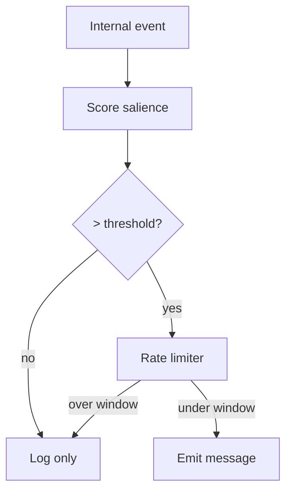

# Salience-Triggered Output

**Also known as:** Endogenous Push, Threshold Notification

**Category:** Streaming & UX  
**Status in practice:** experimental

## Intent

Have the agent emit a message only when an internal salience signal crosses a threshold, not on every cycle.

## Context

A team is running an agent that wakes up on a regular tick, or runs continuously, and has the option to say something to the user on every cycle. It might be a monitoring agent, a background reasoning loop, or any process that produces a stream of internal events that could each become a notification. The team has to decide which of those events are worth the user's attention.

## Problem

An agent that emits on every cycle quickly becomes noise — users stop reading the channel, mute it, or close the application. An agent that emits only when explicitly asked goes silent during the moments when the user would have most wanted to hear from it, such as when a metric breaks pattern or a long-running task finishes. Without a way to score how interesting each internal event is, the team is stuck choosing between spamming and ghosting, with no middle ground that matches output rate to actual signal rate.

## Forces

- Salience scoring is itself a model; flawed scoring leads to noise or silence.
- Threshold tuning is per-context.
- Hygiene: rate-limiting prevents nag spirals.

## Applicability

**Use when**

- The agent runs on a tick or always-on loop and emits too often or too seldom.
- An internal salience signal can be defined from novelty, goal-relevance, and recency.
- Users tolerate occasional silence in exchange for less noise.

**Do not use when**

- The agent is request-driven and emits exactly when asked.
- Missing a low-salience event is unacceptable (compliance, safety telemetry).
- No reliable salience signal can be constructed.

## Therefore

Therefore: score every internal event for salience and only emit when the score clears a threshold (and a rate-limit), so that output rate matches signal rate.

## Solution

Score every internal event for salience (novelty + goal-relevance + recency + prediction-error - fatigue). When the score for a candidate output crosses a threshold, emit. Otherwise log and move on. Rate-limit emissions per time window.

## Variants

- **Threshold-only** — Emit when a fixed salience score exceeds a static threshold; simplest but drifts with context.
- **Rate-limited threshold** — Threshold plus a per-window emission cap so a runaway high-salience burst cannot spam the user.
- **Adaptive-threshold** — Threshold itself moves with recent emission rate and user feedback (mute/snooze) so the agent self-calibrates noisiness.

## Example scenario

An always-on monitoring agent emits one line per second; users mute the channel within an hour and stop reading it. The team adds a salience score (novelty + goal-relevance minus fatigue) and an output threshold. The agent now stays silent while nothing surprising is happening and speaks up the moment a metric breaks pattern. Read-through rate goes up because the channel becomes a signal rather than noise.

## Diagram

## Consequences

**Benefits**

- Output rate matches signal rate.
- Salience scores become inspectable in the trace.

**Liabilities**

- Threshold tuning is fragile to context shifts.
- Silence on low salience can hide problems.

## What this pattern constrains

Output is forbidden unless the salience score exceeds the configured threshold.

## Known uses

- **Long-running personal agent loops (private deployment)** — *Available*

## Related patterns

- *used-by* → [bidirectional-impulse-channel](bidirectional-impulse-channel.md)
- *complements* → [streaming-typed-events](streaming-typed-events.md)
- *complements* → [event-driven-agent](event-driven-agent.md)
- *complements* → [degenerate-output-detection](degenerate-output-detection.md)
- *complements* → [intra-agent-memo-scheduling](intra-agent-memo-scheduling.md)
- *complements* → [mode-adaptive-cadence](mode-adaptive-cadence.md)

## References

- (paper) Karl Friston, *The free-energy principle: a unified brain theory?*, 2010

**Tags:** salience, endogenous, threshold
