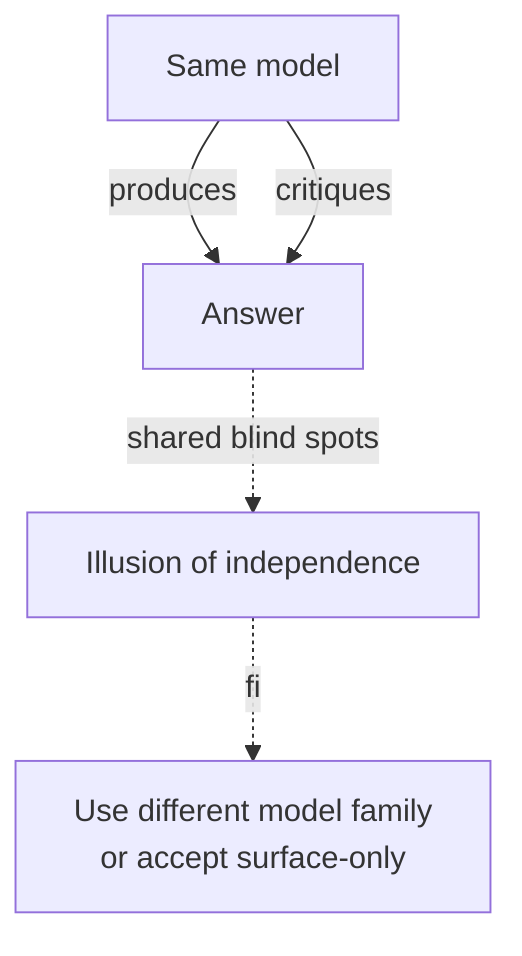

# Same-Model Self-Critique

**Also known as:** Echo-Chamber Reflection, Single-Model Reflexion

**Category:** Anti-Patterns  
**Status in practice:** deprecated

## Intent

Anti-pattern: have the same model both produce an answer and critique it, expecting independence.

## Context

A team builds a reflective agent — Reflexion, self-refine, or an evaluator-optimizer loop — where one call produces a candidate answer and a second call critiques and revises it. To keep cost and integration simple, both calls use the same model, often with prompts that share their wording about what 'good' looks like. The critique step is then presented internally or to users as an independent check on the answer.

## Problem

Because producer and critic come from the same weights and read overlapping prompts, the critic shares the producer's blind spots; whatever the model is confidently wrong about, it is also confidently wrong about when wearing the critic hat. Wrong answers come back from the loop endorsed and slightly polished, and the team reports higher confidence on what is, statistically, the same error rate. Replication studies through 2025 have repeatedly confirmed that single-model self-critique catches surface mistakes but does not act as independent verification.

## Forces

- Two models cost twice.
- Cross-model judges have their own biases.
- Self-critique feels free.

## Applicability

**Use when**

- Never use this; the critic shares the producer's blind spots and reinforces wrong answers.
- If self-critique is the only option, treat it as catching surface errors only.
- Use a different model family for the critic (see llm-as-judge or evaluator-optimizer).

**Do not use when**

- Critique must be independent or trusted to catch deep errors.
- Cost of a wrong-but-confident answer is high.
- A second model family or programmatic verifier is available.

## Therefore

Therefore: route critique to a different model family or a programmatic verifier — and if you cannot, downgrade the claim to 'catches surface errors only' — so that shared blind spots stop being laundered as independent confirmation.

## Solution

Don't pretend it is independent. Either accept that self-critique catches surface errors only, or use a different model family for the critic. See reflection, evaluator-optimizer, llm-as-judge.

## Example scenario

A team ships an agent where the same model writes an answer and then 'self-critiques' it before returning, and treats the critique as independent verification. Replication studies and their own evals show the critic confidently endorses confidently-wrong answers because it shares the producer's blind spots. They stop pretending independence: they either accept that self-critique catches surface errors only, or they swap the critic to a different model family.

## Diagram

## Consequences

**Liabilities**

- False confidence in flawed answers.
- Self-reinforced misconceptions across iterations.

## What this pattern constrains

By definition, this anti-pattern imposes no useful constraint; the missing constraint is the failure mode.

## Known uses

- **Naive Reflexion implementations** — *Available*

## Related patterns

- *alternative-to* → [reflection](reflection.md) — Same-model-self-critique is the misuse mode of reflection; well-engineered reflection (frozen-rubric or self-refine) avoids the failure.
- *conflicts-with* → [evaluator-optimizer](evaluator-optimizer.md)
- *conflicts-with* → [self-refine](self-refine.md)

## References

- (blog) *Theaiengineer.substack: ReAct vs Plan-and-Execute vs ReWOO vs Reflexion*, 2025, <https://theaiengineer.substack.com/p/the-4-single-agent-patterns>
- (paper) Huang et al., *Large Language Models Cannot Self-Correct Reasoning Yet*, 2023, <https://arxiv.org/abs/2310.01798>

**Tags:** anti-pattern, reflection
