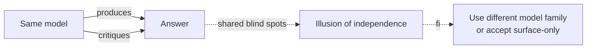

# Same-Model Self-Critique

**Also known as:** Echo-Chamber Reflection, Single-Model Reflexion

**Category:** Anti-Patterns  
**Status in practice:** deprecated

## Intent

Anti-pattern: have the same model both produce an answer and critique it, expecting independence.

## Context

Reflexion or evaluator-optimizer loops where producer and critic share a model and a prompt family.

## Problem

The critic shares the producer's blind spots. Wrong answers are reinforced as confident. 2025 replication studies confirm the effect.

## Forces

- Two models cost twice.
- Cross-model judges have their own biases.
- Self-critique feels free.

## Applicability

**Use when**

- Never use this; the critic shares the producer's blind spots and reinforces wrong answers.
- If self-critique is the only option, treat it as catching surface errors only.
- Use a different model family for the critic (see llm-as-judge or evaluator-optimizer).

**Do not use when**

- Critique must be independent or trusted to catch deep errors.
- Cost of a wrong-but-confident answer is high.
- A second model family or programmatic verifier is available.

## Solution

Don't pretend it is independent. Either accept that self-critique catches surface errors only, or use a different model family for the critic. See reflection, evaluator-optimizer, llm-as-judge.

## Example scenario

A team ships an agent where the same model writes an answer and then 'self-critiques' it before returning, and treats the critique as independent verification. Replication studies and their own evals show the critic confidently endorses confidently-wrong answers because it shares the producer's blind spots. They stop pretending independence: they either accept that self-critique catches surface errors only, or they swap the critic to a different model family.

## Diagram

## Consequences

**Liabilities**

- False confidence in flawed answers.
- Self-reinforced misconceptions across iterations.

## What this pattern constrains

By definition, this anti-pattern imposes no useful constraint; the missing constraint is the failure mode.

## Known uses

- **Naive Reflexion implementations** — *Available*

## Related patterns

- *alternative-to* → [reflection](reflection.md) — Same-model-self-critique is the misuse mode of reflection; well-engineered reflection (frozen-rubric or self-refine) avoids the failure.
- *conflicts-with* → [evaluator-optimizer](evaluator-optimizer.md)
- *conflicts-with* → [self-refine](self-refine.md)

## References

- (blog) *Theaiengineer.substack: ReAct vs Plan-and-Execute vs ReWOO vs Reflexion*, 2025

**Tags:** anti-pattern, reflection
