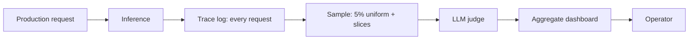

# Sampled Prompt Trace Eval

**Also known as:** Sampled Monitoring Eval, Random-Sample LLM-Judge

**Category:** Governance & Observability  
**Status in practice:** emerging

## Intent

Capture full prompt/response/metadata traces from production into a monitoring dataset, but only run LLM-judge evaluation on a random sample so monitoring cost stays bounded as traffic grows.

## Context

A production LLM application receives thousands or millions of requests. The team wants production quality metrics — LLM-judge scores on actual traffic, not just on offline eval sets. Running an LLM judge on every request doubles inference cost and is infeasible at scale.

## Problem

Two failure shapes are common. Run the judge on every trace and the monitoring cost matches or exceeds the production cost; engineering pressure cuts judging quickly. Run no judging and the team relies on offline evals that drift from production distribution; regressions in real traffic are invisible until users complain. Without a sampling discipline, monitoring is either unaffordable or absent.

## Forces

- LLM-judge cost is per-trace; total scales with traffic.
- A representative sample is sufficient to track quality drift over time.
- Sampling rate must be tuned to traffic volume and budget.
- Some slices of traffic (high-value, high-risk) deserve higher sampling than uniform.

## Applicability

**Use when**

- Production traffic is large enough that judging every trace is infeasible.
- Drift detection on real traffic matters.
- Some slices justify weighted sampling.

**Do not use when**

- Traffic is small enough to judge every trace cheaply.
- Rare-tail failures dominate the failure budget and uniform sampling misses them.
- Per-trace ground-truth exists; sampling not needed because deterministic checks suffice.

## Therefore

Therefore: capture full traces but run LLM-judge evaluation only on a random sample, with optional weighted sampling on high-value slices, so monitoring cost stays bounded while quality metrics remain representative.

## Solution

Log every production request's prompt, response, retrieved context, model parameters, and metadata to a monitoring store (Opik, LangSmith, Comet). On a configurable sample rate (e.g. 5% uniform plus 50% on enterprise tenants), run the LLM judge against the rubric. Aggregate scores over time windows. Surface drift in dashboards. Sampling rate, weighted slices, and budget are all configuration. Distinct from shadow-canary (which compares two variants) and from offline eval (which uses a frozen set).

## Example scenario

A SaaS platform processes 500k LLM requests per day. The team logs every trace to Opik. An LLM judge runs against a faithfulness/answer-quality rubric on 5% uniform plus 50% of enterprise-tier requests. Daily aggregate scores feed a drift dashboard. A regression in faithfulness on the enterprise slice is caught within hours despite the judge running on only ~25k requests.

## Diagram

## Consequences

**Benefits**

- Monitoring cost stays bounded as traffic grows.
- Quality metrics track production distribution, not just offline sets.
- Drift detection on real traffic with statistically defensible sampling.

**Liabilities**

- Tail-end rare failures may be under-sampled.
- Sampling rate tuning is a recurring decision as traffic grows.
- Slice-weighted sampling adds complexity to dashboards and to drift attribution.

## What this pattern constrains

Production quality monitoring with LLM judges must not run on every trace at scale; the judge runs on a random sample drawn at a documented rate.

## Known uses

- **LLM Engineer's Handbook (Iusztin, Labonne) — Prompt monitoring pipeline with sampling** — *Available* — <https://medium.com/decodingai/the-ultimate-prompt-monitoring-pipeline-886cbb75ae25>
- **Opik, Comet, LangSmith production monitoring sampling features** — *Available*

## Related patterns

- *uses* → [llm-as-judge](llm-as-judge.md)
- *complements* → [agent-as-judge](agent-as-judge.md)
- *complements* → [eval-harness](eval-harness.md)
- *complements* → [evaluation-driven-development](evaluation-driven-development.md)
- *complements* → [shadow-canary](shadow-canary.md)
- *uses* → [decision-log](decision-log.md)

## References

- (book) *LLM Engineer's Handbook*, Paul Iusztin, Maxime Labonne, 2024, <https://www.packtpub.com/en-us/product/llm-engineers-handbook-9781836200079>
- (blog) *The Ultimate Prompt Monitoring Pipeline*, <https://medium.com/decodingai/the-ultimate-prompt-monitoring-pipeline-886cbb75ae25>

**Tags:** monitoring, evaluation, sampling
