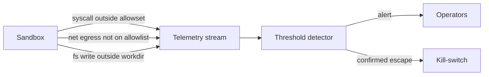

# Sandbox Escape Monitoring

**Also known as:** Sandbox Telemetry, Boundary Violation Alerts

**Category:** Governance & Observability  
**Status in practice:** emerging

## Intent

Treat sandbox boundary violations as telemetry; alert on syscalls, network egress, or filesystem writes outside expected scope.

## Context

Agents executing code or operating filesystems where sandbox-isolation is in place; sandboxes have known escape vulnerabilities.

## Problem

Sandbox-isolation is preventive only; without monitoring, a successful escape (or even an attempt) is invisible until damage is done.

## Forces

- Telemetry granularity vs cost.
- False positives on legitimate boundary-pushing operations.
- Egress patterns evolve faster than allowlists.

## Applicability

**Use when**

- The agent executes code or operates a filesystem inside a sandbox.
- Sandbox boundaries can be instrumented to log syscalls, egress, and writes.
- A safety telemetry pipeline and kill-switch already exist or are being built.

**Do not use when**

- There is no sandbox to monitor (escape monitoring without isolation is theatre).
- Telemetry volume would overwhelm the safety pipeline without thresholds.
- Alerts have no responder and would be ignored.

## Solution

Instrument the sandbox: log every syscall outside the allowed set, every network egress not on the allowlist, every filesystem write outside the working directory. Stream to safety telemetry. Alert on threshold breaches. Pair with kill-switch for automatic halt on confirmed escape.

## Example scenario

A code-execution agent runs user-emitted Python in a container that should have no network. One day a contractor's prompt-injected payload triggers an outbound DNS request; sandbox-isolation alone would have allowed the egress to fail silently. With escape monitoring, the unexpected syscall and the blocked egress both stream to safety telemetry, an alert fires within seconds, and the team locks the offending tenant before any further attempts.

## Diagram

## Consequences

**Benefits**

- Detection of escape attempts and successes.
- Forensic trail when incidents occur.

**Liabilities**

- Telemetry volume.
- Alert fatigue if thresholds are mis-tuned.

## What this pattern constrains

Sandbox events outside the allowed set must be logged and inspectable; silent boundary violations are forbidden.

## Known uses

- **Production code-execution platforms (E2B, Modal sandbox monitoring)** — *Available*

## Related patterns

- *complements* → [sandbox-isolation](sandbox-isolation.md)
- *composes-with* → [kill-switch](kill-switch.md)
- *uses* → [provenance-ledger](provenance-ledger.md)

**Tags:** safety, sandbox, monitoring
