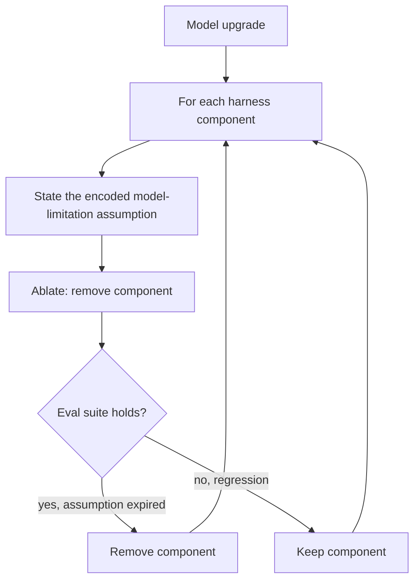

# Scaffold Ablation on Model Upgrade

**Also known as:** Harness Assumption Review, Scaffold Decay Review

**Category:** Governance & Observability  
**Status in practice:** emerging

## Intent

On each model upgrade, treat every harness component as an encoded assumption about a model weakness and ablate the components the new model no longer needs, gated by evals.

## Context

A team runs an agent behind a harness that has accreted over several model generations: retry wrappers, decomposition scaffolds, format-coercion steps, guardrails, sprint or planning constructs. Each was added to compensate for something a past model could not do reliably. A stronger model arrives, and the harness is carried over wholesale because it 'works'.

## Problem

Every harness component encodes an assumption about what the model cannot do on its own, and those assumptions expire silently as models improve. Carried-over scaffolding that the new model no longer needs is not free: it is dead complexity to maintain, it adds cost and latency, and at worst it actively suppresses the stronger model's capability by forcing it down a path built for a weaker one. Because nothing fails loudly when an assumption expires, the harness only grows; no event prompts anyone to remove a component, so workarounds outlive the limitation that justified them.

## Forces

- Carrying the harness over is safe in the short term but accumulates capability-suppressing debt over generations.
- Removing a component risks a regression if the assumption has not fully expired.
- Whether an assumption still holds is only knowable against an eval, which the team must own.
- Over-scaffolding and under-scaffolding both degrade a stronger model; the right amount shifts every release.

## Applicability

**Use when**

- A harness has accreted scaffolding across several model generations.
- A model upgrade is being adopted and the team owns an eval suite to gate changes.
- There is evidence or suspicion that carried-over scaffolding is suppressing the new model's capability.

**Do not use when**

- There is no eval suite to gate removals, so ablation would be guesswork.
- The harness is new and has not yet crossed a model generation.
- The component encodes a policy or safety requirement, not a model-capability workaround.

## Therefore

Therefore: key a harness review to each model release that, component by component, restates the model-limitation assumption the component encodes and ablates the ones the new model no longer needs, gated by evals so removals are evidence-backed rather than hopeful.

## Solution

Make each harness component carry the assumption it encodes ('the model cannot keep a long plan straight', 'the model will not emit valid JSON'). On a model upgrade, walk the components and stress-test each assumption against the new model: temporarily remove the component and run the eval suite. If the eval holds, the assumption has expired and the component comes out; if it regresses, the assumption survives and the component stays. Anthropic demonstrates the move concretely by deleting a sprint construct on an upgrade once the model could plan without it. The eval suite is the gate; the corresponding anti-pattern is keeping stale workaround scaffolding that now constrains the stronger model. Compose with eval-as-contract for the gate and with dynamic-scaffolding for components that should be conditional rather than removed.

## Diagram

## Example scenario

A coding agent's harness includes a sprint construct that forces the model to break work into small, separately planned chunks — added because an earlier model lost the thread on long tasks. A stronger model ships. Instead of carrying the construct over, the team labels it with its assumption ('the model cannot hold a long plan'), removes it, and runs the eval suite. The evals hold or improve, so the sprint construct is deleted. The agent now plans long tasks directly, and the harness is one load-bearing-for-nothing component lighter.

## Consequences

**Benefits**

- Harness complexity tracks the current model's real weaknesses instead of accumulating across generations.
- Capability suppression from scaffolding built for weaker models is removed, not inherited.
- Each removal is evidence-backed, so the review is auditable rather than a matter of taste.

**Liabilities**

- Ablating a component whose assumption has not fully expired causes a regression if the eval missed the case.
- The review is only as trustworthy as the eval suite that gates it.
- Per-release review is recurring work that a carry-everything-over approach avoids.

## What this pattern constrains

A harness component may not survive a model upgrade on inertia; it must be retained only against an eval that shows its underlying model-limitation assumption still holds for the new model.

## Components

- Harness component — a wrapper, scaffold, or guardrail that encodes a model-limitation assumption
- Assumption label — the explicit statement of what the component compensates for
- Ablation step — temporary removal of a component on upgrade to test whether its assumption still holds
- Eval gate — the suite whose pass or regression decides retention or removal

## Tools

- Eval suite — the gate that decides whether a component's assumption still holds for the new model
- Harness component registry — inventory of scaffolds with the model-limitation assumption each encodes
- Ablation harness — temporarily disables a component to test the new model without it

## Evaluation metrics

- Components removed per upgrade — the debt actually shed each generation
- Post-ablation regression rate — share of removals that had to be reverted
- Harness size over time — whether scaffolding is shrinking as the model strengthens or only growing
- Capability-suppression delta — eval lift from removing a scaffold the new model did not need

## Known uses

- **[Anthropic — harness design for long-running apps](https://www.anthropic.com/engineering/harness-design-long-running-apps)** — *Available* — Frames every harness component as an assumption about what the model cannot do, worth stress-testing on upgrade; deletes a sprint construct once the model can plan without it.
- **[Cursor — agent harness](https://cursor.com/blog/continually-improving-agent-harness)** — *Available* — Knocked down early guardrails and moved to dynamic context as models improved.
- **[Addy Osmani — agent harness engineering](https://addyosmani.com/blog/agent-harness-engineering/)** — *Available* — States that when the model gets better at something, the component becomes load-bearing for nothing and should come out.

## Related patterns

- *alternative-to* → [dynamic-scaffolding](dynamic-scaffolding.md)
- *uses* → [eval-as-contract](eval-as-contract.md)

## References

- (blog) Anthropic, *Harness design for long-running application development* 2026,, <https://www.anthropic.com/engineering/harness-design-long-running-apps>
- (blog) Cursor, *Continually improving our agent harness*, <https://cursor.com/blog/continually-improving-agent-harness>
- (blog) Addy Osmani, *Agent Harness Engineering*, <https://addyosmani.com/blog/agent-harness-engineering/>

**Tags:** harness, model-upgrade, scaffolding, evals, maintenance
