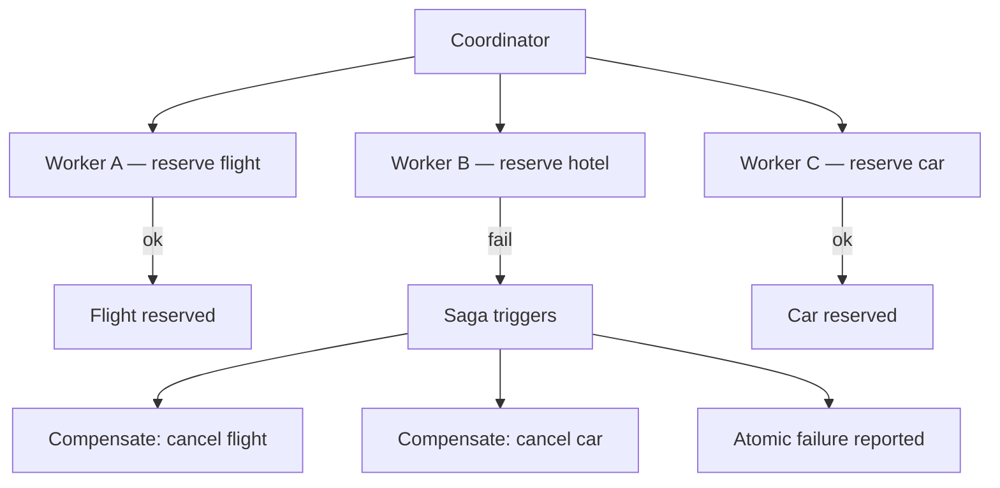

# Scatter-Gather Plus Saga

**Also known as:** Scatter-Gather Saga, Distributed-Transaction Fan-Out

**Category:** Multi-Agent  
**Status in practice:** emerging

## Intent

Distribute tasks across worker agents and aggregate results while maintaining distributed-transaction semantics via compensating actions on partial failure.

## Context

A team uses parallel agent fan-out for throughput. Workers produce side-effects (writes to systems of record). When some workers fail mid-flight, the partial commits leave the system in an inconsistent state. Plain parallelization has no rollback story; map-reduce assumes pure functions.

## Problem

Without saga semantics, partial failures in a fan-out leave half-committed state. The system has no way to recover atomically: workers already committed cannot un-commit, and there is no coordinator that knows which compensating actions to run. Distinct from parallelization (no transactional model) and map-reduce (assumes pure).

## Forces

- Distributed transactions across heterogeneous side-effects are not natively supported.
- Compensating actions must be defined per worker — engineering work per side-effect class.
- Partial-failure detection requires per-worker confirmation tracking.

## Therefore

Therefore: pair scatter-gather with explicit saga semantics — each worker declares a compensating action; on partial failure the coordinator runs compensations for already-committed workers and the operation reports atomic failure.

## Solution

Each worker exposes (do_action, compensate_action). Coordinator dispatches all workers in parallel. On all-success, gather and return. On any failure, coordinator runs compensate_action for all workers that already committed. Reports outcome as atomic: either all committed (and gathered) or none. Pair with compensating-action, parallelization, map-reduce, supervisor-plus-gate.

## Diagram

## Example scenario

A booking agent fans out to 'reserve flight', 'reserve hotel', 'reserve car'. Flight and car succeed, hotel fails. Saga coordinator runs flight.cancel() and car.cancel() before reporting BookingFailed to the user. Without saga, the user sees a flight and car they did not want and a hotel they did not get.

## Consequences

**Benefits**

- Atomic-failure semantics across heterogeneous parallel side-effects.
- No half-committed state on partial failure.
- Saga log is auditable evidence of compensation correctness.

**Liabilities**

- Compensating actions must be defined per worker — engineering work.
- Compensations themselves can fail; nested compensation logic is non-trivial.
- Higher complexity than plain parallelization; harder to debug.

## What this pattern constrains

Every worker must declare a compensating action; coordinator must run compensations on any worker failure before reporting outcome.

## Applicability

**Use when**

- Parallel fan-out where partial failures must be rolled back atomically.
- Each worker has a defined compensating action.
- Cost of partial-state failure exceeds cost of saga overhead.

**Do not use when**

- Workers are pure functions (no side-effects to compensate).
- Compensating actions are not defined for some workers.
- Atomic-failure semantics are not required by the domain.

## Components

- Coordinator — dispatches workers and runs saga on partial failure
- Worker — exposes (do_action, compensate_action)
- Saga log — append-only record of dispatches and compensations
- Compensation runner — executes compensate_action for already-committed workers

## Tools

- Per-worker do_action and compensate_action endpoints
- Saga coordinator
- Saga log — append-only

## Evaluation metrics

- Partial-failure rate
- Compensation success rate — compensations that ran cleanly
- Saga atomicity — share of operations that ended all-or-nothing

## Known uses

- **[Production LLM Agents Runtime Patterns survey (arXiv 2605.20173)](https://arxiv.org/abs/2605.20173v1)** _available_
- **[AWS Step Functions (Saga pattern)](https://awsforengineers.com/blog/aws-step-functions-saga-pattern-implementation/)** _available_ — On a step failure the state machine triggers compensating transactions in reverse order, with Parallel/Map fan-out.

## Related patterns

- _specialises_ **Parallelization**
- _alternative-to_ **MapReduce for Agents**
- _complements_ **Compensating Action**
- _complements_ **Supervisor-Plus-Gate**
- _complements_ **Missing Idempotency on Agent Calls**
- _complements_ **Parallel Fan-Out / Gather**
- _complements_ **Contract Net Protocol**

## References

- [A Methodology for Selecting and Composing Runtime Architecture Patterns for Production LLM Agents](https://arxiv.org/abs/2605.20173v1) — 2026
