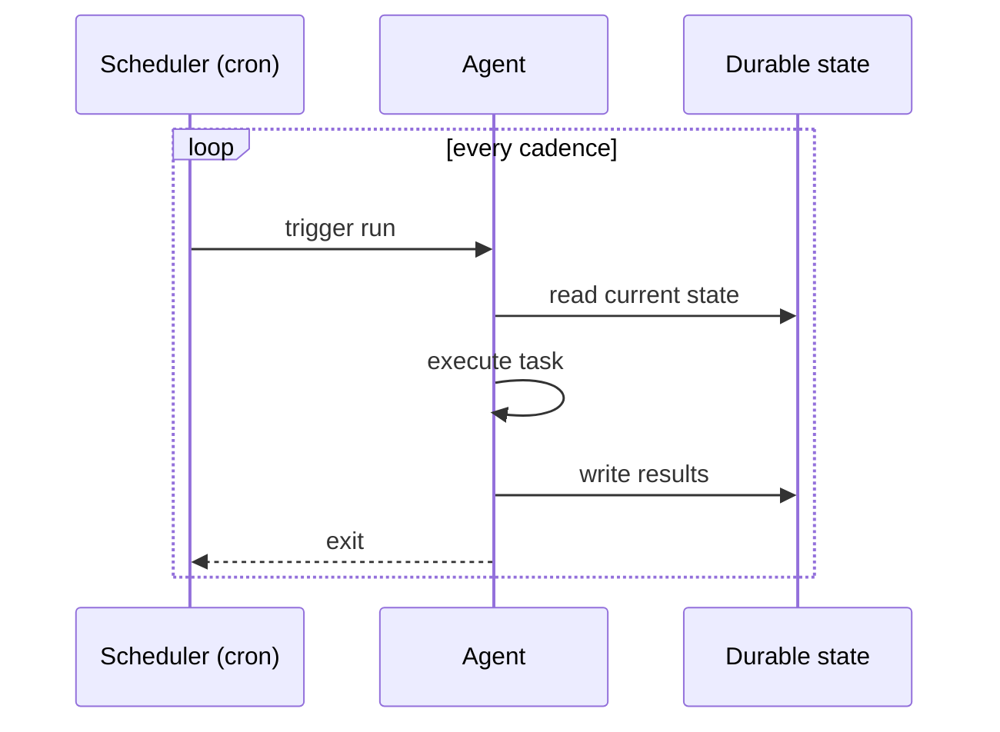

# Scheduled Agent

**Also known as:** Cron Agent, Time-Triggered Agent, Periodic Agent

**Category:** Planning & Control Flow  
**Status in practice:** mature

## Intent

Run the agent on a fixed schedule independent of user requests.

## Context

A team needs an agent to do work on a clock — produce an overnight summary, triage incoming issues every Monday morning, run an hourly health check, send a daily competitive-intelligence digest. The work has to happen whether or not a user remembers to ask. A scheduler (cron, a queue with delayed delivery, a managed scheduler service) and durable storage for the agent's state are available.

## Problem

Request-driven agents only act when someone calls them; if no user prompts the digest, the digest never goes out. Asking a human to trigger the agent every morning defeats the point of automation. Running the agent continuously in a polling loop wastes most of its budget on idle wakeups. Without persisted state between runs, each scheduled invocation starts from zero and cannot pick up where the previous one left off, so anything that needs continuity (last-seen items, in-progress investigations) is lost.

## Forces

- Schedule density trades cost for freshness.
- Failure modes when the agent's run is missed.
- Drift if the schedule is not authoritative.

## Applicability

**Use when**

- A task should run periodically regardless of user prompting.
- Agent state can be persisted in durable storage between runs.
- A scheduler (cron, queue, scheduler service) is available.

**Do not use when**

- The task only matters in response to a specific user request.
- Runs would frequently be wasted because no work is pending.
- Persistent state cannot be carried across runs.

## Therefore

Therefore: trigger the agent on a fixed schedule and persist its state to durable storage between runs, so that time-bounded tasks happen on the clock even when no human is around to ask.

## Solution

Schedule the agent run at fixed cadence (cron, scheduler service). The agent reads its current state, executes its task, writes results, and exits. State persists across runs in durable storage.

## Example scenario

A product manager wants a daily competitive-intelligence digest in their inbox. Building it as a request-driven agent forces them to remember to ask each morning, which they don't. The team schedules the agent to run at 06:00 cron, read its persisted state (last-seen items), execute its task, write results to email and storage, and exit. The digest now arrives reliably even when no human is awake, and the agent's state survives across runs.

## Diagram

## Consequences

**Benefits**

- Time-bounded tasks happen reliably.
- Idempotent runs make retries safe.

**Liabilities**

- Cost per run regardless of need.
- Skew between expected and actual cadence.

## What this pattern constrains

The agent is not invoked by user requests; only the scheduler triggers runs.

## Known uses

- **Claude Code scheduled agents** — *Available*

## Related patterns

- *alternative-to* → [event-driven-agent](event-driven-agent.md)
- *alternative-to* → [spec-driven-loop](spec-driven-loop.md)
- *complements* → [agent-resumption](agent-resumption.md)
- *alternative-to* → [mode-adaptive-cadence](mode-adaptive-cadence.md)

**Tags:** schedule, cron, periodic
