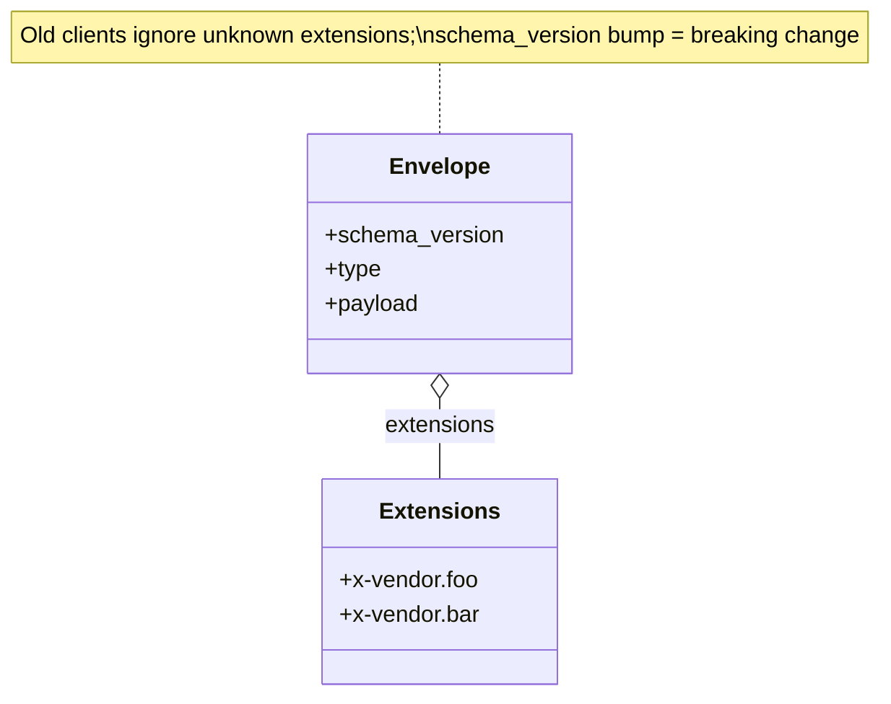

# Schema Extensibility

**Also known as:** Reserved Fields, Namespaced Extensions

**Category:** Structure & Data  
**Status in practice:** mature

## Intent

Build schemas that evolve without breaking old clients via reserved namespaces and extension blocks.

## Context

A team owns a data format that lives for years and is read by clients of different ages — exported files, API payloads, event records in a queue. New fields show up regularly because the product evolves, and the team cannot reasonably upgrade every client at the same moment a new field is added. They need a way to add fields, and to let vendors add their own extensions, without forcing a coordinated release.

## Problem

A rigid schema that lists exactly which fields are allowed will reject any payload that contains a new field, which means every addition becomes a breaking change for every existing client. The obvious workaround — accepting anything and validating nothing — turns the schema into mush, lets typos through, and makes it impossible to tell deliberate extensions apart from accidents. The team has to choose between cascading breaking changes and losing the schema's value as a contract, and neither is acceptable for a long-lived format.

## Forces

- Old clients should ignore new fields, not error.
- New fields should be discoverable, not hidden.
- Versioning policy must be agreed upfront.

## Applicability

**Use when**

- Schemas are long-lived and will accumulate fields over time.
- Multiple clients of different ages must coexist with the same data format.
- Breaking-change cost across clients is high.

**Do not use when**

- The schema is internal, short-lived, and a single client owns it.
- Strict validation of all fields is required (no unknown extensions allowed).
- Versioning discipline cannot be enforced and the envelope would rot.

## Therefore

Therefore: wrap payloads in a versioned envelope with reserved extension namespaces, so that old clients ignore new fields and `schema_version` becomes the only breaking-change signal.

## Solution

Define a versioned envelope (`{schema_version, type, payload}`). Reserve namespaces for extensions (`x-vendor.foo`, `extensions: {...}`). Old clients ignore unknown extensions. Bumps to schema_version are the only breaking-change signal.

## Variants

- **Reserved field numbers** — Protobuf-style: reserve numeric tags up front so future fields cannot collide with old ones (Protocol Buffers).
- **Vendor-namespaced extensions** — Allow `x-vendor.foo` keys outside the core schema; old clients ignore unknown `x-` keys (OpenAPI, JSON Schema).
- **Versioned envelope** — Wrap payload in `{schema_version, type, payload}`; bumps to `schema_version` are the only breaking-change signal.

## Example scenario

A typed event stream between agent and client ships v1; six months later the client team needs three new fields and a vendor-specific extension. Without extensibility the schema breaks every old client. The team had used a versioned envelope (`{schema_version, type, payload, extensions}`) with reserved `x-vendor.*` namespaces from day one; adding the new fields and extensions ships without breaking older clients, and a `schema_version` bump is reserved for genuine incompatibilities.

## Diagram

## Consequences

**Benefits**

- Long-lived format with low breakage.
- Per-vendor extensions don't pollute the core.

**Liabilities**

- Extension proliferation is a real risk.
- Versioning discipline must be enforced socially or technically.

## What this pattern constrains

Clients cannot rely on extension fields outside their declared namespace.

## Known uses

- **Weft** — *Available*. Versioned envelope: {weft_version, type, exported_at, exported_from, items}.

## Related patterns

- *complements* → [polymorphic-record](polymorphic-record.md)
- *complements* → [translation-layer](translation-layer.md)

## References

- (doc) *Protocol Buffers backwards compatibility*, <https://protobuf.dev/programming-guides/proto3/#updating>

**Tags:** schema, extensibility, versioning
