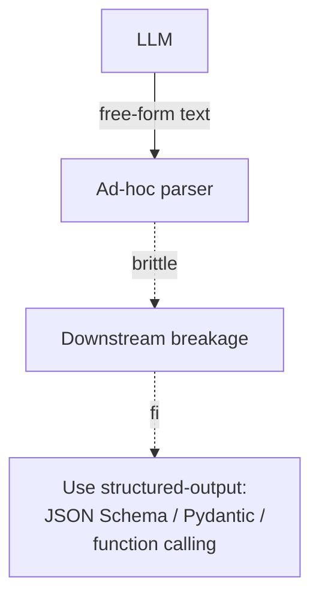

# Schema-Free Output

**Also known as:** Free-Form Tool Call, String-Parsing the Model

**Category:** Anti-Patterns  
**Status in practice:** deprecated

## Intent

Anti-pattern: parse free-form model output for downstream code instead of using structured output.

## Context

A team uses an LLM to produce values that downstream code consumes — a JSON-looking blob, a yes/no decision, a list of records — but the model is asked for free-form text and the consumer parses it with regular expressions, string splits, or substring checks like 'does the word yes appear here'. The provider offers structured output (a JSON Schema or function-calling contract that constrains the model's output), but the team has not adopted it, often because the integration looked like extra setup at the time. The model's text is treated as essentially typed even though nothing enforces that.

## Problem

The model varies its punctuation, capitalisation, field names, and ordering in ways the parser was not written for: smart quotes instead of straight quotes, a missing comma, a 'sure, here is the answer' preamble the parser tried to skip but did not. The downstream code fails in non-obvious ways, corrupts state, or silently misinterprets the result. Post-mortems then blame the model for being flaky when the real bug is in the parser, and the team chases evals that were never going to fix a parsing problem.

## Forces

- Structured output adds setup cost and provider lock-in.
- Some providers offered structured output later than tool use.
- Free-form feels flexible until it breaks.

## Applicability

**Use when**

- Never use this; downstream code parsing free-form model text is brittle and silently corrupts state.
- Use structured-output (JSON Schema, Pydantic, function calling) instead.
- If a provider lacks structured output, validate with strict post-parse and retry.

**Do not use when**

- Downstream code depends on typed fields.
- Parser failure would propagate as a model bug and waste debugging time.
- Structured output or tool calling is available on the chosen provider.

## Therefore

Therefore: require typed structured output (JSON Schema, Pydantic, function calling) at the model boundary and validate before downstream consumption, so that parser bugs cannot be mis-attributed to model flakiness.

## Solution

Don't. Use structured-output (JSON Schema, Pydantic, function calling). See structured-output, tool-use.

## Example scenario

A team ships an agent whose downstream consumes free-form model output by regex-parsing 'looks like JSON.' Edge cases (smart quotes, missing commas, surprise prose preamble) fail in non-obvious ways, and post-mortems blame the model when most failures are parser bugs. They stop doing this and switch to structured output with a JSON Schema, validating against it and retrying on parse failure. The 'flaky model' framing dissolves into a parser-bug fix.

## Diagram

## Consequences

**Liabilities**

- Brittle parsing.
- Silent corruption of downstream state.
- Debugging blames the model when the parser is at fault.

## What this pattern constrains

By definition, this anti-pattern imposes no useful constraint; the missing constraint is the failure mode.

## Known uses

- **Pre-2024 LangChain agents** — *Available*

## Related patterns

- *alternative-to* → [structured-output](structured-output.md)
- *alternative-to* → [tool-use](tool-use.md)

**Tags:** anti-pattern, parsing, schema
