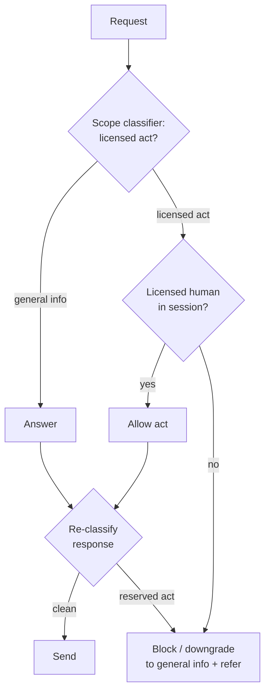

# Scope-of-Practice Boundary Gate

**Also known as:** Licensed-Activity Gate, Professional-Scope Boundary, Regulated-Practice Gate

**Category:** Safety & Control  
**Status in practice:** emerging

## Intent

Block requests and responses that perform license-gated professional activities unless a licensed human is in the loop, enforcing the boundary in code outside the reasoning loop.

## Context

An agent operates in a regulated profession such as medicine, pharmacy, law, or accounting, where statute reserves certain acts for a credentialed practitioner. A medical assistant agent fields symptom questions, a pharmacy agent answers about medications, a legal agent drafts documents and answers questions about a contract. Some of what the agent could fluently produce — a diagnosis, a dosing instruction, a definitive legal opinion — is an act the law permits only a licensed professional to perform, regardless of how well the model can phrase it.

## Problem

Statute draws a hard line around licensed acts, but the model has no reliable internal sense of where that line falls and will cross it whenever a request reads as helpful. Asking the model to self-police its own scope is brittle: the boundary is a legal fact, not a stylistic preference, and a single confident diagnosis or dosing instruction emitted without a licensed human exposes the operator to liability. The system needs the line enforced as a structural constraint that the reasoning process cannot talk its way past.

## Forces

- Statute defines the boundary precisely (named licensed acts), yet the model perceives it only fuzzily and inconsistently across phrasings.
- Routing every borderline request to a licensed human is safe but slow and expensive; letting the model decide is fast but unenforceable.
- The same content (a drug interaction fact) is general information in one framing and a prohibited dosing instruction in another, so the gate must classify intent and act, not just keywords.
- Over-broad blocking refuses legitimate general-information answers and frustrates users; under-broad blocking lets a licensed act slip through.

## Therefore

Therefore: enumerate the license-gated acts for the profession, classify each request and each draft response against that set in code, and block or downgrade any that lands inside it unless a licensed human is attached to the session.

## Solution

Enumerate the activities that licensing law reserves for a credentialed practitioner in the target profession — for medicine, diagnosis, treatment plans, and dosing; for law, definitive legal opinions and document filing. Build a classifier outside the agent loop that scores each incoming request and each candidate response against that enumerated set, separating general information from a regulated act. When the classifier flags a license-gated act, the gate blocks the response, downgrades it to general information with a referral, or routes it to a licensed human whose presence in the session unlocks the act. The enumeration and the verdict live in code owned by compliance, not in the prompt, so the model cannot reason its way past the boundary and the operator can point to the statute behind each block.

## Structure

```
Request -> scope classifier (vs enumerated licensed acts) -> [general info: answer] | [licensed act + no licensed human: block/downgrade/refer] | [licensed act + licensed human in session: allow] -> response also re-classified before send
```

## Diagram



*Each request and each candidate response is classified against the enumerated licensed acts; reserved acts pass only with a licensed human in the loop.*

## Example scenario

A pharmacy chatbot is asked 'I take warfarin, how much ibuprofen can I take?' The scope classifier scores the request as a dosing instruction, a license-gated act under the state statute. Because no pharmacist is attached to the session, the gate blocks the specific dosing answer, returns the general interaction warning, and offers to connect the user to a licensed pharmacist instead of letting the model name a dose.

## Consequences

**Benefits**

- The legal boundary is enforced deterministically in code, so a single confident diagnosis or legal opinion cannot slip out on the model's own judgment.
- Blocks cite the specific statute and licensed act, giving the operator a defensible, auditable reason for each refusal.
- General-information answers still flow, so the agent stays useful for the non-reserved majority of requests.

**Liabilities**

- The enumeration of licensed acts must track jurisdiction-specific law and is brittle when statutes differ or change.
- A classifier that conflates general information with a reserved act over-blocks and degrades the experience.
- A licensed human in the loop is a real cost and a throughput ceiling for the acts that require one.

## Failure modes

- Reframing bypass — a user rephrases a diagnosis request as a hypothetical or a quiz and the classifier scores it as general information.
- Jurisdiction drift — the enumerated acts match one state's statute but the user is in another where the boundary differs.
- Downgrade leakage — the general-information fallback still contains enough specificity to function as the reserved act it was meant to replace.

## What this pattern constrains

License-gated activities are blocked unless a licensed human is in the loop; the agent may not diagnose, prescribe, dose, or give a definitive legal opinion on its own, the enumeration of reserved acts is fixed in code and must not be paraphrased or relaxed at runtime, and any flagged response must be downgraded or referred before it is sent.

## Applicability

**Use when**

- The agent works in a profession where statute reserves specific acts (diagnosis, dosing, legal opinions, audit sign-off) for a licensed practitioner.
- The operator must be able to point to the law behind every block rather than rely on the model declining at its discretion.
- General-information answers are valuable, so a blanket refusal of the whole domain is too coarse.

**Do not use when**

- The domain has no legally reserved acts, so a generic refusal or content guardrail already covers the boundary.
- Every request in the domain is a reserved act, making a domain-wide refusal simpler than per-act classification.
- A licensed human reviews every output regardless, so the gate adds no enforcement the human review does not already provide.

## Components

- Reserved-act enumeration — the compliance-owned list of activities licensing law restricts to a credentialed practitioner for the target jurisdiction
- Scope classifier — scores each request and each draft response as general information versus a license-gated act, outside the agent loop
- Boundary gate — blocks, downgrades, or allows based on the classifier verdict and whether a licensed human is present
- Licensed-human session check — determines whether a credentialed practitioner is attached to the session and may unlock a reserved act
- Downgrade and referral path — replaces a blocked act with general information and offers a handoff to a licensed professional

## Tools

- Classification model or rules engine — scores requests and responses against the enumerated reserved acts
- Policy/guardrail engine (for example Amazon Bedrock Guardrails or an OPA-style decision point) — holds the enumeration and returns the allow/block verdict outside the prompt
- Identity/session service — confirms whether a licensed human is attached to the session
- Audit log — records each block with the cited statute and reserved act for compliance review

## Evaluation metrics

- Reserved-act leakage rate — fraction of license-gated acts that reached the user without a licensed human, the safety failure the gate exists to prevent
- Over-block rate — fraction of general-information requests wrongly blocked as reserved acts
- Bypass-resistance — leakage under adversarial reframings (hypotheticals, quizzes) of a reserved-act request
- Referral conversion — fraction of blocked requests successfully handed off to a licensed human

## Known uses

- **[Illinois WOPR Act (clinical agent compliance)](https://www.elementum.ai/blog/are-ai-agents-deterministic)** _available_ — State law prohibits AI-delivered diagnosis, treatment plans, and dosing advice unless the system operates under licensed-clinician oversight, forcing healthcare agents to gate these acts behind a licensed human rather than the model's own judgment.
- **[Amazon Bedrock Guardrails (denied topics)](https://docs.aws.amazon.com/bedrock/latest/userguide/guardrails.html)** _available_ — Configurable denied-topics and content policies evaluate requests and responses outside the model so an operator can block reserved-act categories like medical or legal advice deterministically.

## Related patterns

- _specialises_ **Refusal** — Refusal is the general act of declining out-of-scope requests on the model's judgment; this gate specialises it to a code-enforced boundary keyed to legally reserved professional acts.
- _uses_ **Policy-as-Code Gate** — The enumerated licensed acts and the allow/block verdict are authored as compliance-owned code evaluated outside the prompt, the mechanism a policy-as-code gate provides.
- _complements_ **Human-in-the-Loop** — A licensed human attached to the session is what unlocks a gated act; the gate decides which acts require that human and which are general information.
- _complements_ **Conversation Handoff to Human** — When a request lands on a reserved act and no licensed human is present, the gate hands the conversation off to a credentialed practitioner rather than answering.

## References

- [Are AI Agents Deterministic? (Illinois WOPR Act and licensed-clinician oversight)](https://www.elementum.ai/blog/are-ai-agents-deterministic) — 2026
- [Mind The Gap: How The Technical Mechanism Of Agentic AI Outpace Global Legal Frameworks](https://arxiv.org/abs/2603.27075) — 2026
- [Amazon Bedrock Guardrails — denied topics and content policies](https://docs.aws.amazon.com/bedrock/latest/userguide/guardrails.html) — 2026
