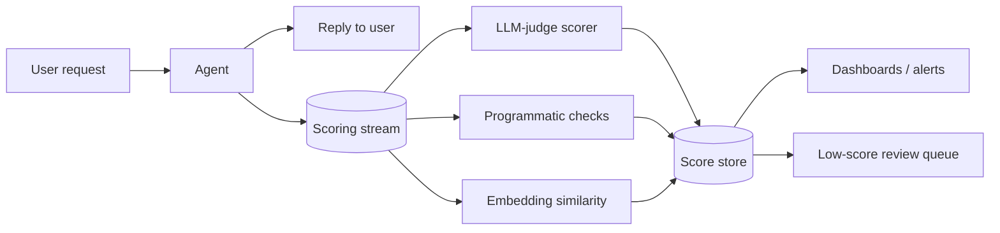

# Scorer Live Monitoring

**Also known as:** Live Evaluation, Production Scoring, Async Output Scorers

**Category:** Governance & Observability  
**Status in practice:** emerging

## Intent

Score agent outputs asynchronously in production with non-blocking scorers that observe, alert, and log but do not regenerate the output.

## Context

Production agent and workflow deployments where quality must be tracked on live traffic, but blocking the user response on a scoring call is unacceptable for latency or cost reasons.

## Problem

Pre-release evals (see eval-harness) cover known distributions, not live traffic; closed-loop evaluator-optimizer adds latency and re-runs the model on every request. There is no cheap way to keep a continuous read on production quality without either of those costs.

## Forces

- Live quality data is the only honest signal that production matches lab.
- Blocking the response on a judge model doubles latency and cost.
- Async scorers can fall behind during traffic spikes and need back-pressure.
- Open-loop scoring is informational only — the user already saw the output by the time the score lands.
- Multiple scorer kinds (LLM judge, programmatic check, embedding-similarity, rubric) emit on different timescales.

## Applicability

**Use when**

- Production quality must be observed continuously, not just at release.
- Latency budget on the user path does not allow a blocking judge call.
- Multiple scorer kinds (LLM judge, programmatic check, embedding similarity) should run side by side.

**Do not use when**

- The agent's reply must be regenerated on low score — use evaluator-optimizer.
- Pre-release coverage is sufficient and live traffic risk is low (use eval-harness alone).
- Scorer cost would dominate the budget — sample more aggressively or drop the scorer.

## Therefore

Therefore: emit each agent output onto a scoring stream that asynchronous, non-blocking scorers consume, so that production quality is monitored continuously without blocking the response or regenerating the output.

## Solution

After the agent returns to the user, publish `{request_id, input, output, context}` to a scoring stream. Independent scorer workers consume the stream and emit `{request_id, scorer, score, evidence}` records. Scorers may be LLM judges, programmatic checks, embedding-similarity to a reference, or rubric checks. Aggregate scores into dashboards and alert rules; route low scores into a re-evaluation queue rather than triggering re-generation in the user's request path. Distinct from evaluator-optimizer (which closes the loop by re-prompting on failure) and from eval-harness (which scores on a fixed set, not live traffic).

## Structure

Agent → user (fast). Agent → scoring stream → [scorer worker, scorer worker, ...] → score store → dashboard / alerting.

## Example scenario

A customer-support agent serves thousands of replies per hour. The team wants a continuous read on reply quality but cannot afford to block each reply on a judge model. They emit every reply onto a scoring stream that three workers consume: an LLM-judge scorer for helpfulness, a programmatic scorer for forbidden phrases, and an embedding-similarity scorer against a curated reference set. Scores populate a dashboard with rolling p50/p95; replies below threshold flow into a human-review queue but the user has already seen the reply. When the LLM-judge score drops sharply after a model swap, the team rolls back before the next deploy.

## Diagram

## Consequences

**Benefits**

- Continuous live-traffic quality signal without latency cost in the user path.
- Many scorer kinds can run side-by-side without contention.
- Low-score events accumulate into a review queue rather than firing in the moment.
- Cost is bounded by sampling rates per scorer.

**Liabilities**

- Open-loop: the bad output already reached the user; this pattern observes rather than corrects.
- Async scorers under traffic spikes can lag the signal by minutes.
- Judge-model scorers can drift across model versions; rubric versioning matters.
- Scorer cost can creep — sampling rates need governance.

## What this pattern constrains

Scorers do not run in the user's request path and may not modify or regenerate the agent's output; the user-visible response must not block on a scorer.

## Known uses

- **Mastra Scorers (live evaluations)** — Mastra scorers run asynchronously alongside agents and workflows, scoring outputs without blocking responses. *Available* — [link](https://mastra.ai/docs/evals/overview)
- **Langfuse / LangSmith / Helicone live evals** — Observability platforms ship live-eval / scorer features that run on traced production outputs. *Available* — [link](https://langfuse.com/docs/scores)

## Related patterns

- *complements* → [eval-harness](eval-harness.md)
- *alternative-to* → [evaluator-optimizer](evaluator-optimizer.md)
- *uses* → [llm-as-judge](llm-as-judge.md)
- *uses* → [agent-as-judge](agent-as-judge.md)
- *complements* → [shadow-canary](shadow-canary.md)

## References

- *doc*: [Mastra — Live evaluations](https://mastra.ai/docs/evals/overview) — Mastra

**Tags:** governance-observability, live-eval, scoring, mastra
