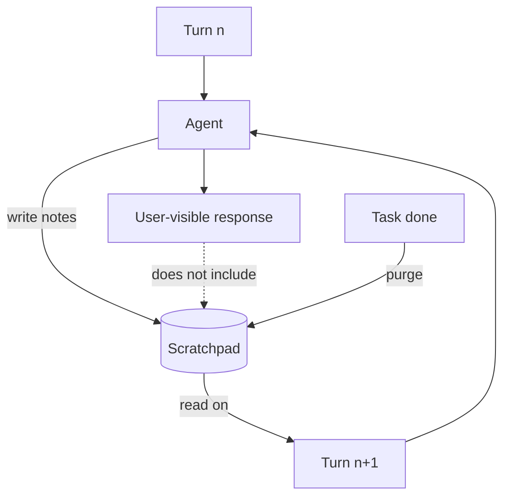

# Scratchpad

**Also known as:** Working Notes, Thinking Tool, Notepad

**Category:** Memory  
**Status in practice:** mature

## Intent

Give the agent a writable scratch space for intermediate notes that informs later turns but does not pollute the response.

## Context

An agent is working on a long task where it benefits from writing things down as it goes — intermediate computations, plans, lists of unresolved questions, candidate options it is considering. None of this scratch work is something the user should see; it is the agent's internal working surface, the equivalent of notes on a whiteboard.

## Problem

Without a dedicated scratchpad, the intermediate work has nowhere appropriate to live. Either it pollutes the user-visible response, so the user sees half-finished computations and the agent's running commentary, or it is held only in the conversation history and is lost the moment that history gets trimmed. Either way the agent loses the artifact that was supposed to support its own reasoning, and the user is forced to read through clutter that was never meant for them.

## Forces

- Scratchpad content adds tokens to subsequent turns.
- What stays in the scratchpad vs the response is a UX choice.
- Scratchpad content can leak via traces.

## Therefore

Therefore: give the agent a separate writable surface for intermediate notes that informs later turns but is not shown to the user, so that working notes can be messy without polluting the response.

## Solution

Provide a tool or convention for writing to a scratchpad (a section of the prompt, a tool call, a file). The agent reads from and writes to it across turns. The user-visible response is separate. The scratchpad is purged at task completion or expires with the session.

## Diagram

## Example scenario

A research agent that has to read ten papers and answer one question keeps repeating itself in the visible response because every intermediate note is also output to the user. The team adds a scratchpad tool: the agent writes intermediate notes to a private buffer it can reread on later turns; the user-visible response is composed at the end. Responses become tight while the agent's working memory stays rich.

## Consequences

**Benefits**

- Intermediate work persists without cluttering output.
- Useful for chain-of-thought style reasoning that should not be visible.

**Liabilities**

- Token cost grows with scratchpad size.
- Scratchpad becomes shadow state if not purged.

## What this pattern constrains

Scratchpad contents are visible only to the agent loop; user-facing output draws from the response slot.

## Applicability

**Use when**

- Long tasks benefit from intermediate notes that should not appear in user output.
- The agent needs to carry computations or unresolved questions across turns.
- A separate writable space (tool, file, prompt section) can be added.

**Do not use when**

- Tasks are short and intermediate state fits in one inference.
- Mixing intermediate notes with output would not actually pollute UX.
- The scratchpad would never be purged and would grow unbounded.

## Components

- Scratchpad surface — a private buffer (prompt section, tool-backed file, or hidden block) the agent reads and writes
- Write interface — convention or tool call that places intermediate notes onto the scratchpad without emitting them to the user
- Read injector — adds scratchpad contents into subsequent turns' prompts so notes inform later reasoning
- Response separator — keeps user-visible output disjoint from the scratchpad slot
- Purge policy — clears the scratchpad at task completion or session end so it does not become shadow state

## Tools

- Hidden thinking surface — Anthropic <thinking> blocks, OpenAI reasoning channels, or an explicit scratchpad tool
- File or KV scratch store — when notes need to span more turns than fit in a prompt section

## Evaluation metrics

- Response cleanliness — user-facing output free of intermediate notes, measured against a rubric
- Carry-forward usefulness — fraction of scratchpad notes the agent meaningfully consults on a later turn
- Scratchpad token overhead — tokens added per turn by reading the scratchpad back
- Shadow-state incidents — cases where an unpurged scratchpad polluted a fresh task
- Leak rate — scratchpad content that escaped into traces, logs, or the user-visible response

## Known uses

- **OpenAI o1-style internal reasoning** _available_
- **Anthropic <thinking> blocks** _available_
- **[Anthropic Claude "think" tool](https://www.anthropic.com/engineering/claude-think-tool)** _available_ — Gives the model a designated scratchpad space for an additional thinking step as part of reaching its answer.
- **[Anthropic Claude Extended Thinking](https://platform.claude.com/docs/en/build-with-claude/extended-thinking)** _available_ — Emits dedicated thinking content blocks the model reasons in before crafting a final response.

## Related patterns

- _complements_ **Short-Term Thread Memory**
- _uses_ **Chain of Thought**
- _complements_ **Extended Thinking**
- _generalises_ **Todo-List-Driven Autonomous Agent**
- _alternative-to_ **Preoccupation Tracking**
- _alternative-to_ **BDI Agent**
- _complements_ **Filesystem as Context**
- _alternative-to_ **Unstructured Human Capture Layer** — A scratchpad is the agent's own writable working space, purged at task end; the dump layer is human-authored, durable, and read-only to the agent.

## References

- [Show Your Work: Scratchpads for Intermediate Computation with Language Models](https://arxiv.org/abs/2112.00114) — Nye et al., 2021
