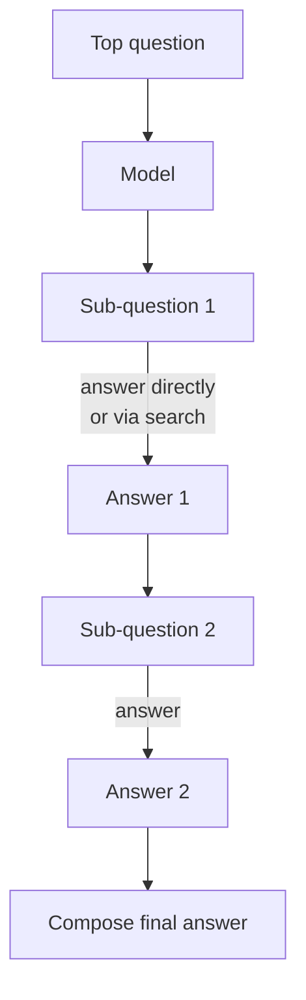

# Self-Ask

**Also known as:** Decompose-Ask, Sub-Question Prompting

**Category:** Reasoning  
**Status in practice:** mature

## Intent

Have the model emit explicit follow-up sub-questions, answer them (optionally via search), then compose the final answer.

## Context

A team is using a model on questions whose answer requires chaining several known facts together. For example, 'which of the founder's PhD advisors won a Turing Award?' depends on first knowing who founded the organisation, then who that person's PhD advisors were, then which awards each of those advisors won. The model can answer each individual hop correctly when asked in isolation, but when the question is posed as a single sentence it tends to return the wrong endpoint.

## Problem

Knowing each fact and being able to chain those facts together inside a single inference are different skills; this gap between them is the so-called compositionality gap. Without scaffolding, the model collapses the chain into a single step and either invents an answer or returns the wrong endpoint. Plain chain-of-thought helps a little, but the reasoning steps are not framed as questions, so the model cannot offload any of them to a search tool, and a human reader cannot easily inspect where in the chain the model went wrong.

## Forces

- Sub-question quality bounds the answer quality.
- Sub-question slots invite tool integration but add latency.
- Excessive decomposition wastes calls.

## Applicability

**Use when**

- The task is multi-hop and the model knows each hop in isolation.
- Compositionality gaps cause the model to skip combining facts.
- Sub-questions can be answered by the model or a search tool.

**Do not use when**

- Single-hop questions where decomposition adds latency without lift.
- The sub-questions cannot be answered cleanly and would compound errors.
- Latency budget cannot afford the extra inference per sub-question.

## Therefore

Therefore: have the model interleave explicit follow-up sub-questions and their answers before composing the final answer, so that decomposition is visible and each step is independently tool-able.

## Solution

Prompt the model to interleave sub-questions and their answers. Each sub-question is either answered by the model directly or by a search tool. The final answer is composed once all sub-questions are answered.

## Variants

- **Self-Ask (model-only)** — Sub-questions are answered by the same model from its parametric memory.
- **Self-Ask + Search** — Each sub-question is delegated to a web/search tool whose answer is spliced back into the trace.
- **Self-Ask + RAG** — Sub-questions are answered by a retrieval pipeline over a private corpus rather than the open web.

## Example scenario

A QA agent fails on multi-hop questions like 'which of the founder's PhD advisors won a Turing Award?' even though it knows each fact. The team prompts it to emit explicit follow-up sub-questions ('who was the founder's PhD advisor?', 'did that person win a Turing Award?'), answer each via search, then compose. Multi-hop accuracy jumps because the compositionality gap is closed by externalising the steps the model otherwise short-circuits.

## Diagram

## Consequences

**Benefits**

- Bridges CoT and tool-using agents naturally.
- Decomposition is lexical and inspectable.

**Liabilities**

- Latency: N sub-question calls per question.
- Sub-questions can drift from the original.

## What this pattern constrains

Sub-question slots are the only insertion point for retrieval or tool calls; the agent cannot retrieve except through a sub-question.

## Known uses

- **Self-Ask + Search** — *Available*

## Related patterns

- *generalises* → [react](react.md)
- *complements* → [least-to-most](least-to-most.md)

## References

- (paper) Press, Zhang, Min, Schmidt, Smith, Lewis, *Measuring and Narrowing the Compositionality Gap in Language Models*, 2022, <https://arxiv.org/abs/2210.03350>

**Tags:** reasoning, decomposition, multi-hop
