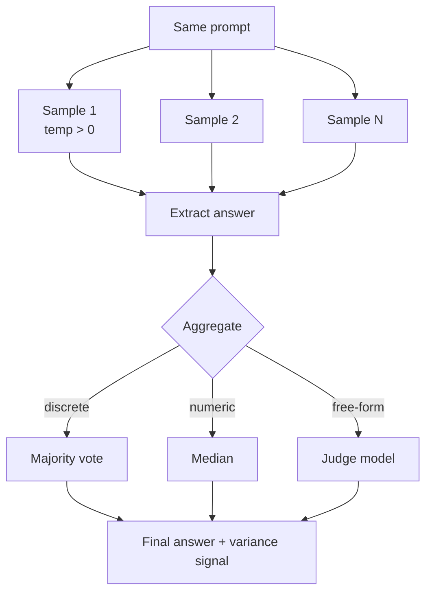

# Self-Consistency

**Also known as:** Sample-and-Vote, Empirical Introspection, Marginalised Reasoning

**Category:** Verification & Reflection  
**Status in practice:** mature

## Intent

Sample the same question multiple times at non-zero temperature and aggregate by majority or judge to mitigate hallucination.

## Context

Reasoning-heavy questions where the model is mostly right but sometimes invents a different chain.

## Problem

A single sample at zero temperature gives the most likely chain; sampling and voting often outperforms it because the right answer is the one most chains converge on.

## Forces

- N samples cost N times more.
- Aggregation logic depends on whether the answer is a class, a number, or free text.
- Variance is itself signal: a high-variance question is one the model is uncertain on.

## Applicability

**Use when**

- Reasoning-heavy questions where the model is mostly right but sometimes invents a wrong chain.
- Answers are extractable in a comparable form (discrete, numeric, or judgeable).
- Cost of N samples is acceptable relative to the quality lift.

**Do not use when**

- The task is deterministic and zero-temperature already wins.
- Answers are free-form and no aggregator (vote, judge) is available.
- Latency budget cannot afford N parallel samples.

## Solution

Run the same prompt N times with non-zero temperature. Extract the answer from each. Aggregate: majority vote for discrete answers, median for numeric, judge for free-form. Variance across samples is logged as a confidence signal.

## Example scenario

A math-tutoring agent at zero temperature gives one wrong answer per ten problems and is confidently wrong every time. The team samples each problem five times at temperature 0.7, extracts the numeric answer from each, and majority-votes. The right answer is the one most chains converge on; variance across samples becomes a useful 'unsure' signal. Per-problem cost is five times higher, but accuracy on the long-tail of tricky problems climbs noticeably.

## Diagram

## Consequences

**Benefits**

- Higher accuracy on reasoning benchmarks at moderate cost.
- Variance is a free uncertainty estimate.

**Liabilities**

- Linear cost scaling.
- Free-form aggregation needs a judge model.

## What this pattern constrains

The final answer is the aggregate, not any single sample; individual samples have no authority.

## Known uses

- **Sparrot** — *Available*. introspect(question, samples, temperature) tool.
- **Chain-of-Thought + Self-Consistency benchmarks** — *Available*

## Related patterns

- *specialises* → [parallelization](parallelization.md)
- *alternative-to* → [best-of-n](best-of-n.md)
- *complements* → [debate](debate.md)
- *used-by* → [confidence-reporting](confidence-reporting.md)
- *specialises* → [test-time-compute-scaling](test-time-compute-scaling.md)
- *complements* → [lats](lats.md)
- *alternative-to* → [map-reduce](map-reduce.md)
- *complements* → [chain-of-thought](chain-of-thought.md)
- *complements* → [chain-of-verification](chain-of-verification.md)
- *complements* → [star-bootstrapping](star-bootstrapping.md)

## References

- (paper) Wang, Wei, Schuurmans, Le, Chi, Narang, Chowdhery, Zhou, *Self-Consistency Improves Chain of Thought Reasoning in Language Models*, 2022, <https://arxiv.org/abs/2203.11171>

**Tags:** sampling, voting, uncertainty
