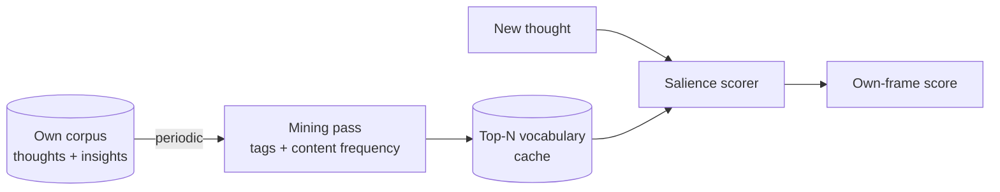

# Self-Corpus Vocabulary

**Also known as:** Personal-Concept Lexicon, Own-Writing Lexicon

**Category:** Memory
**Status in practice:** experimental

## Intent

Mine a small bounded vocabulary from the agent's own writing and cache it as the conceptual axis for scoring new thoughts, so relevance reflects the agent's actual frame rather than a generic embedding space.

## Context

A long-running agent accumulates a corpus of its own output: thought traces, insights, journal entries, notes. Some downstream component wants to score new thoughts for relevance, novelty, or kinship with the agent's existing concerns. The default tool is a generic embedding space, which gives a sensible answer about semantic similarity but tells the agent nothing about its own preoccupations — 'is the agent still pulling at the things it has been pulling at?' is a different question from 'is this semantically close to the previous paragraph?'

## Problem

Generic embeddings score against the world's distribution of meaning, not the agent's. A new thought that lands inside the agent's persistent web of concerns can come back with the same similarity score as a perfectly off-topic but topically-adjacent one, because the embedding space has no notion of what this particular agent has been writing about for months. The result is a salience signal that is plausible-on-paper and indifferent in practice: the agent cannot tell, from the score alone, whether a thought is on its own line of inquiry or just somewhere in the same neighbourhood.

## Forces

- The agent's own corpus is the only source that knows its frame.
- Vocabularies that grow unbounded become a different problem (everything matches).
- The vocabulary must refresh as the agent's frame shifts.
- Mining must be cheap or it cannot run on a schedule.
- Storage must survive across sessions, like the corpus it derives from.

## Therefore

Therefore: periodically mine a small top-N concept vocabulary from the agent's own thoughts and insights — using a mix of frontmatter tags and content frequency — cache it to disk, and refresh on a schedule, so scoring new thoughts can use this learned axis alongside generic similarity.

## Solution

Run a periodic mining pass over the agent's own corpus (e.g. last N weeks of thoughts plus the long-term insight store). Aggregate frontmatter tags and content frequency to extract the top-N concept tokens with weights. Persist this vocabulary as a small JSON cache. Downstream scoring components consume the cache as an additional axis: a thought is scored both on generic embedding similarity to recent context and on overlap with the cached self-vocabulary. Refresh on a cadence proportional to corpus volatility (e.g. weekly for a stable agent, after every dream-consolidation cycle for a more volatile one).

## Example scenario

An agent has been journalling for three months. Once a week, a mining job aggregates frontmatter tags and high-frequency content tokens across recent thoughts and the long-term insight store, picks the top thirty concepts with weights, and writes them to a small JSON cache. When the agent receives a new thought, the salience scorer combines generic embedding distance to recent context with overlap against the cached vocabulary. A thought that uses three of the top-thirty concepts scores higher than a thought with similar embedding distance but no overlap, because the cached vocabulary says 'this is on the line of inquiry'.

## Diagram

*Periodic mining derives a self-vocabulary; downstream scoring uses it as an additional axis alongside generic similarity.*

## Consequences

**Benefits**

- Relevance scoring becomes sensitive to the agent's own frame.
- Vocabulary changes are visible and auditable — operators can see what the agent is currently 'about'.
- Small footprint (top-N tokens) is cheap to load and use.

**Liabilities**

- Frame lock-in: a stale vocabulary reinforces what the agent already knows at the expense of new directions.
- Mining is opinionated; tag-vs-frequency weighting is a tuning knob.
- If the corpus is too small the vocabulary is noisy.

## What this pattern constrains

Scoring components cannot use only the generic embedding space for own-frame relevance; the agent's learned vocabulary must be available as a separate axis so generic similarity does not displace own-frame fit.

## Applicability

**Use when**

- The agent has an own-writing corpus large enough to mine (weeks of thoughts).
- Downstream scoring needs an own-frame axis beyond generic similarity.
- Refresh cadence is feasible on the deployment's compute budget.

**Do not use when**

- The agent is short-lived and has no accumulating corpus.
- Generic semantic similarity is sufficient for the salience use case.
- Strong frame lock-in would harm exploration more than it helps relevance.

## Known uses

- **Author's long-running personal agent (single private deployment)** — *Available* — Single-source evidence: one private deployment by the catalog author; no independently documented use yet.

## Related patterns

- *complements* → [vector-memory](vector-memory.md)
- *complements* → [cluster-capped-insight-store](cluster-capped-insight-store.md)
- *complements* → [salience-attention-mechanism](salience-attention-mechanism.md)
- *complements* → [dream-consolidation-cycle](dream-consolidation-cycle.md)

## References

- (paper) *A statistical interpretation of term specificity and its application in retrieval*, 1972, <https://www.emerald.com/insight/content/doi/10.1108/eb026526/full/html>
- (paper) *BERTopic: Neural topic modeling with a class-based TF-IDF procedure*, 2022, <https://arxiv.org/abs/2203.05794>

**Tags:** memory, vocabulary, personalisation, salience
