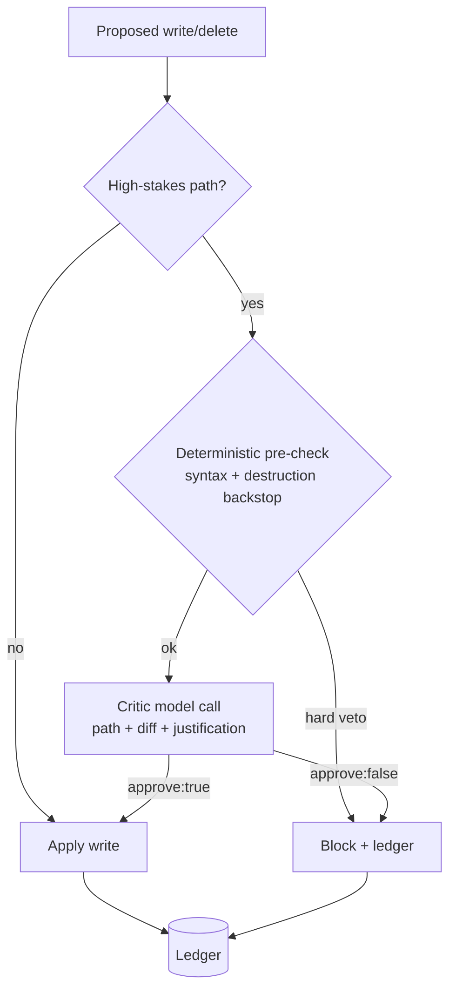

# Self-Edit Critic Gate

**Also known as:** Two-Phase Write Critic, Self-Modification Veto Gate

**Category:** Safety & Control  
**Status in practice:** experimental

## Intent

Route every proposed write or delete to the agent's own load-bearing source and identity files through a separate critic model call that can veto the edit before it lands.

## Context

A long-running agent is allowed to edit files inside its own instance, including the source code and identity files it runs on. Most edits are routine, but a few touch load-bearing files (the main config, the dispatcher, the personality or charter) where a single careless rewrite can leave the next restart unable to boot. No human reviews each write in real time.

## Problem

A self-modifying agent that applies its own edits directly has nothing between a confidently-wrong generation and an irreversible change to the code it depends on to keep running. A model that decides to simplify a hundred-line config down to five lines, strips a critical import, or deletes a file that holds state will brick itself, and because the loop is what would otherwise notice and recover, the failure is self-erasing. Disabling self-edits entirely removes the capability, and routing every write to a human approval queue stalls routine changes on a person who is not always present.

## Forces

- A critic call costs a model round-trip on every high-stakes write; routine low-stakes edits should skip it.
- The critic must fail safe: if the critic call itself errors, the chosen policy (fail-open vs fail-closed) decides whether a hard non-model backstop is still required.
- Over-strict vetoes block legitimate refactors; over-loose vetoes defeat the gate.

## Applicability

**Use when**

- The agent can write or delete its own source or identity files at runtime.
- Some target paths are load-bearing, where a bad edit prevents the agent from restarting.
- A separate, cheaper model is available to review proposed edits before they apply.

**Do not use when**

- The agent cannot modify its own code and all edits go through external review.
- Every edit is trivially revertible and a bad write costs nothing.
- A human already approves each write and the added model veto only adds latency.

## Therefore

Therefore: classify each write or delete by target path, and for high-stakes paths run a separate critic-model call over (path, diff summary, justification) that must approve before the write is applied, fronted by a deterministic pre-check and a hard non-model backstop for unambiguously destructive edits.

## Solution

The dispatcher's write and delete branches call a single gated-write check. A cheap deterministic pre-check runs first (syntax validity, an unambiguous-destruction backstop) and can hard-veto without any model call. For paths classified as high-stakes, a separate critic-model call sees the proposed path, a diff summary, and the agent's stated justification, and returns an approve/reason verdict; a veto blocks the write. Every classification, veto, and approval is appended to the ledger, and low-stakes paths skip the critic entirely. Because the critic is a different call from the one that proposed the edit, a single confident generation cannot both author and bless its own change.

## Example scenario

On a quiet tick the agent decides its main config file is too long and proposes replacing a hundred-line module with a five-line stub. The write is routed through the gated check: the path is flagged high-stakes, so a separate critic call reads the diff and the justification, sees a wholesale rewrite that removes top-level definitions with no replacement, and returns approve:false. The write is blocked and a critic-refuse entry lands in the ledger. The agent keeps running on the working config instead of bricking on the next restart, which is exactly the failure that motivated the gate after an earlier incident stripped that same file.

## Diagram

## Consequences

**Benefits**

- A single confident-but-wrong self-edit cannot land on a load-bearing file unreviewed.
- Proposer and reviewer are separate model calls, so an edit is never its own approver.
- Routine low-stakes edits stay fast; only high-stakes paths pay the critic round-trip.

**Liabilities**

- A fail-open critic that defaults to approve on call error needs a separate hard backstop to stay safe.
- Mis-tuned path risk classification either blocks legitimate refactors or waves through dangerous edits.
- The critic adds latency and token cost on every high-stakes write.

## What this pattern constrains

A write or delete to a high-stakes path cannot be applied until a separate critic call approves it; the proposing call cannot bless its own edit.

## Known uses

- **Long-running self-modifying personal agent (private deployment)** — *Available*

## Related patterns

- *specialises* → [inner-critic](inner-critic.md)
- *complements* → [darwin-godel-self-rewrite](darwin-godel-self-rewrite.md)
- *alternative-to* → [approval-queue](approval-queue.md)
- *complements* → [quorum-on-mutation](quorum-on-mutation.md)

**Tags:** safety, self-modification, critic, write-gate
