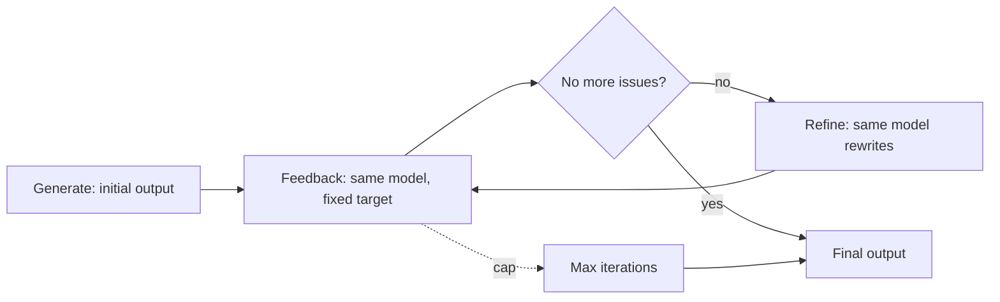

# Self-Refine

**Also known as:** Iterative Self-Feedback

**Category:** Verification & Reflection  
**Status in practice:** mature

## Intent

Iterate generate → feedback (same model) → refine until a stop criterion fires, with no separate critic model.

## Context

Generation tasks where the same model can produce useful self-feedback against an explicit improvement target.

## Problem

One-shot generation under-uses the model; calling for explicit critique-and-revise from the same model raises quality at modest cost.

## Forces

- Same-model critique inherits the model's blind spots.
- Termination criterion is its own design.
- Cost grows linearly with iterations.

## Applicability

**Use when**

- The same model can produce useful self-feedback against an explicit improvement target.
- One-shot generation under-uses the model and quality matters.
- Cost of a few extra refine turns is acceptable.

**Do not use when**

- A different model family is available and would give independent critique.
- The model's self-feedback is known to be unreliable on this task.
- Latency budget forbids multiple refine passes.

## Therefore

Therefore: assign generate, feedback, and refine as three distinct roles on the same model with a fixed stop criterion, so that single-model self-correction stays bounded instead of looping indefinitely.

## Solution

Three roles, one model. (1) Generate: produce initial output. (2) Feedback: same model returns concrete improvement points against a fixed target. (3) Refine: same model rewrites using the feedback. Repeat until the model says 'no more issues' or max iterations.

## Example scenario

A coding agent writes a function that compiles but uses an awkward API surface. Running through a Self-Refine loop where the same model produces concrete improvement points against a checklist (clarity, names, error handling), then refines, yields a noticeably cleaner function in the second pass. The team caps it at three iterations or a no-op feedback signal, accepting that self-critique catches surface issues only and not deep correctness bugs.

## Diagram

## Consequences

**Benefits**

- Quality improvement on tasks with measurable targets.
- Same-model loop is simple to deploy.

**Liabilities**

- Reinforces same-model blind spots (Reflexion replication studies).
- Diminishing returns after 2-3 iterations.

## What this pattern constrains

Feedback must conform to the chosen target; revisions must address the most recent feedback.

## Known uses

- **Self-Refine paper benchmarks (math, code, dialog)** — *Available*

## Related patterns

- *specialises* → [reflection](reflection.md)
- *alternative-to* → [evaluator-optimizer](evaluator-optimizer.md)
- *conflicts-with* → [same-model-self-critique](same-model-self-critique.md) — Self-Refine is the well-engineered version of the failure mode same-model-self-critique describes.

## References

- (paper) Madaan, Tandon, Gupta, Hallinan, Gao, Wiegreffe, Alon, Dziri, Prabhumoye, Yang, Welleck, Majumder, Gupta, Yazdanbakhsh, Clark, *Self-Refine: Iterative Refinement with Self-Feedback*, 2023, <https://arxiv.org/abs/2303.17651>
- (paper) Yue Liu, Sin Kit Lo, Qinghua Lu, Liming Zhu, Dehai Zhao, Xiwei Xu, Stefan Harrer, Jon Whittle, *Agent design pattern catalogue: A collection of architectural patterns for foundation model based agents* (2025) — https://doi.org/10.1016/j.jss.2024.112278

**Tags:** reflection, iterative, self-feedback
