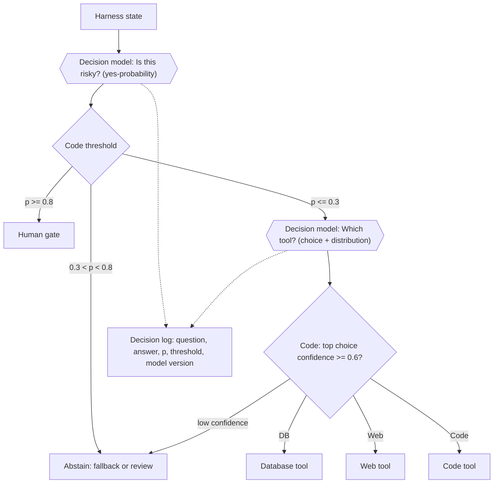

# Semantic Decision Node

**Also known as:** Bounded Semantic Decision, Probabilistic Branch Condition, Smart If, System One Decision Call, Decision Model in the Harness

**Category:** Routing & Composition  
**Status in practice:** emerging

## Intent

Place a small decision model at a branch point in harness-owned control flow, have it answer one declared question as a typed probability, and let code apply the threshold and take the branch.

## Context

An agent harness is full of narrow judgements that code cannot write as rules: is this request risky, is this tool output an injection attempt, which of four tools fits this step, is the draft on topic. Each one decides which path the run takes next. The control flow around those judgements, meaning the tree, the graph or the state machine, is already explicit code that the team reviews and versions. Since 2026 there are models built only for this job; the San Francisco lab TypeSafe, which came out of stealth in September 2026, ships Jev as a 'System One' model that returns typed choices, scores and yes/no probabilities instead of text.

## Problem

When a general-purpose LLM is asked to make these branch decisions, the decision and the branch fuse into one generated answer. The model may name an option outside the allowed set, phrase its answer so that parsing it is itself a judgement, or state high certainty on a coin-flip. The threshold that decides when to act, when to ask a human and when to fall back sits implicitly inside the prompt, where it cannot be reviewed, tuned per model version or audited afterwards. The call also costs frontier-model latency and price for a question whose answer is a single bit, and in a harness that asks dozens of such questions per turn that cost dominates. Writing the conditions as hard-coded rules instead fails on exactly the fuzzy inputs that made a model necessary.

## Forces

- The branch structure should be explicit, reviewable code, yet some branch conditions are semantic and cannot be written as rules.
- A decision is only actionable if its answer is guaranteed to be one of the declared options, not a sentence that has to be interpreted.
- A probability is only useful for thresholding if it is calibrated; a confident score that is wrong at the same rate as an unsure one is worse than no score.
- Harnesses ask many narrow questions per turn, so each decision has to cost milliseconds and fractions of a cent rather than a frontier-model call.
- One question that bundles several criteria is harder to calibrate and debug than several independent questions whose answers code combines.

## Therefore

Therefore: keep the tree or graph in code, and at each fuzzy node ask a small decision model exactly one declared question over the current state, receive a typed answer with a probability or distribution, and let code compare it against a versioned threshold that picks the branch, including an abstain branch for the uncertain middle.

## Solution

Declare each branch condition as a question with a fixed answer type: a yes/no probability, a choice from a closed set with a distribution over the options, or a score on declared levels. At the node, send the current state and the question to a decision model whose output is constrained to that type, so an answer outside the schema cannot occur. The model returns the answer, the probability or distribution, and a confidence; it never names the next step. Code holds the thresholds, kept in one reviewed file next to the questions and keyed by the model version that answered, and maps the result onto the branches: act above a high threshold, route to a human or a fallback in the uncertain band, take the other branch below a low one. A compound judgement is split into orthogonal questions answered independently over the same state, so one answer never becomes context for another, and code composes them. Every decision is logged with the question, the answer, the probability, the threshold and the model version, so a wrong branch can be traced to a wrong answer or a wrong threshold. Thresholds are tuned on labelled traffic as coverage-against-accuracy curves rather than set once by intuition.

## Structure

```
Harness control flow (tree / graph / state machine, in code) -> fuzzy node -> decision model(state, declared question) -> typed answer {choice | score | yes-probability} + confidence -> code threshold (versioned, per model version) -> branch A | abstain -> human or fallback | branch B -> decision log.
```

## Diagram



*The tree belongs to the harness; the decision model only answers the fuzzy questions at its nodes, and code applies the thresholds, including an abstain band for the uncertain middle.*

## Example scenario

A support agent has to decide whether each incoming message is a billing question, a bug report or something else, and whether it contains a refund demand. Instead of asking the main model in a prompt, the harness asks a small decision model two separate questions and gets back, say, billing at 0.93 and refund demand at 0.41. The code sends the ticket to the billing lane because 0.93 clears the 0.8 threshold, and flags it for a person because 0.41 falls in the uncertain band between 0.3 and 0.7.

## Consequences

**Benefits**

- The control flow stays readable code; only the branch conditions that need judgement are delegated, and each one is a named, testable question.
- Typed, schema-constrained answers remove the parsing step and the out-of-set answer as failure classes.
- Moving thresholds into code makes the act, ask and fall-back boundaries reviewable, tunable and auditable, and lets them change when the model version changes.
- A small dedicated decision model answers in around a hundred milliseconds at a small fraction of frontier cost, so a harness can afford many decisions per turn.
- Orthogonal questions composed in code are easier to calibrate and debug than one bundled prompt.

**Liabilities**

- The pattern is only as good as the calibration: a probability that is not calibrated on this traffic turns every threshold into a guess.
- A high confidence means the model applied the question as written, including a badly written question, so question design becomes a new source of defects.
- Decision models built for local text judgements do poorly on questions that require predicting another model's behaviour or reasoning across many steps, and the harness has no signal that it asked such a question.
- Each question and threshold pair is a new artefact to version, test and re-tune on every model upgrade.

## Failure modes

- A probability is wired directly to a side effect with no abstain band, so a 0.51 answer performs an irreversible action.
- Low scores are treated as safe: the bottom bucket of an injection or risk classifier still contains real positives, and the harness passes them through unchecked.
- Thresholds tuned for one model version are kept after the provider silently upgrades the model, and the branch rates drift.
- Several criteria are packed into one question, the answer is well-calibrated for none of them, and the false-positive rate climbs.
- The node is asked a question beyond local text judgement, such as which model will fail on this task, and returns a confident answer no better than chance.

## What this pattern constrains

The decision model only answers a declared question with a typed value and probability: it must not choose or name the branch, call tools or produce free text, and the threshold that turns its answer into a branch lives only in versioned code.

## Applicability

**Use when**

- The harness control flow is explicit code and some branch conditions need semantic judgement that rules cannot express.
- The decision has a closed answer set: yes or no, one of a fixed list, or a position on a declared scale.
- Many such decisions happen per turn or per item, so latency and cost per decision matter.
- The team needs to review, audit and tune the thresholds that decide when the agent acts, asks or falls back.

**Do not use when**

- The step needs generated text, code, explanations or arithmetic rather than a choice among declared options.
- The question requires reasoning across many steps or predicting another model's behaviour, where small decision models perform near chance.
- No labelled traffic exists to tune thresholds and the decision drives an irreversible action.
- A deterministic rule or a lookup answers the question exactly, which is cheaper and fully auditable.

## Components

- Harness control flow — the tree, graph or state machine in code that owns every branch
- Declared question — one criterion with a fixed answer type: yes/no probability, closed choice or scored level
- Decision model — a small, schema-constrained model that returns the typed answer, its probability or distribution and a confidence, and nothing else
- Threshold table — versioned code mapping answers to branches, keyed by the model version that answered
- Abstain branch — the route for answers in the uncertain band, usually a human or a fallback handler
- Decision log — records question, answer, probability, threshold and model version for every decision

## Tools

- TypeSafe Jev — decision model returning Choice, Score and Noul answers with calibrated probabilities through a REST API and Python and JavaScript SDKs
- Vercel AI SDK TypeSafe provider — exposes Jev decisions inside TypeScript agent harnesses
- Semantic Router — embedding-similarity routing with a configurable score threshold for closed route sets
- Constrained decoding with token log-probabilities — the do-it-yourself version on a general model, restricting output to the option tokens and reading their probabilities
- Calibration tooling — reliability diagrams and coverage-against-accuracy curves for choosing thresholds on labelled traffic

## Evaluation metrics

- Expected calibration error — gap between stated probability and observed accuracy, per question
- Coverage at target accuracy — share of decisions taken automatically while accuracy stays above the required level
- Abstain rate — share of decisions sent to the uncertain band, which prices the human or fallback load
- Low-score miss rate — real positives found in the lowest probability bucket, the risk that low scores are wrongly treated as safe
- Decision latency and cost per call — whether the node is cheap enough for the number of decisions per turn
- Branch-rate drift across model versions — change in how often each branch fires after a model upgrade

## Known uses

- **[TypeSafe AI Jev](https://docs.typesafe.ai/)** _available_ — Decision model from TypeSafe AI, a San Francisco lab that came out of stealth on 15 September 2026. Jev takes a text state and declared questions of three shapes, Choice, Score and Noul (a yes/no probability), and returns typed answers with probabilities and confidence that application code thresholds; questions over the same state are evaluated independently.
- **[Semantic Router (Aurelio AI)](https://github.com/aurelio-labs/semantic-router)** _available_ — Embedding-based variant: routes are sets of example utterances, a query is scored against them in vector space, and a route is returned only when its score clears a configurable threshold, otherwise none, leaving the branch to application code.
- **[Vercel AI SDK TypeSafe provider](https://registry.npmjs.org/@ai-sdk/typesafe-ai)** _available_ — The @ai-sdk/typesafe-ai provider package exposes Jev decisions to TypeScript harnesses built on the AI SDK.

## Related patterns

- _generalises_ **Routing** — Routing classifies an incoming request once and dispatches it to a lane; a semantic decision node is the same mechanism placed at any branch point inside the harness, with the probability exposed and the threshold held in code.
- _complements_ **LLM as Periphery** — Periphery keeps state and transitions in deterministic code and uses the model at the edges; a semantic decision node is the typed, probabilistic form of the classification edge that architecture calls for.
- _composes-with_ **Agentic Behavior Tree** — A behavior tree supplies the explicit selectors and sequences; semantic decision nodes supply the condition leaves whose truth needs judgement, returning a probability that the tree thresholds into success or failure.
- _complements_ **Stochastic-Deterministic Boundary (SDB)** — The decision model is the proposer and the code threshold is the verifier; the abstain band is the structured reject signal.
- _complements_ **Calibrated Help-Gate via Conformal Prediction** — Conformal prediction gives a principled way to set the abstain band: ask for help whenever the calibrated prediction set is not a single option.
- _complements_ **Complexity-Based Routing** — A complexity classifier is one semantic decision node; benchmarks of decision models show this particular question, which asks the model to predict another model's failures, is among the hardest to answer from local text.
- _complements_ **Hybrid Symbolic-Neural Routing** — Symbolic rules handle the conditions that can be written down; semantic decision nodes handle the rest inside the same code-owned structure.
- _complements_ **Cost-Aware Action Delegation** — Classifying an action as read-only, reversible or destructive is a typical semantic decision node; the tiered approval policy is the code that consumes its answer.
- _complements_ **Confidence Reporting** — Confidence reporting surfaces uncertainty to a human reader; here the probability is consumed by code, which is why it must be calibrated rather than merely stated.
- _uses_ **Structured Output** — The typed answer schema is structured output taken to its limit: a closed set of options plus a probability, with no free text.
- _complements_ **False Confidence Syndrome** — The anti-pattern this node is most exposed to; calibrated training and threshold curves tuned on labelled traffic are the defence.
- _complements_ **Human-in-the-Loop** — The abstain band between the two thresholds is where a human approval step belongs.

## References

- [TypeSafe documentation (Jev)](https://docs.typesafe.ai/) — 2026
- [A deep dive into Jev, TypeSafe's System One model](https://flaviocopes.com/jev/) — Flavio Copes, 2026
- [Benchmarking Jev: what a decision model can (and can't) do in an agent harness](https://dev.to/aitejiu/benchmarking-jev-what-a-decision-model-can-and-cant-do-in-an-agent-harness-20po) — 2026
- [Small Language Models are the Future of Agentic AI](https://arxiv.org/abs/2506.02153) — Peter Belcak, Greg Heinrich, Shizhe Diao, Yonggan Fu, et al., 2025
- [Language Models (Mostly) Know What They Know](https://arxiv.org/abs/2207.05221) — Saurav Kadavath, Tom Conerly, Amanda Askell, Tom Henighan, et al., 2022
- [Just Ask for Calibration: Strategies for Eliciting Calibrated Confidence Scores from Language Models Fine-Tuned with Human Feedback](https://arxiv.org/abs/2305.14975) — Katherine Tian, Eric Mitchell, Allan Zhou, Archit Sharma, et al., 2023
- [Selective Classification for Deep Neural Networks](https://arxiv.org/abs/1705.08500) — Yonatan Geifman, Ran El-Yaniv, 2017
