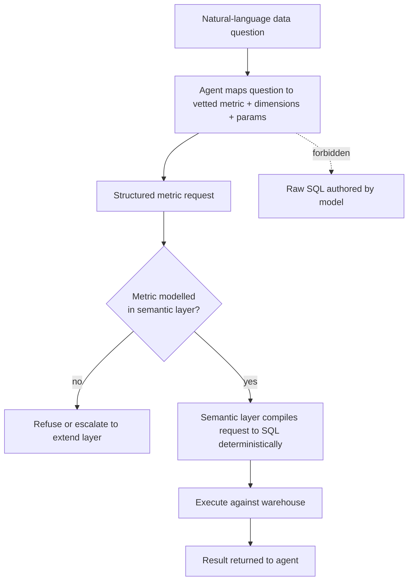

# Semantic-Layer Query Guardrail

**Also known as:** Semantic-Layer SQL Guardrail, Metric-Layer Query Routing, Vetted-Metric Query Guardrail

**Category:** Tool Use & Environment  
**Status in practice:** emerging

## Intent

Route natural-language data questions through a curated semantic layer so the model selects and parameterises vetted metrics and dimensions instead of free-authoring raw SQL against production data.

## Context

An agent answers natural-language questions over a production data warehouse — revenue last quarter, active users by region, churn for a cohort. Free-form text-to-SQL is the obvious mechanism, but in practice it rarely survives contact with a real schema: column names are cryptic, business terms are organisation-specific, and the same word means different things to different teams. A separate semantic layer — a metric store such as a dbt Semantic Layer, LookML, or Cube model — already encodes the vetted definitions of each metric and dimension and can compile a metric request into correct SQL on its own.

## Problem

Natural language is ambiguous and business terminology is domain-specific, so the model does not know what a particular organisation means by revenue or active user, and a text-to-SQL system that lets the model author raw SQL will silently pick the wrong column, the wrong join, or the wrong filter and return a confidently incorrect number. Letting the model write arbitrary SQL against production also widens the action surface to every table the credential can reach. The system needs the model's language understanding to map the question onto a metric, without granting it the authority to define what that metric is or to author the query that computes it.

## Forces

- Free-form text-to-SQL covers any question the schema can express, but a single misread column or join yields a wrong answer that looks authoritative and is hard to catch.
- Business definitions such as revenue or active user are organisation-specific and change over time; encoding them once in a shared layer is correct, while re-deriving them in each generated query is fragile.
- Arbitrary model-authored SQL against production widens the blast radius to every table the credential can read; a fixed catalogue of metrics narrows it.
- A semantic layer must be modelled and maintained up front, which is real work and cannot answer a question whose metric nobody has defined yet.

## Therefore

Therefore: place a curated semantic layer between the question and execution so the model maps the question onto a vetted metric and its parameters, and the layer — not the model — deterministically compiles and runs the SQL.

## Solution

Model the metrics, dimensions, and business definitions once in a semantic layer and expose querying it as the agent's only data tool. The agent's job shrinks from authoring SQL to selecting: it maps the natural-language question onto one or more pre-defined metrics, picks the dimensions to group by, and fills in time grain and filter parameters, emitting a structured metric request rather than a SQL string. The semantic layer validates that request against its schema and deterministically compiles it to SQL — resolving the canonical column, join path, and definition behind each metric — then executes it and returns the result. Because the definitions live in the layer, every consumer computes revenue the same way; because the agent cannot author raw SQL, it cannot reach a table outside the modelled catalogue or invent a definition. A question whose metric is not yet modelled is refused or escalated to extend the layer rather than answered by improvised SQL.

## Structure

```
Question --model maps to metric+params--> Structured metric request --validate--> Semantic layer compiles to SQL deterministically --execute--> Result returned to agent
```

## Diagram



*The agent selects and parameterises vetted metrics; the semantic layer, not the model, compiles and runs the SQL. Authoring raw SQL is forbidden.*

## Example scenario

A business-intelligence agent is asked 'what was active-user revenue in EMEA last quarter?'. Instead of writing SQL, it maps the question onto two pre-defined metrics — active_users and revenue — sets the region dimension to EMEA and the time grain to the prior quarter, and emits a structured metric request. The dbt Semantic Layer validates the request, compiles it to the correct SQL using the team's vetted definitions of active user and revenue, runs it, and returns the figures. When someone later asks for a metric nobody has modelled, the agent reports that the metric is undefined rather than improvising a query.

## Consequences

**Benefits**

- Every answer uses the organisation's vetted definition of each metric, so the same question returns the same number regardless of which agent or consumer asked it.
- The model cannot reach a table outside the modelled catalogue or invent a business definition, so the data action surface is bounded to vetted metrics.
- SQL compilation is deterministic and owned by the layer, so a correct metric selection cannot be undermined by a model-authored join or filter error.
- Metric definitions are maintained in one place, so a change to how revenue is computed propagates to every agent answer without re-prompting.

**Liabilities**

- A question whose metric has not been modelled cannot be answered until someone extends the semantic layer, so coverage lags ad-hoc text-to-SQL.
- The semantic layer is upfront modelling and ongoing maintenance work that a small or fast-moving schema may not justify.
- Selection is not free of error: the model can still map a question onto the wrong vetted metric or the wrong grouping, returning a precise answer to the wrong question.

## Failure modes

- Metric mis-selection — the model maps the question onto a plausible but wrong vetted metric, so the layer computes the correct SQL for the wrong measure.
- Parameter drift — the model fills in the wrong time grain, filter, or grouping dimension, returning a precise answer that does not match the question's intent.
- Coverage gap masking — a question whose metric is unmodelled is forced onto the nearest defined metric instead of being refused, hiding that no vetted answer exists.
- Stale definition — the layer's metric definition lags a business change, so every agent answer is consistently and silently out of date.

## What this pattern constrains

The agent may not author or execute raw SQL against production data; it may only select from and parameterise metrics and dimensions defined in the semantic layer, and a question whose metric is not modelled must be refused or escalated rather than answered by improvised SQL.

## Applicability

**Use when**

- An agent answers natural-language questions over a production warehouse where business terms such as revenue or active user have organisation-specific definitions the model cannot infer.
- A semantic or metric layer (dbt Semantic Layer, Cube, LookML) already encodes vetted metric and dimension definitions, or one is worth building.
- Wrong answers from a mis-authored query are costly and consistency of definitions across consumers matters more than answering every possible ad-hoc question.

**Do not use when**

- The questions are too varied or exploratory to pre-model, so a fixed metric catalogue would refuse more questions than it answers.
- No semantic layer exists and the schema is too small or fast-moving to justify modelling one.
- The question genuinely needs per-row semantic judgement over free text that no pre-defined metric captures, where table-augmented generation fits better.

## Components

- Semantic layer — the metric store that holds vetted metric, dimension, and business definitions and owns SQL compilation
- Metric catalogue — the enumerable set of pre-defined metrics and dimensions the agent may select from
- Metric-selection agent — maps the natural-language question onto metrics, dimensions, time grain, and filter parameters
- Structured metric request — the validated request object the agent emits instead of a SQL string
- Deterministic compiler — resolves each metric to its canonical columns and join path and generates the SQL
- Query executor — runs the compiled SQL against the warehouse and returns the result
- Coverage gate — refuses or escalates a question whose metric is not modelled rather than improvising SQL

## Tools

- Semantic-layer / metric store (for example dbt Semantic Layer, Cube, LookML) — defines metrics and compiles requests to SQL
- Metric query API — accepts a structured metric request and returns results without exposing raw SQL authoring
- Tool-calling LLM — maps the question onto vetted metrics and fills in dimensions and parameters
- Data warehouse — executes the layer-compiled SQL over production tables

## Evaluation metrics

- Metric-selection accuracy — fraction of questions mapped onto the correct vetted metric and grouping
- Definition-consistency rate — share of answers that match the canonical metric definition across agents and consumers
- Coverage / refusal rate — fraction of questions answerable from modelled metrics vs correctly refused for being unmodelled
- Raw-SQL escape rate — count of queries that reach production outside the semantic layer (target zero)
- Answer-correctness vs a free-form text-to-SQL baseline on the same question set

## Known uses

- **[dbt Semantic Layer (MetricFlow)](https://docs.getdbt.com/docs/build/about-metricflow)** _available_ — Metrics and dimensions are defined once in YAML semantic models; MetricFlow handles SQL query construction, compiling a metric request into the correct SQL across join paths so consumers query vetted metrics rather than authoring SQL.
- **[Cube](https://cube.dev/)** _available_ — Semantic layer that exposes modelled measures and dimensions through a query API and an AI/agent endpoint, so an agent selects vetted metrics and the layer generates the SQL.

## Related patterns

- _alternative-to_ **Table-Augmented Generation** — TAG keeps the model authoring an executable query and embeds model calls inside its execution for semantic predicates; this pattern removes the model's authority to author SQL entirely, routing the question through pre-defined metrics the layer compiles deterministically.
- _complements_ **Canonical-Entity Grounding** — Grounding replaces model-emitted identifiers with authoritative lookups; this pattern replaces model-authored metric definitions and SQL with vetted ones, so the two together bound both the entities and the measures an agent's data query may reference.
- _complements_ **Risk-Tiered Action Autonomy** — Narrowing read queries to a curated metric catalogue is the read-side analogue of tiering write autonomy: both shrink the agent's action surface against production to a vetted, bounded set.
- _complements_ **Tool Discovery** — The semantic layer presents the catalogue of vetted metrics and dimensions as the agent's selectable surface, so the agent discovers and picks from modelled metrics rather than free-authoring against the raw schema.

## References

- [AI Agent 產品開發仍然不簡單（2025）](https://ihower.tw/blog/13513-agent-design-is-still-hard-2025) — ihower (Wen-Tien Chang), 2025
- [About MetricFlow — dbt Semantic Layer](https://docs.getdbt.com/docs/build/about-metricflow) — 2025
- [About the dbt Semantic Layer](https://docs.getdbt.com/docs/use-dbt-semantic-layer/dbt-sl) — 2025
