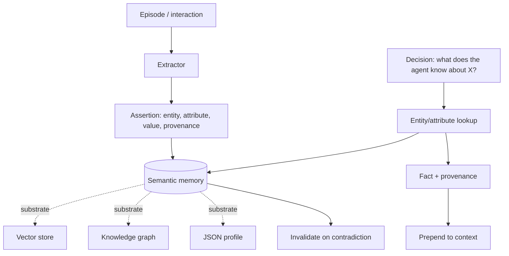

# Semantic Memory

**Also known as:** Fact Memory, Agent Knowledge Store, Knowledge Memory

**Category:** Memory  
**Status in practice:** emerging

## Intent

Maintain a dedicated store of what the agent holds to be true about the user and the world, separate from event records (episodic) and learned how-to (procedural).

## Context

An agent operates across many sessions and accumulates durable knowledge: who the user is, what they prefer, what is definitionally true about the domain, what conclusions have settled. This knowledge needs to survive across sessions, be retrievable when relevant, and stay separate from the raw event history that produced it. The team is choosing how this fact layer is represented and queried independently of any single storage technology.

## Problem

Without a dedicated semantic store, every fact the agent 'knows' either lives in a static system prompt (frozen, cannot grow with experience) or is re-derived from raw episodes on every turn (slow, lossy, and prone to drift between runs). Mixing facts with raw events also confuses retrieval — 'user prefers dark mode' gets stored as 'on 2026-03-12 the user said: I prefer dark mode' and surfaces only by similarity to that timestamp's wording, not as a stable assertion. The CoALA framework names semantic memory as a distinct long-term type for exactly this reason: the agent needs a layer that holds *what is true*, separately from *what happened* and *how to act*.

## Forces

- Substrate is a separate choice from function: vector index, knowledge graph, JSON profile, or text can all back semantic memory, with different retrieval and update characteristics.
- Facts decay: yesterday's truth ('user is on Pacific time') becomes today's fiction, so invalidation and recency must be explicit.
- Conflict resolution: two contradicting assertions must be resolved at write time or read time, not papered over.
- Provenance matters: extracted facts can be wrong; the agent must record whether a fact came from the user, was inferred, or was imported, and what episode produced it.

## Applicability

**Use when**

- The agent needs to remember durable facts (user preferences, domain truths, settled conclusions) across sessions.
- Retrieval by 'what does the agent know about X' must be cheap and substrate-agnostic.
- Facts must be updatable and invalidatable independently of the events that produced them.

**Do not use when**

- Memory needs are session-scoped and a typed short-term state suffices.
- The agent has no extraction pipeline and assertions would be polluted by raw event text.
- Provenance and conflict resolution cannot be enforced — without them the store rots quickly.

## Therefore

Therefore: maintain a dedicated semantic-memory layer keyed by entity and attribute, populated by explicit extraction or assertion with provenance, and queried at decision-time independently from episodic recall — choose the substrate (vector, graph, profile) to fit the retrieval pattern, not the other way round.

## Solution

The CoALA framework (Sumers et al. 2023) names semantic memory as one of three long-term memory types alongside episodic and procedural, defined by function rather than storage. Implementations vary by substrate: LangMem's semantic channel uses profile (single JSON document) or collection (many documents) stores; knowledge-graph implementations (cognee, Zep) store assertions as typed triples; vector stores can back it when retrieval is by similarity over fact text. The function is the same regardless: extract durable assertions from interactions, store them with entity/attribute keys and provenance, retrieve them when the situation calls for 'what does the agent know about X'. Refer to [vector-memory](vector-memory.md) and [knowledge-graph-memory](knowledge-graph-memory.md) as substrate options.

## Example scenario

A long-running personal assistant has logged hundreds of conversations with one user. Buried in those logs are durable facts: the user's timezone, their preferred language, their dietary restrictions, the names of their kids, their employer. Treating all of this as episodic recall is wasteful — every time the agent needs the timezone, it would have to semantically retrieve old messages, parse out a date claim, and trust whichever match came up first. The team instead adds a semantic-memory layer: a small extraction step writes assertions like (user, timezone, 'Europe/Berlin', source-episode-id, 2026-04-12) into a profile store. Retrieval at decision time is now a direct lookup, the episode that produced the fact is still recoverable via provenance, and invalidating the timezone when the user moves is one write.

## Diagram

## Consequences

**Benefits**

- Stable facts survive across sessions without re-derivation from raw episodes.
- Retrieval becomes assertion-shaped rather than event-shaped — 'what is the user's timezone' returns the fact, not the conversation in which it was set.
- Substrate decisions can change (vector → graph, profile → collection) without changing the agent's contract with the memory.

**Liabilities**

- Extraction errors are sticky — a wrong fact poisons every later turn until invalidated.
- Conflict resolution policy is its own design problem.
- Provenance and update governance add real implementation cost beyond the substrate itself.

## What this pattern constrains

Forbids treating raw event records as facts. The semantic layer stores assertions about *what is true*; the episodic layer stores happenings; assertions are written by an explicit extraction or assertion step, not by appending raw events.

## Known uses

- **LangChain LangMem SDK — semantic channel (profile and collection stores)** — *Available* — <https://www.langchain.com/blog/langmem-sdk-launch>
- **CoALA framework — semantic memory as third long-term memory type** — *Available* — <https://arxiv.org/abs/2309.02427>
- **cognee — knowledge-graph-backed semantic store for agents** — *Available* — <https://www.cognee.ai/>
- **Mem0 — facts and preferences API for agent memory** — *Available*

## Related patterns

- *complements* → [episodic-memory](episodic-memory.md)
- *complements* → [procedural-memory](procedural-memory.md)
- *uses* → [vector-memory](vector-memory.md) — Vector store is one substrate option for semantic memory.
- *uses* → [knowledge-graph-memory](knowledge-graph-memory.md) — Knowledge graph is one substrate option for semantic memory.
- *specialises* → [cross-session-memory](cross-session-memory.md)
- *complements* → [self-corpus-vocabulary](self-corpus-vocabulary.md)

## References

- (paper) Sumers, Yao, Narasimhan, Griffiths, *Cognitive Architectures for Language Agents (CoALA)*, 2023, <https://arxiv.org/abs/2309.02427>
- (doc) *LangGraph Memory Concepts — semantic, episodic, procedural types*, 2025, <https://docs.langchain.com/oss/python/concepts/memory>
- (blog) *LangMem SDK launch — semantic, episodic, procedural channels*, 2025, <https://www.langchain.com/blog/langmem-sdk-launch>

**Tags:** memory, long-term, facts, coala, function-level
