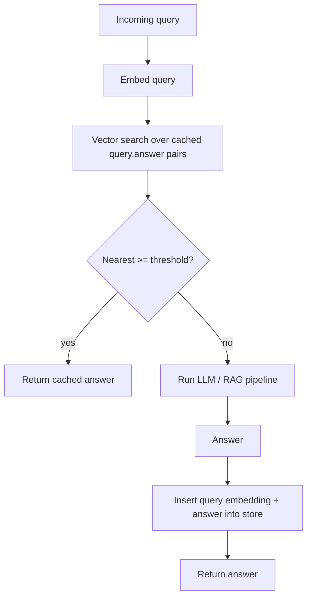

# Semantic Response Cache

**Also known as:** Vector Response Cache, Similarity Cache, LLM Semantic Cache

**Category:** Retrieval & RAG  
**Status in practice:** emerging

## Intent

Embed each query and, when its nearest cached neighbour is within a similarity threshold, return the stored answer instead of re-running the model so near-duplicate questions are answered cheaply.

## Context

A service answers a stream of natural-language queries with an LLM or a retrieval-augmented pipeline, and many of those queries are near-duplicates phrased differently: the same support question, the same lookup, the same intent worded a dozen ways. Each call costs tokens and latency, yet a classic key-value cache only fires on byte-for-byte repeats, so it almost never hits when wording varies.

## Problem

An exact-match cache keyed on the raw text misses two queries that mean the same thing but read differently, so the expensive pipeline runs again for an answer that already exists. Paraphrase, word order, punctuation, and filler all defeat string equality. The service needs a cache that recognises that two differently worded queries are close enough in meaning to share one answer, without re-running the model to find out.

## Forces

- A looser similarity threshold lifts the hit rate and cuts cost, but raises the risk of returning a stored answer to a query that only looks similar.
- Embedding and vector-searching every incoming query adds work, so the cache only pays off when the hit rate is high enough to cover that overhead.
- Cached answers age: an entry that was correct when stored can go stale as the underlying data or documents change.
- A semantic match hides why an answer was returned, making a wrong hit harder to spot than an exact-key miss.

## Therefore

Therefore: embed each query, vector-search the store of prior (query, answer) pairs, return the cached answer when the nearest neighbour clears the similarity threshold, and otherwise run the full pipeline and write the new pair back to the cache.

## Solution

Keep a vector store of prior (query, answer) pairs. On each request, embed the query and search the store for its nearest neighbour. If the neighbour's similarity clears a configured threshold, return the stored answer immediately and skip the model entirely. If nothing clears the threshold, run the full LLM or retrieval pipeline, return its answer, and insert the new (query embedding, answer) pair so the next near-duplicate hits. The threshold is the central knob: set it tight enough that only genuinely equivalent queries share an answer, and pair it with a time-to-live or an invalidation hook so entries do not outlive the data they summarise. Scope the store per tenant or per user when answers depend on identity, so one caller's cached answer is never served to another.

## Structure

```
Query --embed--> vector search over (query,answer) store --hit (>= threshold)--> stored answer | --miss--> LLM/RAG pipeline --> answer --insert--> store
```

## Diagram



*Embed the query, search the cache; a similarity hit returns the stored answer, a miss runs the pipeline and populates the cache.*

## Example scenario

A customer-support assistant gets the same billing question worded a hundred ways: 'how do I change my card', 'where do I update payment method', 'can I switch the card on file'. Each one embeds close to the others, so after the first is answered by the LLM the rest land on a cached hit and return in milliseconds without another model call, while a genuinely new question falls through to the full pipeline.

## Consequences

**Benefits**

- Near-duplicate queries return without a model call, cutting cost and tail latency in proportion to the hit rate.
- The cache absorbs paraphrases that an exact-match key-value cache would miss entirely.
- Load on the downstream LLM or retrieval pipeline drops, which raises effective throughput under bursty traffic.

**Liabilities**

- A threshold set too loose returns a stored answer to a query that merely resembles a cached one, surfacing a wrong answer.
- Cached answers go stale when the underlying data changes, so a hit can serve an out-of-date result.
- Embedding and searching every query is overhead that is wasted when the hit rate is low.
- An answer cached without per-tenant scoping can leak one user's result to another.

## Failure modes

- Loose-threshold false hit — two queries cross the similarity threshold but have different intents, so a wrong stored answer is returned.
- Stale serve — an entry is returned long after the data it summarised changed.
- Cross-tenant leak — an answer cached globally is served to a different user whose context differs.
- Negative payoff — the hit rate is too low to cover the per-query embedding and search cost.

## What this pattern constrains

A query is answered from the cache only when its nearest stored neighbour clears the similarity threshold; below that threshold the cache must not return, and the full pipeline runs instead.

## Applicability

**Use when**

- A high share of incoming queries are near-duplicates phrased differently, so an exact-match cache rarely hits.
- Answering is expensive (token cost or latency) and a stored answer is acceptable for equivalent queries.
- A similarity threshold and a freshness policy can be tuned and monitored against wrong-hit rate.

**Do not use when**

- Queries are highly diverse with few repeats, so the hit rate cannot cover the per-query embedding and search overhead.
- Answers depend on rapidly changing data or per-request state, so even a recent cached answer is unsafe to reuse.
- A wrong answer from a borderline similarity match carries unacceptable cost and exact matching is required instead.

## Components

- Query embedder — turns each incoming query into the vector used for similarity lookup
- Vector store — holds prior (query embedding, answer) pairs and serves nearest-neighbour search
- Similarity gate — compares the nearest neighbour's score against the configured threshold to decide hit or miss
- Pipeline fallback — the LLM or retrieval-augmented path that runs on a cache miss and produces a fresh answer
- Cache writer — inserts each new (query embedding, answer) pair, applying time-to-live and per-tenant scoping
- Invalidation hook — evicts or refreshes entries when the underlying data they summarise changes

## Tools

- Embedding model — produces the query vectors that drive similarity lookup
- Vector database — stores embeddings and runs approximate nearest-neighbour search (for example a pgvector or Cosmos DB store)
- GPTCache — library that wires query embedding, similarity evaluation, and answer storage together
- API gateway policy — gateway-side semantic-cache layer that intercepts requests before the model (for example Azure API Management)

## Evaluation metrics

- Cache hit rate — fraction of queries served from the store without a model call
- Wrong-hit rate — fraction of cache hits whose answer was incorrect for the new query, by threshold setting
- Cost and latency saved — tokens and tail latency avoided versus running the full pipeline every time
- Staleness rate — fraction of hits that returned an answer the underlying data had since changed

## Known uses

- **[Azure API Management — semantic caching for Azure OpenAI](https://learn.microsoft.com/en-us/azure/api-management/azure-openai-enable-semantic-caching)** _available_ — API gateway policy that embeds the prompt, looks up a vector store, and returns a cached completion on a similarity hit before forwarding to the model.
- **[Azure Cosmos DB — semantic cache](https://learn.microsoft.com/en-us/azure/cosmos-db/gen-ai/semantic-cache)** _available_ — Stores (prompt embedding, response) pairs and serves the cached response when a new prompt is within a configured vector-similarity threshold.
- **[GPTCache](https://github.com/zilliztech/GPTCache)** _available_ — Open-source semantic cache that embeds queries and returns a stored LLM answer when a similar query is found, with a tunable similarity evaluator.
- **[Raft — vector cache write-up](https://habr.com/ru/companies/raft/articles/930788/)** _available_ — Production write-up describing a similarity-threshold cache that serves prior answers for sufficiently similar queries (original-language source).

## Related patterns

- _alternative-to_ **Prompt Caching** — Prompt caching reuses an unchanging prefix matched exactly on the provider side; the semantic cache matches whole queries by vector similarity and caches the answer.
- _alternative-to_ **Tool Result Caching** — Tool-result caching keys on exact (tool, normalised args); the semantic cache keys on embedding similarity rather than an exact match.
- _complements_ **Naive RAG** — The cache sits in front of the retrieve-then-generate pipeline and short-circuits it on near-duplicate queries before any retrieval runs.
- _complements_ **Agentic RAG** — A similarity hit returns the stored answer before the iterative plan-retrieve-reflect loop is entered, saving its repeated model calls.

## References

- [Enable semantic caching for Azure OpenAI APIs in Azure API Management](https://learn.microsoft.com/en-us/azure/api-management/azure-openai-enable-semantic-caching) — 2025
- [Semantic cache with Azure Cosmos DB](https://learn.microsoft.com/en-us/azure/cosmos-db/gen-ai/semantic-cache) — 2025
- [GPTCache — semantic cache for LLM queries](https://github.com/zilliztech/GPTCache) — 2023
- [Vektornyj kesh: delaem umnye otvety eshche bystree (Raft)](https://habr.com/ru/companies/raft/articles/930788/) — 2025
- [Semanticheskij obnovlyaemyj kesh na AlloyDB Omni](https://habr.com/ru/articles/995884/) — 2025
- [GPTCache: An Open-Source Semantic Cache for LLM Applications Enabling Faster Answers and Cost Savings](https://aclanthology.org/2023.nlposs-1.24/) — Fu Bang, 2023
- [MeanCache: User-Centric Semantic Caching for LLM Web Services](https://arxiv.org/abs/2403.02694) — Waris Gill, Mohamed Elidrisi, Pallavi Kalapatapu, Ammar Ahmed, Ali Anwar, Muhammad Ali Gulzar, 2024
- [GPT Semantic Cache: Reducing LLM Costs and Latency via Semantic Embedding Caching](https://arxiv.org/abs/2411.05276) — Sajal Regmi, Chetan Phakami Pun, 2024
- [Semantic Caching for Low-Cost LLM Serving: From Offline Learning to Online Adaptation](https://arxiv.org/abs/2508.07675) — 2025
