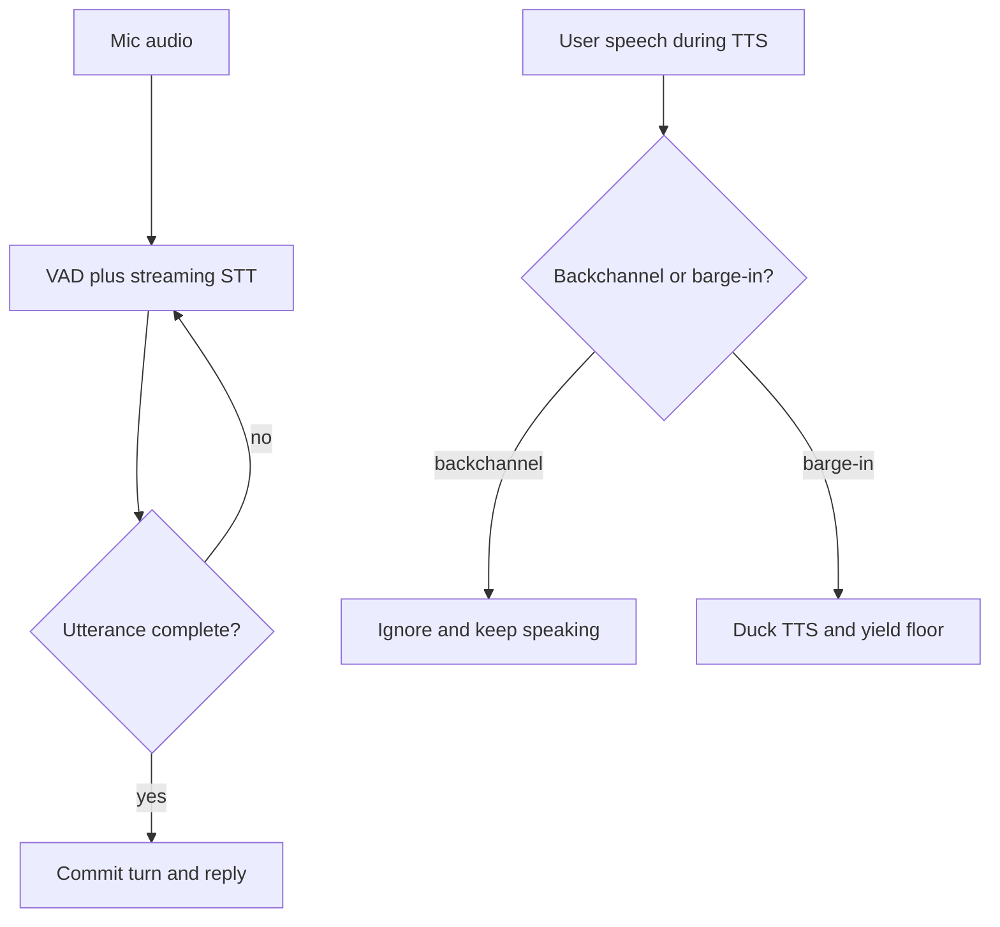

# Semantic Turn Endpointing

**Also known as:** Semantic Turn Detection, Model-Based Endpointing

**Category:** Streaming & UX  
**Status in practice:** emerging

## Intent

Decide when a voice user has yielded the floor by classifying the partial transcript's semantic completeness rather than a fixed silence timeout, so the agent replies quickly without cutting the speaker off mid-thought.

## Context

A voice agent runs a duplex audio loop: streaming speech-to-text transcribes the caller while text-to-speech plays the agent's reply. The loop must decide, many times per turn, whether the caller has finished speaking or merely paused. A fixed voice-activity-detection silence threshold answers this from raw acoustics, waiting for a gap of, say, 800 milliseconds and then committing the turn.

## Problem

Acoustic silence is a poor proxy for conversational completeness. A long timeout adds close to a second of latency to every reply and makes the agent feel sluggish, while a short timeout fires on natural hesitations and filler words and cuts the speaker off. The same threshold also cannot tell a backchannel such as 'uh-huh' from a genuine attempt to interrupt, so the agent either talks over the caller or freezes mid-sentence.

## Forces

- A short silence threshold lowers response latency but commits the turn during natural pauses; a long threshold avoids interrupting but makes every reply feel slow.
- Raw energy-based detection is cheap and easy to ship, but it confuses backchannels and hesitations with end-of-turn and with barge-in.
- Semantic completeness lives in the words, not the waveform, so reading it needs the partial transcript, which itself arrives with streaming-recognition lag.

## Therefore

Therefore: drive the turn decision from a model that reads the partial transcript and predicts whether the utterance is semantically complete, keep a short acoustic timeout as a floor, and classify any speech detected during playback as backchannel or barge-in before yielding the floor.

## Solution

Run a small turn-detection model over the streaming transcript in parallel with voice-activity detection. The model scores whether the user's utterance is a complete thought; a complete utterance commits the turn after a short pause while an incomplete one waits longer, so the agent answers fast on finished sentences and stays patient through hesitations. While the agent is speaking, a second classifier labels detected user speech as a backchannel, which is ignored, or a barge-in, which ducks the text-to-speech and yields the floor. The acoustic timeout remains as a floor so the turn always eventually commits.

## Structure

```
Mic audio -> VAD + streaming STT -> turn-detection model(partial transcript) -> complete? commit turn : keep listening. During TTS: detected speech -> backchannel|barge-in classifier -> ignore | duck-and-yield.
```

## Diagram



*Turn commitment is driven by the semantic completeness of the transcript, with a separate backchannel-versus-barge-in decision during playback.*

## Example scenario

A customer calls a support line handled by a voice agent and says 'I'd like to change my flight... to, um, the one on Friday.' A fixed-timeout agent commits after the pause at 'change my flight' and answers the wrong question. A semantic-endpointing agent reads the partial transcript, sees the sentence is unfinished, waits through the 'um', and only answers once the caller has actually finished.

## Consequences

**Benefits**

- Turn latency drops toward human gap timing (roughly 200-300 ms on finished utterances) without committing during mid-sentence pauses.
- Backchannels no longer trigger false interruptions, so the agent keeps the floor through 'mhm' and 'right'.

**Liabilities**

- The turn-detection model adds inference cost and one more component to tune and monitor per language and accent.
- A mis-scored incomplete utterance still commits early, and a mis-scored complete one adds a longer wait.
- Quality depends on streaming-transcript accuracy, which degrades with noise, accents, and code-switching.

## Failure modes

- Early commit — the model scores an incomplete utterance as complete and the agent answers before the caller finishes.
- Backchannel-as-barge-in — a listening 'uh-huh' is read as an interruption and the agent stops mid-reply.
- Transcript lag — recognition latency delays the semantic signal so the acoustic floor fires first and the gain is lost.

## What this pattern constrains

The agent must not commit a turn on silence duration alone; it can yield the floor only after the turn-detection model judges the utterance complete or the fallback timeout elapses, and a detected backchannel cannot count as barge-in.

## Applicability

**Use when**

- A real-time voice agent needs to feel responsive while callers pause, hesitate, and use filler words.
- Backchannels and partial interruptions are common and a fixed silence threshold mislabels them.
- A streaming transcript is available early enough to score turn completion before the acoustic timeout.

**Do not use when**

- The interface is push-to-talk or text, so floor control is explicit and no endpointing is needed.
- Latency is not user-facing (batch transcription, offline analysis), so a simple timeout suffices.
- No streaming transcript is available and only raw audio energy can be used.

## Components

- Streaming STT — transcribes caller audio incrementally to feed both detectors
- Voice-activity detector — flags speech presence and provides the fallback acoustic timeout
- Turn-detection model — scores whether the partial transcript is a semantically complete utterance
- Backchannel/barge-in classifier — during playback, labels detected user speech as ignorable or floor-yielding
- Floor controller — commits the turn or ducks text-to-speech based on the detectors' signals

## Tools

- Voice-activity detection (for example Silero VAD) — frame-level speech presence and the timeout floor
- Turn-detection model (for example LiveKit TurnDetector or Pipecat smart-turn) — semantic end-of-turn scoring
- Streaming speech-to-text — low-latency partial transcripts
- Text-to-speech with ducking — pausable playback so a barge-in can yield the floor

## Evaluation metrics

- End-of-turn latency on finished utterances versus a fixed-timeout baseline
- False-cutoff rate — turns committed while the caller was mid-utterance
- Backchannel false-interruption rate — agent stops on a non-interrupting 'uh-huh'
- Barge-in response time — delay from caller interruption to text-to-speech ducking

## Known uses

- **[LiveKit Agents (turn-detector plugin)](https://livekit.com/blog/turn-detection-voice-agents-vad-endpointing-model-based-detection)** _available_ — Open-source transformer turn-detection model over the partial transcript, replacing a fixed VAD silence threshold for end-of-turn.
- **Pipecat (SmartTurnAnalyzer)** _available_ — Open semantic turn-detection model shipped in the Pipecat voice-agent framework.
- **Vapi endpointing** _available_ — Configurable semantic endpointing controls in the Vapi voice-agent platform.
- **Moshi (Kyutai)** _available_ — Full-duplex speech LLM that handles turn-taking natively rather than via a silence threshold.

## Related patterns

- _complements_ **Interruptible Agent Execution** — Interruptible execution is the task-level halt surface; semantic turn endpointing is the sub-second audio floor-control that decides when a barge-in even counts.
- _complements_ **Multilingual Voice Agent Stack** — The co-located speech-to-text, LLM, and text-to-speech pipeline supplies the streaming transcript this pattern classifies for turn completion.
- _complements_ **Liminal-State Detection** — Both read paralinguistic timing cues; liminal-state detection infers the user's attentional state, this one infers end-of-turn.

## References

- [Turn Detection for Voice Agents: VAD, Endpointing, and Model-Based Detection](https://livekit.com/blog/turn-detection-voice-agents-vad-endpointing-model-based-detection) — LiveKit, 2026
- [Turn-Taking in Voice Agents: Why Rule-Based VAD Is Broken and What Comes Next](https://gradium.ai/content/turn-taking-voice-agents-vad) — 2026
- [FireRedChat: A Pluggable, Full-Duplex Voice Interaction System with Cascaded and Semi-Cascaded Implementations](https://arxiv.org/abs/2509.06502) — 2025
