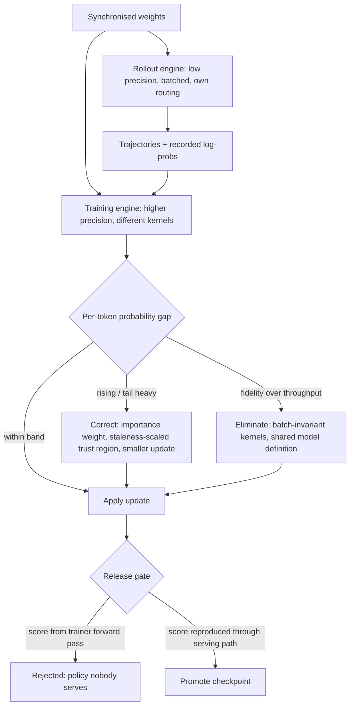

# Served-Policy Anchoring

**Also known as:** Training-Inference Mismatch Control, Rollout-Engine Policy Gap, Inference-Policy Objective

**Category:** Governance & Observability  
**Status in practice:** emerging

## Intent

Treat the policy the inference engine actually serves, not the one the training engine computes, as the object being optimised and gated, and measure their probability agreement continuously.

## Context

An agent is post-trained with reinforcement learning on a hybrid stack. Trajectories are generated by a throughput-tuned inference engine such as vLLM or SGLang, which uses fused low-precision kernels, continuous batching and its own expert-routing decisions. Gradients are computed by a separate training engine such as Megatron or a sharded-data-parallel backend at higher precision, with a different kernel path. Weights are copied between the two after every update, so both hold identical parameters, and the same inference engine will later serve production traffic.

## Problem

Identical parameters do not make one policy. The two engines assign different probabilities to the same trajectory even when synchronised, so every batch of rollouts is off-policy with respect to the gradients computed from it, on every step of every run. The consequence is an objective misalignment: an update that improves the training-engine policy does not necessarily improve the inference policy, the one that is deployed. A reward curve can therefore rise for weeks while describing a policy no request is ever served by, and the run can destabilise or collapse without the metric that is being watched showing why.

## Forces

- The inference engine is chosen for generation throughput — low-precision quantisation, fused kernels, continuous batching — and each of those choices is a source of numerical divergence from the higher-precision path that computes gradients.
- An effective update to the policy in the training engine does not necessarily improve the inference policy, so optimising the measurable quantity and optimising the deployed artefact are not the same task.
- The gap is not a static numerical offset but a dynamic failure coupled to optimisation: gradient noise and mismatch escalate together as training progresses, so standard importance-sampling corrections that hold early can fail during extended runs.
- The gap can be eliminated rather than corrected — under batch-invariant kernels the measured disagreement rates fall to exactly zero — but determinism is bought with throughput, so the size of the gap is a purchased quantity rather than a fixed fact of the stack.
- Decoupling rollout generation from optimisation raises throughput and adds staleness compounded by policy lag, engine delays and expert routing, while clipping constrains only sampled outward updates and so acts as a sampled surrogate rather than a full-policy constraint.

## Therefore

Therefore: make per-token probability agreement between the rollout engine and the training engine a first-class metric on every step, size the off-policy correction to the measured gap, and admit a release only on numbers reproduced through the serving path.

## Solution

Name the served policy as the optimisation target and instrument the distance to it. For each batch of rollouts, recompute the log-probability of the sampled tokens under the training engine and compare it against the log-probability the rollout engine recorded when it generated them. The resulting log-ratio distribution — its disagreement rate, its tail mass, and its trend across steps — is logged next to reward as a training metric with its own thresholds, so a rising mismatch is visible before the run destabilises. The correction is then sized to that measurement rather than assumed: importance weighting, a trust region contracted in proportion to observed staleness, or a reduction in update size when an early-warning signal fires. Where correctness outweighs generation throughput, the gap is removed instead of corrected by running the rollout engine in a batch-invariant mode and sharing one model definition between the two paths, which drives the disagreement to zero. Release is gated on the same principle: a candidate checkpoint is scored by re-running the evaluation through the inference engine, precision and decoding configuration that production will use, and that served-policy score, not the trainer's forward pass, is what is compared against the current release. Every reported number carries the engine name, version, precision and routing configuration it was produced under, because a threshold measured on one configuration does not transfer to another.

## Structure

```
Rollout engine (production precision, kernels, routing) --generates--> trajectories + recorded log-probs. Training engine (higher precision) --recomputes--> log-probs on the same tokens. Gap probe --> log-ratio distribution --> alarm + correction (importance weight / staleness-scaled trust region / smaller update) or elimination (batch-invariant kernels). Release gate scores the checkpoint through the serving path, not the trainer.
```

## Diagram



*The same weights become two policies; the gap between them is measured every step, corrected or eliminated, and the release gate accepts only a score produced by the serving path.*

## Example scenario

A team post-trains a tool-using agent with reinforcement learning and watches the reward curve climb steadily for three weeks. The checkpoint is promoted, and in production the agent performs no better than the one it replaced. The rollouts had been generated by the throughput-tuned inference server while the gradients came from the training framework, and the two assigned different probabilities to the same trajectories, so the curve described a policy that never answered a single request.

## Consequences

**Benefits**

- The number that gates a release describes the artefact that ships, so a training curve cannot rise for a policy that is never served.
- Instability becomes visible as a rising mismatch metric before the reward curve collapses, giving the run an early-warning signal rather than a post-mortem.
- The correction term is sized to a measured quantity instead of a guessed one, and reported results carry the engine, precision and routing configuration that produced them.
- The choice between correcting the gap and eliminating it with batch-invariant kernels becomes an explicit trade of throughput against fidelity rather than an unexamined default.

**Liabilities**

- Recomputing log-probabilities for every rollout batch under the training engine costs an extra forward pass per step, and batch-invariant inference costs generation throughput, so the discipline is paid for in wall-clock time.
- A threshold set too tight stalls training on mismatch that the correction would have absorbed, and one set too loose admits the collapse it was meant to catch.
- The metric measures agreement between two runtimes, not correctness: the engines can agree closely on a policy that is getting worse.
- The size of the gap depends on model, precision, batching and hardware, so a threshold calibrated on one configuration is not evidence about another and has to be re-measured after any engine or precision change.

## Failure modes

- The reward curve climbs for weeks and the checkpoint is promoted, but the number was produced by the trainer's forward pass and the served policy never moved.
- Importance sampling holds through early training and fails during an extended run, so the collapse arrives past the point where the correction was validated and no mismatch metric was logged to explain it.
- Asynchronous rollouts are accepted at any lag on the assumption that clipping bounds the update, though clipping gates only sampled outward tokens and leaves the high-staleness tail weakly controlled.
- An engine upgrade, a precision change or a routing change moves the gap and no threshold is re-measured, so the alarm that would have fired last month cannot fire now.
- The mismatch is driven to zero in a small debug configuration and assumed to be zero in the production configuration, where batch sizes and expert routing differ.

## What this pattern constrains

A checkpoint must not be promoted on a score the training engine produced; the released number is admitted only from a run through the serving engine, precision and decoding configuration production will use, and no rollout batch may be consumed as on-policy without its measured training-inference probability gap.

## Applicability

**Use when**

- Rollouts are generated by an inference engine that is not the engine computing gradients.
- Inference runs at lower precision, or with different kernels, batching or expert routing, than the training path.
- Rollout generation is decoupled from optimisation, so batches arrive with lag behind the weights being updated.
- The checkpoint being trained will be deployed through the same inference engine that produced its rollouts.

**Do not use when**

- Generation and gradients share one engine, one precision and one kernel path, so there is no gap between two runtimes to measure.
- The model is consumed only through a third-party API and no post-training loop is owned, in which case attesting the serving stack is the available remedy instead.
- The run is short enough to finish before mismatch and gradient noise escalate, and the throughput lost to instrumentation would cost more than the accuracy it recovers.

## Components

- Rollout engine — generates trajectories at production precision, kernels and routing, and is the policy that will actually serve requests
- Training engine — computes gradients at higher precision on the same parameters, forming a second policy over one set of weights
- Probability-agreement probe — recomputes the log-probability of sampled tokens under the training engine and compares it with what the rollout engine recorded
- Gap metric and alarm — logs disagreement rate, tail mass and trend beside reward, with thresholds that fire before the run destabilises
- Off-policy correction — importance weighting, a staleness-scaled trust region, or a reduced update size, sized to the measured gap
- Alignment mode — batch-invariant kernels and a shared model definition that remove the gap instead of correcting it, at a throughput cost
- Serving-path release gate — re-scores the candidate checkpoint through the production engine, precision and decoding configuration before promotion
- Runtime configuration record — engine name, version, precision and routing settings attached to every reported number so thresholds are not transferred across configurations

## Tools

- vLLM or SGLang — the rollout engine whose kernels, batching and precision define the served policy
- Batch-invariant kernel mode — makes output independent of batch size and request order so the two paths can be driven to exact agreement
- verl or a comparable reinforcement-learning framework — supplies the hybrid rollout and training loop and the alignment path between the two engines
- Megatron or a sharded-data-parallel backend — the higher-precision path that computes gradients on the synchronised weights
- Experiment tracker — records the gap metric on the same axis as reward so the two curves are read together rather than separately

## Evaluation metrics

- Per-token probability disagreement rate — share of sampled tokens where the two engines differ beyond tolerance
- Log-ratio tail mass — how much of a batch sits in the high-mismatch tail that a clipping interval does not constrain
- Served-policy score minus training-engine score — how much of a reported improvement survives a run through the serving path
- Rollout staleness in optimiser steps — lag between the weights that generated a batch and the weights being updated from it
- Throughput cost of the alignment setting — generation tokens per second lost to batch-invariant or higher-precision inference

## Known uses

- **[verl (Volcano Engine Reinforcement Learning for LLMs)](https://github.com/volcengine/verl)** _available_ — Ships a dedicated zero-mismatch rollout path, vexact, built on batch-invariant kernels and a model definition shared with the sharded-data-parallel training backend, so the rollout and gradient paths agree exactly.
- **[vLLM batch invariance mode](https://docs.vllm.ai/en/latest/features/batch_invariance.html)** _available_ — VLLM_BATCH_INVARIANT makes output independent of batch size and request order; the documentation names reinforcement learning as a motivating case because RL training often requires deterministic rollouts for reproducibility and stable training.
- **[Monotonic Inference Policy Update (MIPU)](https://arxiv.org/abs/2606.29526)** _pure-future_ — Constructs sampler-referenced candidate updates and accepts a synchronised candidate only when an inference-side gap proxy indicates the served policy improved, making the inference policy rather than the training policy the optimisation objective.
- **[ACRL (Adaptive Control of Training-Inference Discrepancy)](https://arxiv.org/abs/2607.24062)** _pure-future_ — Holds the measured discrepancy inside a target band during training; under FP8 inference it matches the higher-precision baseline accuracy and outperforms importance-sampling corrections.
- **[Staleness-Adaptive Trust Region on SGLang plus Megatron](https://arxiv.org/abs/2607.18722)** _pure-future_ — Uses the detached sampled log-ratio as a staleness proxy and contracts the clipping interval on the high-mismatch tail, evaluated on a decoupled asynchronous setup with SGLang generating and Megatron training.

## Related patterns

- _complements_ **Serving-Stack Attestation** — That pattern establishes which backend is actually behind an endpoint when the identity is a claim; here the backend is known and the concern is the numerical gap between two runtimes holding the same weights.
- _complements_ **Determinism-Tiered Replay Gate** — That gate classifies a deployed agent by re-running identical inputs and assigns a reproducibility tier; this is a training-loop invariant plus a correction term, measured on token probabilities rather than on replayed decisions.
- _complements_ **Confident Inconsistency** — The anti-pattern of variance that stays invisible because nobody re-runs; here the divergence is between two runtimes on one set of weights and is measured continuously rather than discovered.
- _complements_ **Eval Harness** — The harness decides which dataset scores a version; this pattern constrains which runtime is allowed to produce that score.
- _complements_ **Dual Evaluation (Offline + Online)** — Both refuse to trust a single pre-deploy number, but the split there is offline benchmark against live traffic, and here it is the training engine against the serving engine on the same checkpoint.
- _complements_ **RL-Trained Conductor Orchestrator** — An orchestrator trained with reinforcement learning inherits exactly this seam, since its rollouts come from an inference engine and its gradients from a training engine.

## References

- [The Mirage of Optimizing Training Policies: Monotonic Inference Policies as the Real Objective for LLM Reinforcement Learning](https://arxiv.org/abs/2606.29526) — 2026
- [ACRL: Adaptive Control of Training-Inference Discrepancy for Stable Reinforcement Learning](https://arxiv.org/abs/2607.24062) — 2026
- [Beyond Precision: Training-Inference Mismatch is an Optimization Problem and Simple LR Scheduling Fixes It](https://arxiv.org/abs/2602.01826) — 2026
- [Stale but Stable: Staleness-Adaptive Trust Regions for Stabilizing Asynchronous Reinforcement Learning](https://arxiv.org/abs/2607.18722) — 2026
- [Re-feeding Is Not Replaying: Measuring Replay Noise in Counterfactual Token-Credit Estimation](https://arxiv.org/abs/2606.15621) — 2026
- [volcengine/verl — training and inference alignment, vexact zero-mismatch rollout](https://github.com/volcengine/verl)
- [vLLM — Batch Invariance](https://docs.vllm.ai/en/latest/features/batch_invariance.html)
- [Defeating Nondeterminism in LLM Inference](https://thinkingmachines.ai/blog/defeating-nondeterminism-in-llm-inference/)
