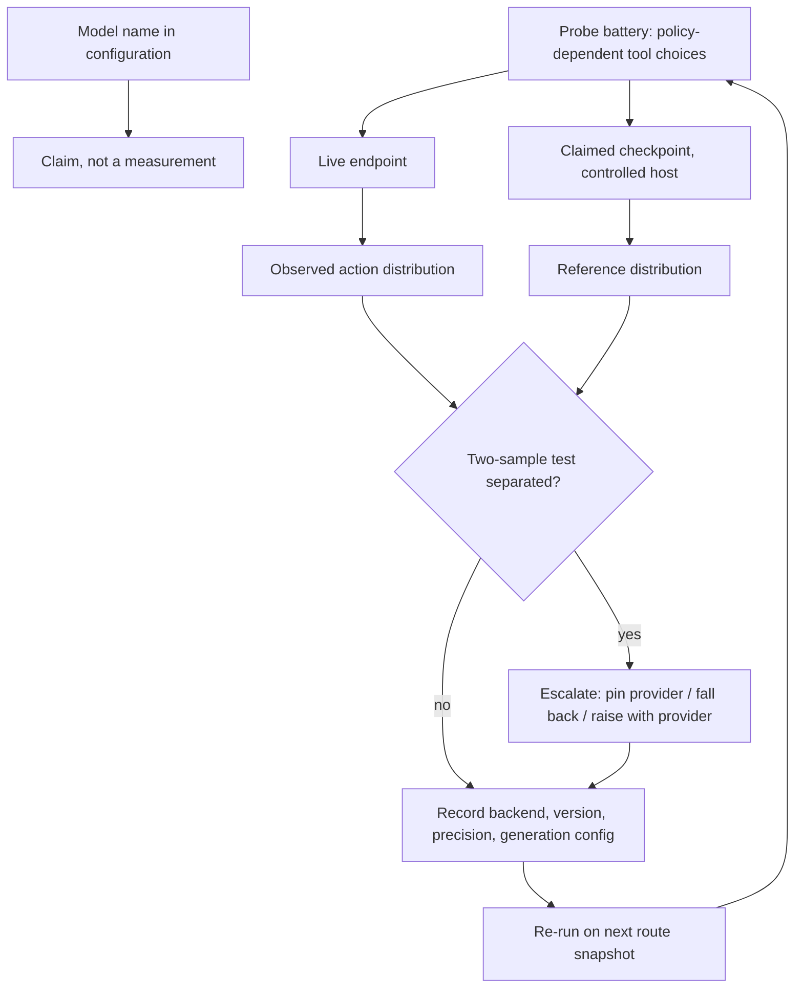

# Serving-Stack Attestation

**Also known as:** Backbone Attestation Probe, Served-Model Verification, Endpoint Provenance Probe

**Category:** Governance & Observability  
**Status in practice:** emerging

## Intent

Treat the served model, inference backend and generation defaults behind an endpoint as an unverified claim, and establish them by black-box behavioural probe recorded alongside every result.

## Context

An agent reaches a hosted model through an API and names the model it wants in configuration. The party on the other side owns the whole serving stack: which checkpoint is loaded, at which precision, on which inference framework, with which default decoding settings, and which route in a pool of machines handles this particular request. None of that is returned in the response. Open-weight checkpoints re-hosted by resellers make the gap wider, because the reseller chooses quantization and framework freely, and the same name is served by many of them at different prices.

## Problem

The model name in configuration is a claim written by the party whose costs fall when a cheaper checkpoint is served, and nothing in the response confirms it. A backbone can be substituted, quantized or wrapped without any visible change, and even a fully honest provider changes what the caller measures: under greedy, sampling-noise-free decoding, roughly 39 percent of the benchmark variability a practitioner sees out of the box can be attributed to the inference backend alone, and framework names and versions are almost never disclosed with a published score. The obvious audit is unusable on agentic traffic. Serving stacks discard text and expose only the structured action once the model calls a tool, so text-channel tests have nothing to measure on exactly the requests an agent generates, and where text does come back, provider-injected system prompts distort its distribution enough that such tests falsely accuse honest providers 67 percent and 53 percent of the time. The damage also hides from cheap evaluation: extreme fidelity loss showed little detectable association with single-shot accuracy while coinciding with a declining long-horizon pass rate as task exposure grew.

## Forces

- The endpoint's model name is the only identity signal returned, and it is authored by the party whose serving costs fall if a smaller or lower-precision checkpoint answers the request.
- Text is the natural audit channel and the first thing the serving stack removes: once the model calls a tool, modern stacks expose only the structured action, so a text-channel test is blind on agentic traffic.
- A text-channel test that does run is confounded by provider-injected system prompts; measured false-positive rates of 67 percent and 53 percent mean it accuses honest providers more often than it clears them.
- The backend is not a neutral carrier of the checkpoint: about 39 percent of out-of-the-box benchmark variability under greedy decoding stems from the backend, so a model name alone cannot make two numbers comparable.
- Cheap evaluation misses the harm — fidelity loss barely moved single-shot accuracy but tracked a falling pass rate on long-horizon tasks, which is where the failure is expensive.
- A probe costs tokens and latency and has to be repeated whenever the route can change, while writing a model name into configuration costs nothing at all.

## Therefore

Therefore: verify endpoint identity on a channel the serving stack still exposes — the categorical distribution over tool calls, or the output distribution under a frozen context — re-run that probe per route snapshot, and record the measured backend and generation configuration with every result.

## Solution

Build a probe on a channel that survives the agentic path. For tool-calling traffic that channel is the structured action: a fixed battery of prompts whose tool choice is genuinely policy-dependent yields a categorical distribution over tool names and arguments that is characteristic of the backbone and remains visible after the stack drops the text. Where no tool is involved, freeze everything the caller controls — one system prompt, fixed decoding parameters, a fixed seed where the API offers one — and compare the output distribution under that frozen context. Take a reference distribution from the claimed checkpoint run on infrastructure the caller controls, or from the provider's own behaviour at a recorded snapshot when the weights are closed, then apply a two-sample test that needs no token probabilities from the target API and report separation at a controlled false-positive rate. Re-run the probe per route snapshot rather than once at onboarding, because a pooled endpoint can change what answers without changing any version string. Independently of the verdict, attach the backend name and version, the precision, and the generation configuration actually in effect to every recorded result and every published benchmark number, so a later comparison is between like and like. Define in advance what a separated result triggers: pin a provider, fall back to another route, or open the finding with the provider, since a probe with no escalation path only produces logs.

## Structure

```
Probe battery -> live endpoint (tool-call channel or frozen context) --> observed distribution; claimed checkpoint --> reference distribution; two-sample test --> separated / not separated --> escalation. Backend + version + precision + generation config recorded with every result.
```

## Diagram



*Endpoint identity is established by comparing a probe distribution from the live endpoint against one from the claimed checkpoint, then recorded with the serving stack that produced it and re-checked per route snapshot.*

## Example scenario

A team pins an open-weight 70B model in configuration and buys it from a reseller at a lower price than the reference host charges. For three weeks the nightly single-shot benchmark is unchanged and short tasks look fine, but multi-step jobs start failing further and further into the run. A probe against the endpoint shows the tool-call distribution no longer matches the same checkpoint the team runs on its own machine, and the reseller confirms it moved that route to a lower-precision copy. Nothing in the response payload had changed; the model name field still said exactly what the configuration said.

## Consequences

**Benefits**

- Substitution becomes detectable on the traffic an agent actually generates, instead of only on a text channel the serving stack removes.
- Honest providers stop being accused: the tool-call probe held a 7 percent false-positive rate under system-prompt injection against 67 percent and 53 percent for text-channel baselines, while separating every one of 630 evaluated substituted checkpoint pairs.
- Every recorded result carries the backend and generation configuration it was produced under, so a regression can be attributed to the stack rather than charged to the model.
- Long-horizon degradation that single-shot benchmarks miss gains a monitoring channel tied to the route that served the request.

**Liabilities**

- The probe spends tokens and latency and must repeat per route snapshot, so its cost scales with how aggressively the provider routes across a pool.
- A reference distribution needs access to the claimed checkpoint; with closed weights the only baseline is the provider's own past behaviour, which drifts for legitimate reasons and weakens the verdict.
- Separation is evidence of difference, not of bad faith — a precision change, a framework upgrade and a deliberate substitution look alike from outside.
- The battery has to be built from prompts whose tool choice really is policy-dependent; a battery where every backbone picks the same tool measures nothing while appearing to pass.
- Recording backend and generation configuration everywhere adds fields to every result record and benchmark table, and partial adoption leaves comparisons looking sound while remaining incomparable.

## Failure modes

- The audit runs on the text channel, so requests that end in a tool call produce nothing to compare and the endpoint effectively goes unchecked.
- A provider-injected system prompt shifts the text distribution and the audit reports substitution against a provider that served exactly what it advertised.
- The probe runs once at integration and never again, so a routing change made weeks after onboarding is never observed.
- Benchmark numbers are published with a model name and no framework or version, and a later replication that differs is read as a property of the model.
- The probe separates, no escalation was agreed beforehand, and the finding is written to a log nobody acts on.
- The battery is reused unchanged for so long that the provider could fit its routing around it, and passing the probe stops implying anything about ordinary traffic.

## What this pattern constrains

A configured model name must not be recorded as the identity of what served a request; identity is admitted only from a probe run against the live endpoint on a channel the serving stack still exposes, and no result may be compared with another without the backend, precision and generation configuration each was produced under.

## Applicability

**Use when**

- The endpoint is operated by someone else and nothing in the response makes the served checkpoint, precision or framework verifiable.
- Traffic is agentic, so most requests end in a tool call and the text channel carries too little to compare.
- Results are compared across time, across providers, or against published benchmark numbers.
- An open-weight model is bought from a reseller, where quantization, framework and routing are the reseller's choices to make.
- Long-horizon task success matters, since that is where fidelity loss shows up before single-shot accuracy moves.

**Do not use when**

- The model runs on infrastructure the caller controls, where the framework, precision and generation configuration can be read directly instead of inferred.
- No reference behaviour for the claimed checkpoint can be obtained, so a probe can report change but never identity.
- The workload is single-shot and low stakes, and the recurring probe costs more than the failure it would catch.
- The provider already returns a signed per-response record of backbone, framework version and generation defaults that the caller has reason to trust.

## Components

- Probe battery — a fixed set of prompts whose tool choice is genuinely policy-dependent, so the served backbone shows in the action channel the stack still exposes
- Reference distribution — behaviour recorded from the claimed checkpoint under a frozen context, the baseline any live endpoint is tested against
- Two-sample test — decides whether the live endpoint's distribution is separated from the reference at a controlled false-positive rate, without needing token probabilities from the API
- Route-snapshot scheduler — re-runs the probe whenever the served route can have changed, since a pooled endpoint can switch backbones with no version string moving
- Serving-stack record — framework name and version, precision and the generation configuration in effect, attached to every result and every published number
- Escalation policy — the agreed action on separation: pin a provider, fall back to another route, or raise the finding with the provider

## Tools

- Tool-calling API surface — the channel that survives when the serving stack discards text on an agentic request
- Self-hosted inference of the claimed checkpoint — produces the reference distribution the live endpoint is tested against
- Statistical two-sample test over categorical actions — separates distributions from samples alone, with no probability information from the target API
- Provider-routing controls — pin or exclude upstream providers so a verified route can be held once it has been established
- Lineage store — holds the framework, version, precision and generation-configuration record alongside each output

## Evaluation metrics

- Detection rate on known substitutions — share of deliberately swapped or requantized checkpoints the probe separates
- False-positive rate under injected system prompts — how often an honest provider is accused of serving something else
- Probe cost per route snapshot — tokens and latency spent per verification, against the traffic it covers
- Attestation coverage — share of recorded results carrying framework name, version, precision and generation configuration
- Long-horizon pass rate by served route — pass rate as task exposure grows, split by route, since fidelity loss appears there before single-shot accuracy moves
- Probe staleness — time since the battery was last refreshed, as a check that passing it still says something about ordinary traffic

## Known uses

- **[AgentProv (tool-use policy probes)](https://arxiv.org/abs/2609.00052)** _pure-future_ — Audits agentic API providers on the structured-action channel rather than the text channel; reported separation of every substituted backbone across 630 evaluated checkpoint pairs at a 7 percent false-positive rate under system-prompt injection.
- **[Ventor-QTest (vendor-hosted API verification)](https://arxiv.org/abs/2608.16391)** _pure-future_ — Formalises hosted model routing as a stochastic process and audits it black-box without probability information from the target API; found extreme fidelity loss tracking a declining long-horizon pass rate while single-shot accuracy stayed flat.
- **[Model Equality Testing](https://arxiv.org/abs/2410.20247)** _pure-future_ — The text-channel two-sample formulation of the same question; it is the baseline whose fragility on tool-calling traffic and under injected system prompts motivates probing the action channel instead.
- **[OpenRouter provider routing](https://openrouter.ai/docs/features/provider-routing)** _available_ — Exposes which upstream provider and which quantization served a request and lets a caller pin or exclude providers, so the served route can be recorded and constrained; it does not itself test whether the served backbone matches the advertised name.
- **[Artificial Analysis endpoint benchmarking](https://artificialanalysis.ai/methodology)** _available_ — Benchmarks hosted endpoints per provider rather than per model name and re-runs on a schedule, which surfaces differences between two endpoints advertising the same model.

## Related patterns

- _complements_ **Hidden Mode Switching** — That anti-pattern is the provider-side prohibition on swapping the served model without disclosure; this is the consumer-side measurement for the case where the provider is somebody else and disclosure cannot be assumed.
- _complements_ **Lineage Tracking** — Lineage records the model version the caller claimed; this pattern supplies the measured backend, precision and generation configuration that make the recorded identity a fact rather than a copy of configuration.
- _complements_ **Determinism-Tiered Replay Gate** — Replay re-runs identical inputs to classify reproducibility, which a consistently substituted endpoint can pass; the probe answers the different question of which backbone and stack are answering at all.
- _complements_ **Confident Inconsistency** — That anti-pattern is unmeasured variance in outputs over time; attestation names one common cause of it, a route or backend that changed under a stable model name.
- _complements_ **Provider Fallback** — Fallback moves traffic to another provider on failure; a separated probe result is one of the signals that should move it, and each fallback target needs its own attestation.
- _complements_ **Provider-String Routing** — The provider/model string is the claim this pattern tests; routing by string makes the claim easy to write and makes verifying it necessary.
- _complements_ **Scaffold Ablation on Model Upgrade** — That pattern re-tests harness assumptions on an upgrade the operator performs; this one detects the upgrade, downgrade or requantization the provider performs without telling the operator.

## References

- [AgentProv: Auditing Agentic LLM API Providers via Tool-use Policy Probes](https://arxiv.org/abs/2609.00052) — Xun Wang, Bihe Zhao, Michael Backes, Franziska Boenisch, Adam Dziedzic, 2026
- [Ventor-QTest: Threat-Model-Driven Verification of Vendor-Hosted LLM APIs](https://arxiv.org/abs/2608.16391) — Xiangfan Wu, Zonghao Ying, Huiyu Wu, Xing Zheng, Huangsheng Cheng, Xiaorong Shi, Jing Guo, 2026
- [What We Observe as LLM Behavior Can Be a Side-effect of Inference Backend](https://arxiv.org/abs/2608.04714) — Shahed Masoudian, Passant Shafaei, Monorama Swain, Markus Schedl, 2026
- [Model Equality Testing: Which Model Is This API Serving?](https://arxiv.org/abs/2410.20247) — Irena Gao, Percy Liang, Carlos Guestrin, 2024
- [OpenRouter Provider Routing](https://openrouter.ai/docs/features/provider-routing)
