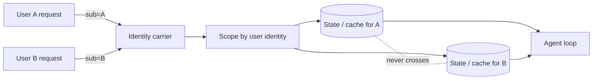

# Session Isolation

**Also known as:** Tenant Separation, Per-User State

**Category:** Memory  
**Status in practice:** mature

## Intent

Keep one user's session state and memory unreachable from another user's agent.

## Context

Multi-user agent products where leaks across users are a privacy and security failure.

## Problem

Shared memory backends and shared model contexts can leak one user's data into another's response.

## Forces

- Cache hits across users are tempting for cost; they break isolation.
- Auth scope must travel with every read and write.
- Multi-tenant prompt injection becomes a real attack surface.

## Applicability

**Use when**

- Multiple users share an agent backend and cross-user leaks are unacceptable.
- Session state and caches can be keyed end-to-end by user identity.
- Auth identity (OAuth, JWT subject) flows through the stack.

**Do not use when**

- The agent serves a single user or fully trusted tenant.
- Identity propagation cannot be enforced through every cache and store.
- Session state genuinely is shared and intended (collaborative workspaces).

## Solution

Session state is keyed by per-user identity (OAuth/JWT subject). Reads and writes carry that identity end-to-end. Caches are scoped per user. Prompts never include another user's content.

## Example scenario

A multi-tenant assistant uses a shared vector cache across all users and one day a competitive-intelligence answer for tenant A surfaces in tenant B's context because the embedding match was strong. The team scopes every cache key, every memory backend read, and every prompt context to the per-user OAuth subject end-to-end. Cross-tenant contamination becomes structurally impossible rather than 'we hope it doesn't happen.'

## Diagram

## Consequences

**Benefits**

- Privacy and security boundary is explicit and testable.
- Multi-tenant compliance posture is simpler.

**Liabilities**

- Loss of cross-user cache benefits.
- Auth plumbing in every layer.

## What this pattern constrains

No code path may read or cache user A's state under user B's identity.

## Known uses

- **Bobbin (Stash2Go)** — *Available*. Per-user OAuth/JWT scope for tools and state.
- **Weft** — *Available*. Bearer-wrapped per-user OAuth 1.0a tokens.

## Related patterns

- *complements* → [short-term-memory](short-term-memory.md)
- *complements* → [input-output-guardrails](input-output-guardrails.md)
- *complements* → [cross-session-memory](cross-session-memory.md)
- *complements* → [tool-result-caching](tool-result-caching.md)
- *complements* → [prompt-injection-defense](prompt-injection-defense.md)
- *complements* → [pii-redaction](pii-redaction.md)
- *complements* → [secrets-handling](secrets-handling.md)
- *complements* → [sovereign-inference-stack](sovereign-inference-stack.md)

**Tags:** memory, multi-tenant, auth
