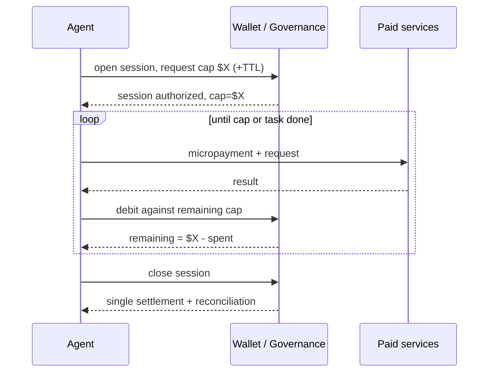

# Session-Scoped Payment Authorization

**Also known as:** Pre-Authorized Spend Session, Prepaid Micropayment Session, Session Spend Cap

**Category:** Safety & Control  
**Status in practice:** experimental

## Intent

Bound an agent's autonomous spending by having it open a payment session with a pre-approved cap, stream many micropayments inside that session, and settle once on close, instead of seeking approval for every transaction.

## Context

An agent transacts with paid services on a user's behalf — calling metered APIs, buying compute, paying other agents for sub-results. Each individual charge is tiny and frequent, so a human approval per transaction is impossible, but unbounded autonomous spend is unacceptable. Emerging agent-payment protocols (x402, AP2, ACP) give agents the rails to pay; the open question is how to cap the risk.

## Problem

Per-transaction human approval does not scale to an agent making hundreds of micropayments a minute, but handing the agent an open-ended wallet exposes the user to runaway or adversarial spend. The system needs a unit of authorization larger than one transaction yet bounded enough that a compromised or looping agent cannot drain funds.

## Forces

- Micropayments are too frequent for per-transaction human approval.
- An open-ended wallet exposes the user to runaway or malicious spend.
- A cap that is too tight stalls legitimate work mid-session; too loose and it is no protection.
- Settlement and reconciliation want to happen once, not per micropayment.
- The agent, the wallet, and the paid service are separate trust domains that must agree on the cap.

## Therefore

Therefore: make the session the unit of authorization — pre-approve a spend cap when the session opens, let the agent stream micropayments freely under that cap, and settle and reconcile once when it closes.

## Solution

Introduce a session as the authorization boundary for spend. When the agent begins a paid workflow, it opens a session and the wallet (or a governance layer) pre-authorizes a maximum amount and possibly a time-to-live. Inside the session the agent streams micropayments to services without further approval, each debited against the remaining cap; when the cap is reached the session blocks or escalates. On completion the session closes and settles once, reconciling the streamed payments. The cap, TTL, and per-recipient limits are the safety envelope; the agent's freedom exists only inside it. This is the session model emerging in machine-payment protocols layered over x402, AP2, and ACP.

## Structure

```
Agent opens session -> wallet pre-authorizes cap (+ TTL, per-recipient limits) -> agent streams micropayments under cap -> cap exhausted? block/escalate -> session close -> single settlement + reconciliation.
```

## Diagram



*The session cap is the safety envelope: the agent streams micropayments freely under it and settles once on close.*

## Example scenario

A shopping agent is told to assemble a parts list under a $200 budget. It opens a payment session pre-authorized to $200, then streams small payments to a dozen catalog and pricing APIs as it researches, each debited against the cap. When it has spent $187 it stops querying paid sources and reports back; the session closes and settles once, and even if the agent had looped, it could never have spent past the $200 it was granted.

## Consequences

**Benefits**

- Autonomous micropayment streams run without per-transaction human approval.
- Worst-case loss is bounded by the session cap, not the wallet balance.
- Settlement and reconciliation happen once per session, not per payment.
- Caps, TTL, and per-recipient limits give graded control over autonomy.

**Liabilities**

- A cap set too high still permits significant loss before it trips.
- Mid-session cap exhaustion can strand a half-finished task.
- Session state and pre-authorization add protocol complexity across trust domains.
- A compromised agent can still spend up to the full cap before detection.
- Reconciliation disputes are harder to unwind after a single bulk settlement.

## What this pattern constrains

The agent must not initiate a payment that would take cumulative session spend over the pre-authorized cap, and must not transact outside an open, authorized session. When the cap is reached it must stop and escalate rather than seek funds elsewhere.

## Applicability

**Use when**

- An agent makes frequent micropayments that cannot each be human-approved.
- You need a hard ceiling on autonomous spend per workflow.
- Settlement is cheaper or cleaner done once per session than per payment.
- The payment rails support pre-authorization and held caps (x402, AP2, ACP).

**Do not use when**

- Spend is rare enough that per-transaction approval is fine.
- Each payment is large and warrants individual human sign-off.
- No payment protocol in use supports session pre-authorization.
- A single global budget already bounds the agent and per-session granularity adds no safety.

## Known uses

- **[x402 (Coinbase)](https://github.com/coinbase/x402)** — *Available* — Open protocol for agent payments over HTTP 402 that the session/streaming models layer on to authorize and settle agent spend.
- **[Agent Payments Protocol (AP2, Google)](https://github.com/google-agentic-commerce/AP2)** — *Available* — Defines mandates and authorization scopes for agent-initiated payments, the substrate a session cap is expressed against.
- **[AIエージェント決済の6層構造 (Zenn)](https://zenn.dev/komlock_lab/articles/agent-payments-stack-2026)** — *Available* — Describes the session model: the agent opens a session, pre-approves a spending limit, streams micropayments within it, and settles at session close.

## Related patterns

- *specialises* → [agent-initiated-payment](agent-initiated-payment.md) — Agent-initiated payment is the general capability; session-scoped authorization specialises it by making a capped session, not a single charge, the unit of approval.
- *complements* → [step-budget](step-budget.md) — Step-budget bounds compute steps; a session cap bounds money. Both are exhaustible envelopes around autonomy.
- *complements* → [circuit-breaker](circuit-breaker.md) — A circuit-breaker halts on an error or anomaly signal; the session cap halts on cumulative spend. Together they bound both failure and cost.

## References

- (spec) Coinbase, *x402: an open protocol for internet-native payments*, 2025, <https://github.com/coinbase/x402>
- (spec) Google, *Agent Payments Protocol (AP2)*, 2025, <https://github.com/google-agentic-commerce/AP2>
- (blog) komlock_lab, *エージェントが払う仕組み — AIエージェント決済の6層構造*, 2026, <https://zenn.dev/komlock_lab/articles/agent-payments-stack-2026>

**Tags:** safety-control, payments, autonomy, budget, agent-commerce
