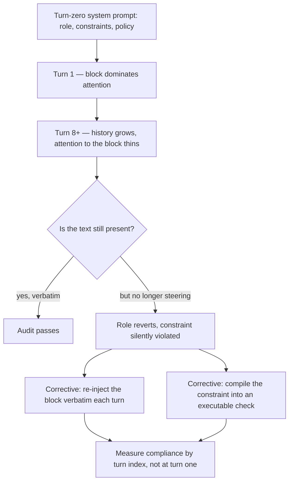

# Set-and-Forget System Prompt

**Also known as:** Instruction Drift, Turn-Zero-Only Policy, System-Prompt Attention Decay

**Category:** Anti-Patterns  
**Status in practice:** deprecated

## Intent

Anti-pattern: state the agent's role and policy once in the turn-zero system prompt and assume it keeps binding, when attention to that block decays over turns while its text sits unchanged in context.

## Context

An agent is configured by writing its role, its constraints and its operating policy into a system prompt that is sent once, before the first user turn. Everything after that — user messages, model replies, tool calls and their results — is appended to the same window. The block is never edited, never summarised and never falls out of the window, so an operator inspecting the running conversation finds the policy exactly as it was written. The same shape appears outside dialogue, where a repository instruction file states standing conventions that a coding agent is expected to honour for the length of an autonomous run.

## Problem

Presence is not the same as force. Attention to a fixed opening block thins as the history in front of it grows, so the instruction stops steering the model long before it stops being readable. A quantitative benchmark of multi-turn dialogs reports significant instruction drift within eight rounds for LLaMA2-chat-70B and GPT-3.5, attributed to attention decay over dialogue length. The same non-bindingness is measured for passive instruction files: on SWE-bench Lite a documented constraint is honoured 67.0% of the time, and asking the model to reflect over that same text is worse at 50.3%, while compiling the constraint into an executable check reaches 88.3%. That reflection scores below the plain baseline is the clearest sign the failure is architectural rather than a wording problem. The taxonomy of multi-agent failures puts the two resulting modes at the very top of its list: disobeying the task specification and disobeying the role specification.

## Forces

- A single opening block is cheap to write and free to carry, while re-asserting the policy on every turn costs tokens and breaks the cached prefix, so the default architecture is exactly the one that drifts.
- Presence in the window is trivial to audit and binding force is not, so a check that the policy text is still there returns green while behaviour has already reverted to generic.
- Attention is finite and spreads across a lengthening history, so the opening block competes with more recent tokens every turn no matter how emphatically it is phrased.
- The cheapest available remedy — asking the model to re-read its own standing instructions — measures worse than doing nothing extra, at 50.3% compliance against a 67.0% baseline.
- Evaluation is usually run on short exchanges, so the configuration is signed off at the turn where it still binds and never measured at the turn where it does not.

## Therefore

Therefore (the corrective): stop resting a standing constraint on one opening block — re-inject its verbatim wording each turn where the model will read it, or compile it into a check outside the model, and measure compliance against turn index.

## Solution

The corrective splits into two families, and serious deployments use both. The first is re-assertion: the prompt-assembly step recomputes and re-injects the role and policy block verbatim on every turn, placed late in the prompt rather than at position zero, so its weight does not depend on how far the conversation has run; attention-level remedies such as split-softmax do the same job inside the model. The second is externalisation: the constraint is compiled into something that executes — a static check, a runtime shim, or a validator that intercepts an action before it lands — so a violation is caught by a mechanism that has no attention budget to lose. Whichever family is chosen, compliance is measured as a function of turn index and run length rather than at the opening turn, because a configuration that binds at turn one and not at turn twenty passes every short evaluation.

## Structure

```
Turn-zero policy block (written once, never edited) + history that grows every turn; attention to the block thins with distance, so behaviour reverts to generic while the text stays verbatim. Correctives: per-turn verbatim re-injection, or an executable check outside the model.
```

## Diagram



*The opening policy block stays verbatim in context while attention to it thins with dialogue length, so an audit passes at the same turn the constraint stops binding.*

## Example scenario

A support agent is configured with a system prompt saying it must never quote a price and must hand every billing question to a human. For the first few exchanges it does exactly that. Twenty turns into a long troubleshooting conversation the customer asks what the upgrade costs, and the agent answers with a figure. The instruction is still in the prompt, word for word, and nothing summarised, edited or evicted it.

## Consequences

**Benefits**

- Naming the failure separates two things operators conflate: an instruction being present in the context versus an instruction still governing behaviour.
- It gives a measurable target — compliance by turn index — where the usual evaluation reports only turn-one adherence.
- It points at the two correctives that are known to work, per-turn re-injection and external enforcement, and away from the reflection remedy that measures worse than the baseline.

**Liabilities**

- An agent passes its configuration review on short exchanges and then reverts to generic behaviour inside eight rounds of ordinary dialogue, with no error raised and no trace anomaly to inspect.
- A third of documented constraints go silently unhonoured in long autonomous runs, and in settings without real-time supervision those violations compound into rework.
- The correctives are not free: re-injecting the block every turn spends context budget and invalidates the cached prefix, and externalising a constraint requires expressing it in something executable.
- Debugging misfires, because the policy text is intact and readable, so effort goes into rewording a block whose wording was never the problem.

## Failure modes

- Role reversion — the agent abandons its assigned responsibilities and answers as a generic assistant, with the role description still verbatim in the prompt.
- Task-specification violation — a stated constraint on the work is broken silently, with a well-formed result that nothing flags as non-compliant.
- Late-turn regression — behaviour is correct for the first few exchanges and degrades with dialogue length, so short evaluations never see it.
- Reflection backfire — a self-review step is added over the same passive text and compliance drops below the baseline that had no review at all.
- Green audit — an inspection greps for the policy string, finds it present and unchanged, and certifies a configuration that has already stopped binding.

## What this pattern constrains

A standing role or policy constraint must not rest on a single turn-zero block: it has to be re-injected verbatim on each turn or enforced by a check outside the model, and compliance can never be signed off from opening-turn behaviour alone.

## Applicability

**Use when**

- Watch for this in any agent whose role, constraints or policy are stated once in a system prompt and never restated.
- Suspect it when behaviour is correct early in a session and reverts to generic later, with the prompt text unchanged.
- Audit for it when standing conventions live in an instruction file that a long autonomous run is trusted to honour without any check.
- Cite this entry when a fix attempt consists of rewording the opening block and the drift returns at the same turn depth.

**Do not use when**

- Interactions are short enough that the conversation never reaches the depth at which the opening block stops binding.
- The standing policy block is already recomputed and re-injected verbatim on every turn, which is the corrective rather than the anti-pattern.
- Every load-bearing constraint is enforced by a deterministic check outside the model, so the prompt wording is advisory rather than binding.
- The problem is that the summariser rewrote the rule or that the prompt grew unmanageably, which are the neighbouring anti-patterns rather than this one.

## Components

- Turn-zero system prompt — carries the role, constraints and policy, sent once before the first user turn and never restated
- Growing dialogue or trajectory history — appended every turn and competing with the opening block for a finite attention budget
- Attention allocation over position — thins the opening block's influence as distance grows, with its text unchanged and fully in context
- Per-turn re-injection slot — the missing prompt-assembly step that would restate the policy verbatim where the model still reads it
- External enforcement point — the missing static check, runtime shim or validator that would reject a violating action outside the model
- Turn-indexed compliance measurement — the missing evaluation that reports adherence at turn twenty rather than only at turn one

## Tools

- Prompt-assembly harness — the place where a standing block can be recomputed and re-injected verbatim on every turn
- Multi-turn instruction-following benchmarks — measure adherence as a function of turn index instead of at the opening exchange
- Policy engines, linters and pre-commit checks — enforce a standing constraint outside the model so its force does not depend on attention
- Attention-level remedies such as split-softmax — reweight the standing block against a lengthening history inside the model
- Trace inspection over full sessions — locates the turn depth at which behaviour reverted rather than sampling the opening turns

## Evaluation metrics

- Compliance by turn index — whether adherence at turn twenty matches adherence at turn one
- Drift onset turn — how many rounds of ordinary dialogue pass before the standing instruction stops binding, measured at under eight for several chat models
- Silent violation rate — share of actions that break a documented constraint with no error raised and no anomaly in the trace
- Passive-text versus enforced-check compliance gap — 67.0% against 88.3% on repository instruction files over SWE-bench Lite
- Reflection uplift — whether a self-review step over the same text helps or hurts, measured at 50.3% against a 67.0% baseline

## Known uses

- **[Multi-turn dialogs with LLaMA2-chat-70B and GPT-3.5 (instruction-stability benchmark)](https://arxiv.org/abs/2402.10962)** _available_ — Quantifies the failure directly: significant instruction drift within eight rounds of conversation, attributed to attention decay over dialogue length, with split-softmax offered as a mitigation.
- **[MAST failure taxonomy over traces from seven multi-agent frameworks](https://arxiv.org/abs/2503.13657)** _available_ — Disobeying the task specification and disobeying the role specification are the first two entries in a taxonomy of fourteen failure modes clustered into three categories, making this the most common shape of multi-agent breakdown observed in practice.
- **[Repository agent-instruction files read by coding agents](https://agents.md/)** _available_ — Standing conventions written once as passive text for an autonomous run; measured compliance on SWE-bench Lite is 67.0%, against 88.3% when the same constraint is compiled into an executable check.

## Related patterns

- _alternative-to_ **Guardrail Erosion Through Compaction** — Sibling anti-pattern with a different mechanism: there a compaction pass rewrites the rule into vagueness, so pinning the text fixes it. Here the text is verbatim and fully in context, and the decay is in attention over dialogue length, so protecting it from the summariser changes nothing.
- _alternative-to_ **Standing State Injection** — The corrective on the re-assertion side, applied to task state; the same per-turn recompute-and-inject discipline applied to the role and policy block is exactly what this anti-pattern omits.
- _alternative-to_ **Constitutional Charter** — The corrective for stable rules: a block the agent reads every turn and cannot modify, rather than one read once before the first turn.
- _alternative-to_ **Policy-as-Code Gate** — The corrective on the externalisation side — the constraint becomes an executable check outside the model, which measured 88.3% compliance against 67.0% for the same constraint left as passive text.
- _complements_ **Attentive Reasoning Queries** — Re-anchors the model's attention on the critical instructions at reasoning time, which is a direct in-model remedy for the decay named here.
- _complements_ **Lost in the Middle (Positional Bias)** — The same positional weakness measured for retrieval targets; here it applies to the standing instruction block itself, which sits at the position that ages fastest.
- _complements_ **Context Window Dumb-Zone Cap** — A different axis of the same degradation: that one is a utilisation threshold measured by how full the window is, while instruction drift shows up at eight rounds of ordinary dialogue with the window nowhere near full.
- _complements_ **Prompt Bloat** — Two failures of the same block in opposite directions: bloat is a prompt that grows and is never pruned, this is a prompt that never changes and stops binding anyway.
- _complements_ **Rogue Agent Drift** — That failure needs a long-running deployment with persistent memory and self-modification; this one needs neither and appears inside a single conversation.
- _complements_ **Context-Driven Architecture Drift** — The coding-agent case of a convention not being honoured: there the conventions were never written down in machine-readable form, here they were written down plainly and still went unhonoured a third of the time.

## References

- [Measuring and Controlling Instruction (In)Stability in Language Model Dialogs](https://arxiv.org/abs/2402.10962) — 2024
- [Why Do Multi-Agent LLM Systems Fail?](https://arxiv.org/abs/2503.13657) — 2025
- [ContextCov: Deriving and Enforcing Executable Constraints from Agent Instruction Files](https://arxiv.org/abs/2603.00822) — 2026
- [Lost in the Middle: How Language Models Use Long Contexts](https://arxiv.org/abs/2307.03172) — 2023
- [Effective context engineering for AI agents](https://www.anthropic.com/engineering/effective-context-engineering-for-ai-agents) — Anthropic, 2025
