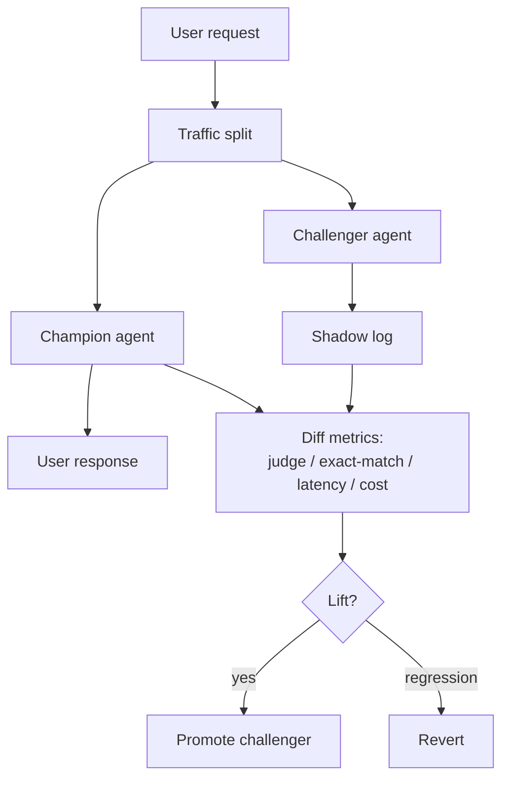

# Shadow Canary

**Also known as:** Shadow Agent, Canary Deployment

**Category:** Governance & Observability  
**Status in practice:** mature

## Intent

Run a candidate agent version in shadow alongside the champion, comparing outputs without affecting users.

## Context

A team wants to roll out a new model, a tweaked prompt, or a reworked tool wiring to an agent already serving real users. They have an existing version (the champion) that they trust on live traffic and a candidate version (the challenger) they want to validate before promoting. The traffic distribution in production includes long-tail queries that no pre-release evaluation set fully captures.

## Problem

Pre-release evaluations cover the distributions the team thought to put in the test set, not the surprising ones that show up in real usage. Releasing the challenger directly to a fraction of users exposes those users to whatever regressions it has. The team is forced to choose between launching blind and hoping nothing breaks, or building a separate evaluation set so comprehensive that it never actually matches live behaviour.

## Forces

- Shadow runs cost money for output never shown.
- Comparison logic for free-form outputs is non-trivial.
- Shadow latency must not affect the user-visible path.

## Applicability

**Use when**

- Agent changes are non-deterministic and CI cannot capture field behaviour.
- Real traffic can be replayed through a challenger without affecting users.
- A diff metric (judge model, exact match, latency) can be defined.

**Do not use when**

- Privacy rules forbid duplicating traffic through a shadow path.
- Cost of running both champion and challenger is prohibitive.
- No diff metric exists that reliably catches regressions.

## Therefore

Therefore: dual-route a fraction of real traffic through both champion and challenger, return the champion's output to the user, and diff the challenger's logged output on agreed metrics, so that a candidate is validated on live distribution before it can affect anyone.

## Solution

Route a fraction of real traffic through both champion and challenger. Champion's output reaches the user. Challenger's output is logged. Diff the outputs on agreed metrics (judge model, exact match on tool calls, latency, cost). Promote on lift; revert on regression.

## Example scenario

A team wants to upgrade the underlying model on an in-production agent but pre-release evals miss real-traffic regressions. They route ten percent of real traffic through both champion (current) and challenger (candidate); only champion's reply reaches the user. A judge model diffs the two on agreed metrics over a week. They catch a regression on a niche legal-style query that no eval covered, fix it, then promote the challenger.

## Diagram

## Consequences

**Benefits**

- Field-quality regression detection.
- Confidence to roll out non-deterministic changes.

**Liabilities**

- 2x cost during shadow window.
- Diff-noise on free-form outputs is hard to attribute.

## What this pattern constrains

Challenger output is not user-visible during shadow; only logging.

## Known uses

- **Standard practice in ML/agent platforms** — *Available*

## Related patterns

- *complements* → [eval-harness](eval-harness.md)
- *uses* → [llm-as-judge](llm-as-judge.md)
- *alternative-to* → [perma-beta](perma-beta.md)
- *complements* → [eval-as-contract](eval-as-contract.md)
- *complements* → [prompt-versioning](prompt-versioning.md)

**Tags:** governance, shadow, release
