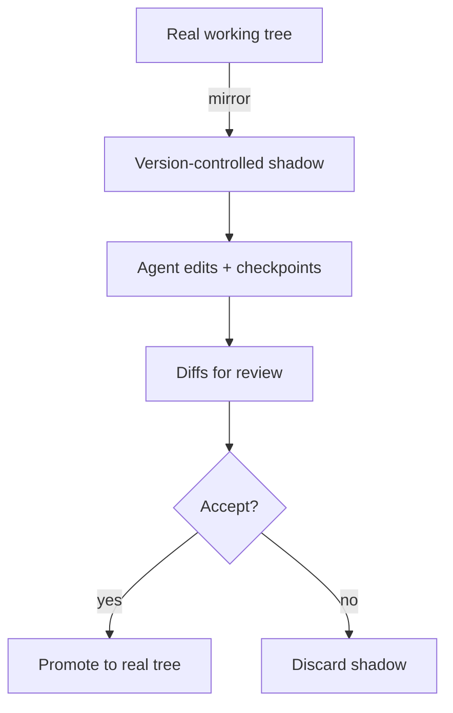

# Shadow Workspace

**Also known as:** Agent-Edit VCS, Shadow Git Checkpoints

**Category:** Tool Use & Environment  
**Status in practice:** emerging

## Intent

Mirror the workspace into an isolated, version-controlled shadow where the agent makes and reverts edits, surfacing diffs for review and promoting only accepted changes to the real tree.

## Context

An autonomous coding agent edits files in a developer's working tree. It needs to experiment — try an edit, run tests, back out, try another — and it gets things wrong. Editing the real tree in place means a bad run can corrupt uncommitted work, and there is no clean per-edit history to review or revert.

## Problem

An agent that writes straight to the working tree gives the human no safe boundary: a wrong edit overwrites real work, a multi-step change is hard to review as a whole, and undoing one step without losing the others is fiddly. The agent needs room to make and unmake edits freely, while the human keeps a reviewable, revertible record and the real tree stays clean until changes are accepted.

## Forces

- An agent must experiment and recover from bad edits, but direct writes to the real tree risk corrupting the developer's uncommitted work.
- Per-edit rollback and whole-change review need a version history, yet maintaining a parallel copy costs disk and bookkeeping.
- The shadow must track the real tree closely enough that promoting accepted changes is clean, not a merge nightmare.

## Therefore

Therefore: keep the agent's edits in a version-controlled shadow of the workspace (a per-task checkpoint repo or an in-memory overlay), expose diffs for review and per-step rollback, and promote only accepted changes to the real tree.

## Solution

Mirror the working tree into a shadow the agent edits instead of the real files — commonly a per-task hidden git repository that checkpoints every edit, or an in-memory overlay that tracks modifications without writing to disk. Each agent edit becomes a diff the human can inspect, and any step can be rolled back to a prior checkpoint without disturbing the others. When the change is accepted it is promoted to the real working tree; if rejected, the shadow is discarded and the real tree is untouched.

## Structure

```
real tree --mirror--> shadow (agent edits, checkpointed) --diffs--> review -> accept: promote to real tree | reject: discard shadow
```

## Diagram



*The agent edits a checkpointed shadow; only accepted diffs are promoted to the real tree.*

## Example scenario

A coding agent refactors a module across eight files. It works in a hidden checkpoint repo that snapshots each edit, so when step six breaks the build the developer rolls back just that step instead of the whole run. Once the diff looks right the agent promotes the change to the real working tree; had it looked wrong, discarding the shadow would have left the original files exactly as they were.

## Consequences

**Benefits**

- A bad agent edit can never corrupt the developer's working tree; the real files change only on accept.
- Every edit is a reviewable diff and any step can be rolled back independently.
- The agent can experiment freely, which makes recovery from a wrong path cheap.

**Liabilities**

- Maintaining a parallel shadow costs disk and synchronisation bookkeeping.
- If the shadow drifts from the real tree, promoting accepted changes turns into a merge problem.
- An in-memory shadow can lose work if the process dies before promotion.

## Failure modes

- Shadow drift — the real tree changes underneath the shadow and promotion conflicts.
- Lost promotion — accepted changes fail to apply cleanly back to the real tree.
- Silent divergence — the agent reasons against the shadow while the human sees the stale real tree.

## What this pattern constrains

The agent does not write directly to the real working tree; all edits land in the shadow first and may only be promoted after review, so a rejected or broken edit never reaches the developer's files.

## Applicability

**Use when**

- An agent edits a real workspace and a wrong edit must never corrupt the developer's files.
- Per-edit diffs and independent rollback are needed for review and recovery.
- The shadow can be kept close enough to the real tree that promotion stays clean.

**Do not use when**

- The agent only proposes changes a human applies by hand, so no live edit boundary is needed.
- The workspace is throwaway and corrupting it carries no cost.
- An undo-via-inverse-action approach already covers recovery without a parallel copy.

## Components

- Real working tree — the developer's files, changed only on accept
- Shadow workspace — the version-controlled copy or overlay the agent edits
- Checkpointer — snapshots each agent edit so any step can be rolled back
- Diff and review surface — presents agent edits for human inspection
- Promoter — applies accepted changes from the shadow back to the real tree

## Tools

- Version control (git) — backs the per-edit checkpoints and rollback in the shadow
- Diff viewer — renders agent edits for review before promotion
- Filesystem overlay — optionally tracks edits in memory without touching disk

## Evaluation metrics

- Real-tree corruption incidents — should be zero, since edits land in the shadow first
- Rollback usage rate — how often a step is reverted, showing the safety net in use
- Promotion conflict rate — how often accepted changes fail to apply cleanly
- Review latency per change — time from agent edit to human accept or reject

## Known uses

- **[Cline (shadow git checkpoints)](https://github.com/cline/cline)** _available_ — Keeps an isolated git repo per workspace and offers diff-based rollback of agent edits.
- **Moatless Tools (in-memory shadow mode)** _available_ — Tracks file modifications in memory without writing to disk until accepted.
- **[Inside the Scaffold (coding-agent taxonomy)](https://arxiv.org/abs/2604.03515)** _available_ — Catalogs shadow git checkpoints and in-memory shadow mode as execution-isolation and state-management techniques.

## Related patterns

- _alternative-to_ **Compensating Action** — Compensating Action undoes an effect by running an inverse action; a shadow workspace reverts by discarding a diff/checkpoint instead.
- _alternative-to_ **Durable Workflow Snapshot** — Snapshots persist execution/workflow state for resume; a shadow workspace versions the files the agent mutates for review and rollback.
- _complements_ **Synthetic Filesystem Overlay** — An overlay presents a virtual filesystem surface; the shadow adds version history and diff-based rollback over the edits made through it.
- _complements_ **Subagent Isolation** — Worktree isolation separates parallel subagents; a shadow workspace isolates the agent's edits from the real tree for safe review.

## References

- [Inside the Scaffold: A Source-Code Taxonomy of Coding Agent Architectures](https://arxiv.org/abs/2604.03515) — 2026
- [cline/cline](https://github.com/cline/cline) — 2024
