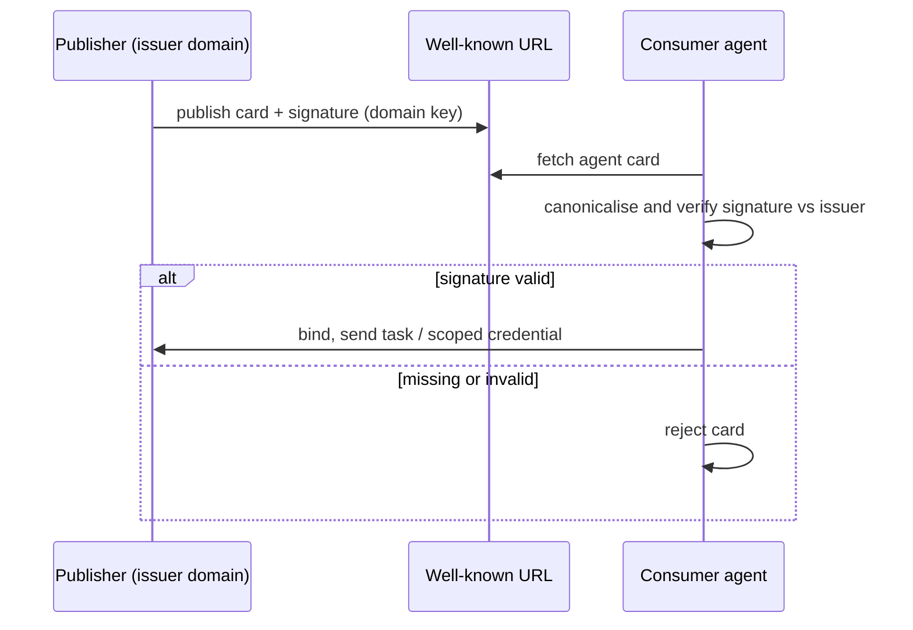

# Signed Agent Card

**Also known as:** Verifiable Agent Card, Signed Agent Capability Card

**Category:** Multi-Agent  
**Status in practice:** emerging

## Intent

Cryptographically sign an agent's published capability card so a consuming agent can verify it was issued by the claimed domain before binding to or delegating to it, closing the spoofing gap in agent-to-agent discovery.

## Context

Agents discover each other at runtime by fetching a published descriptor — an agent card or capability manifest — that advertises identity, endpoint, skills, and authentication needs. In an open, cross-vendor setting, a client agent reads such a card and then binds to the remote agent, sending it tasks and sometimes delegated credentials. Discovery assumes the card it fetched genuinely belongs to the party it names.

## Problem

A plain capability card is just a JSON document at a URL, and anything can serve one. Nothing stops a hostile party from publishing a card that claims another organisation's identity and skills, or from tampering with a card in transit, so a client that trusts the card at face value can be steered into delegating work or credentials to an impostor. Discovery needs a way to check that a card truly came from the domain it claims, without a central registry vouching for every agent.

## Forces

- Open cross-vendor discovery wants any agent to publish a card and any client to read it; trust wants the client to know the card is authentic before acting on it.
- A central authority vouching for every agent would add a bottleneck and a single point of control that decentralised discovery is meant to avoid.
- Verification has to ride with the card itself, because the consuming agent has no prior relationship with the publisher and may never contact a third party.

## Therefore

Therefore: have the publisher cryptographically sign the agent card with a key bound to its domain, attach the signature to the card, and require the consuming agent to verify the signature against the issuer before it binds to the agent or delegates anything to it.

## Solution

Add a signature to the agent card. The publisher signs the card's canonical content with a key whose authority traces to the domain that issued it — for example a JWS signature the consumer can validate against the issuer's published key — and embeds the signature in the card. A consuming agent that fetches the card first canonicalises and verifies the signature: a card whose signature is missing, malformed, or not traceable to the claimed issuer is rejected before any binding. Only a card that verifies is trusted enough to drive endpoint selection, capability binding, and credential delegation. Because the proof travels in the card, verification needs no central broker, and each consumer checks authenticity independently.

## Structure

```
Publisher --sign(card, domain key)--> signed agent card @ well-known URL --fetch--> Consumer --verify(signature vs issuer)--> bind | reject.
```

## Diagram



*The consumer verifies the card's signature against the claimed issuer before binding; an unsigned or invalid card is rejected.*

## Example scenario

A travel agent service and an airline's booking agent have never interacted. The travel agent fetches the airline agent's card from a well-known URL to learn its endpoint and skills. Because the card is signed with a key tied to the airline's domain, the travel agent verifies the signature before sending a booking task and a scoped credential; an impostor card served from a look-alike host fails verification and is dropped.

## Consequences

**Benefits**

- A consumer can confirm a card genuinely came from the claimed issuer before delegating work or credentials, without a central registry.
- Tampering with a published or in-transit card invalidates the signature, so altered capabilities or endpoints are detected.
- Authenticity is checkable independently by each consumer, keeping cross-vendor discovery decentralised.

**Liabilities**

- The publisher must manage a signing key and its rotation; a leaked key lets an attacker mint cards that verify.
- Consumers must implement canonicalisation and verification correctly, and subtle canonicalisation mismatches make valid cards fail.
- A valid signature proves origin, not good behaviour — a genuinely signed card can still describe a malicious or low-quality agent.

## Failure modes

- Unverified trust — the consumer skips verification and binds to an unsigned or unchecked card, defeating the pattern.
- Key compromise — a stolen signing key produces forged cards that pass verification.
- Canonicalisation drift — publisher and consumer disagree on canonical form, so authentic cards fail to verify and get rejected.

## What this pattern constrains

A consuming agent must not bind to or delegate to a remote agent on an unsigned card; a card whose signature is missing or does not verify against the claimed issuer is rejected before any task or credential is sent.

## Applicability

**Use when**

- Agents from different organisations discover and bind to each other without a pre-shared trust relationship.
- A consuming agent delegates tasks or credentials based on a fetched capability card.
- Impersonation or tampering of the discovery descriptor is a realistic threat.

**Do not use when**

- All agents live inside one trust boundary that already authenticates every endpoint.
- Discovery is static and hardcoded, so no untrusted card is ever fetched.
- A central registry already authenticates and vouches for every agent's identity.

## Components

- Agent card — the published descriptor of identity, endpoint, skills, and auth needs
- Signing key — the issuer's domain-bound key used to sign the card
- Signature (for example JWS) — the verifiable proof attached to the card
- Card verifier — consumer-side step that canonicalises the card and checks the signature against the issuer
- Binding gate — proceeds to task or credential delegation only on a verified card

## Tools

- JWS / JSON Web Signature — signs and verifies the agent card
- Well-known discovery endpoint — where the signed card is published and fetched
- Issuer key resolution (domain-bound key or DID) — lets the consumer trace the signature to the claimed issuer

## Evaluation metrics

- Share of bindings preceded by a successful card-signature verification
- Rejected-card rate — unsigned, malformed, or untraceable cards dropped before binding
- False-reject rate from canonicalisation mismatches on authentic cards
- Time-to-revoke — how fast a compromised signing key can be rotated and old cards invalidated

## Known uses

- **[A2A Protocol (Agent Card Signing)](https://a2a-protocol.org/latest/specification/)** _available_ — The A2A specification defines an AgentCardSignature object and a JWS-based Agent Card Signing scheme (specification section 8.4) so clients can verify a card's authenticity and issuer.
- **[A2A agent discovery](https://a2a-protocol.org/latest/topics/agent-discovery/)** _available_ — A2A agent cards are the discovery descriptor a client fetches to bind by capability; signing makes that descriptor verifiable before binding.

## Related patterns

- _complements_ **Agent Capability Manifest** — The manifest publishes an agent's identity and skills for runtime discovery; signed agent card is the authenticity layer that lets a consumer trust the manifest before binding.
- _complements_ **Cryptographic Instruction Authentication** — Both use signatures to establish provenance; instruction authentication signs system instructions against injection, signed agent card signs the discovery descriptor against impersonation.
- _complements_ **Delegated Agent Authorization** — Verifying the card precedes safe delegation; delegated authorization then scopes what credentials the now-trusted agent receives.

## References

- [A2A Protocol Specification — Agent Card Signing](https://a2a-protocol.org/latest/specification/) — A2A Project (Linux Foundation), 2026
- [A2A Agent Discovery — The Agent Card](https://a2a-protocol.org/latest/topics/agent-discovery/) — A2A Project, 2026
- [Protocollo A2A: i cinque pattern che portano gli agenti AI in produzione](https://www.agendadigitale.eu/industry-4-0/protocollo-a2a-i-cinque-pattern-che-portano-gli-agenti-ai-in-produzione/) — Agenda Digitale, 2026
