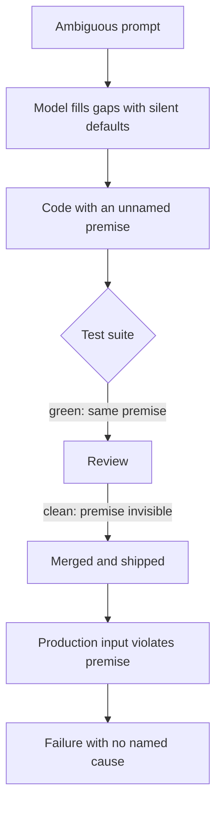

# Silent Hypotheses in Generated Code

**Also known as:** Silent Hypothesis to Production, Unnamed Assumption Shipped, Hypothese Silencieuse

**Category:** Anti-Patterns  
**Status in practice:** emerging

## Intent

Anti-pattern: model-written code rests on an unstated runtime premise that passing tests and code review never surface, so the hidden assumption travels into production and fails there.

## Context

A coding agent generates a function or a change and the code reads cleanly, the test suite stays green, and a reviewer approves it. To produce plausible code the model fills every gap the prompt left open with a default guess: that an input is always sorted, that a list is never empty, that a currency is the local one, that a timestamp is in the server's timezone, that an upstream service answers within a second. Each guess is a premise the code now depends on, yet none of it is written down anywhere a reader or a test can see.

## Problem

Passing tests prove only that the code behaves correctly on the cases the tests cover, which are usually the cases that share the same unstated premise the code was written under. The hidden assumption is therefore invisible at exactly the two moments meant to catch defects: the green suite confirms the happy path the model already assumed, and the reviewer, reading fluent code, sees no flag because nothing names the premise. The assumption surfaces only when production sends an input that violates it, and by then the failure looks like a runtime incident with no obvious cause rather than a design choice nobody made on purpose.

## Forces

- To generate runnable code the model must resolve every ambiguity the prompt left open, and the cheapest resolution is a silent default rather than a question back to the developer.
- A green test suite reads as proof of correctness, but it only certifies the cases tested, which tend to share the same premise the code was generated under.
- Fluent, idiomatic generated code lowers a reviewer's guard precisely when the load-bearing assumption is the thing that is missing from the page.
- Naming and testing every assumption is slow and pushes against the speed that made code generation attractive in the first place.

## Therefore

Therefore (the anti-pattern): the team ships generated code on the strength of a green suite and a clean review, leaving each unstated premise unnamed and untested until production traffic violates it.

## Solution

The remedy is to treat passing tests as non-proof of correctness and to surface the hidden premises before they ship. When generating code, have the model emit the assumptions it made explicit alongside the code as comments, preconditions, or assertions, so every silent default becomes a named, reviewable claim. Add tests that target the violated-premise cases — empty inputs, unsorted data, foreign currency, late upstream responses — rather than only the happy path the code was written under. In review, ask of each change what it assumes about its inputs and environment and whether anything checks that assumption, treating an unnamed premise as a defect rather than a detail. Where a premise cannot be tested cheaply, encode it as a runtime guard that fails loudly instead of corrupting state quietly.

## Structure

```
Prompt (ambiguous) -> Model fills gaps with silent defaults -> Code (unnamed premise) -> Tests green (same premise) + review clean (premise invisible) -> Production input violates premise -> Failure with no named cause
```

## Diagram



*An unstated premise survives a green suite and a clean review, then fails when production violates it.*

## Example scenario

A developer asks an agent to add a function that returns the average order value. The code reads cleanly and the tests pass. Nobody notices the agent assumed the order list is never empty, because every test fixture has orders in it. Three weeks later a new customer with no orders hits the endpoint, the function divides by zero, and the checkout page errors out. The bug was a silent assumption that travelled all the way to production without ever being named.

## Consequences

**Liabilities**

- A production failure presents as an unexplained incident because the premise that broke was never written down to point at.
- The green suite gives false assurance, so the team's confidence is highest exactly where the untested assumption is weakest.
- Every additional generated change can add new silent premises faster than review can name the old ones.
- Debugging is slow because the assumption lives in the model's vanished reasoning, not in the visible code.

## Failure modes

- Empty- or null-input collapse — the code assumes a non-empty collection or present value and crashes or corrupts state on the case the model never considered.
- Environment-premise drift — code assumes a timezone, locale, currency, or service latency that holds in test and dev but not for some production traffic.
- Happy-path test lock-in — the generated tests encode the same assumption as the code, so the suite can never expose the premise it shares.
- Review rubber-stamp — fluent generated code passes review because nothing on the page names the assumption a reviewer would have questioned.

## What this pattern constrains

Generated code must not be merged on a green suite and a clean review alone; each unstated premise about inputs and environment must be named as a comment, assertion, or test, and passing tests cannot be treated as proof that no hidden assumption remains.

## Applicability

**Use when**

- A team relies on a model or coding agent to generate or modify code that ships to production.
- Generated changes are gated mainly by a passing test suite and a quick human review.
- Prompts often leave input shapes, environment, or edge cases unspecified, so the model must fill them with defaults.

**Do not use when**

- Generated code is paired with explicit assumption surfacing — assertions, preconditions, or property tests on the cases the prompt left open.
- Inputs and environment are fully specified and contract-tested, leaving the model no ambiguity to resolve with a silent default.
- The code is throwaway, sandboxed, or never reaches production where a violated premise could cause harm.

## Components

- Ambiguous prompt — the underspecified request that leaves gaps the model must resolve
- Silent default — the unstated premise the model chooses to make the code runnable
- Generated code — the merged change that now depends on the unnamed premise
- Happy-path test suite — green tests that share the code's assumption and so cannot expose it
- Code review — the human gate that sees fluent code but no flag naming the premise
- Production input — the real-world case that finally violates the assumption

## Tools

- Code-generation agent — produces the change and the silent defaults inside it
- Test runner — reports the green suite that the team mistakes for proof of correctness
- Assertion and precondition checks — the cure-side guards that turn a silent premise into a loud failure
- Property-based and edge-case test generators — exercise inputs the happy-path suite never covers

## Evaluation metrics

- Named-assumption coverage — fraction of generated changes whose premises are made explicit as comments, assertions, or tests
- Edge-case-to-happy-path test ratio — how much of the suite probes premise-violating inputs versus the assumed case
- Premise-violation incident rate — production failures traced to an unstated assumption per release
- Mean time to diagnose — how long incidents take to trace, a proxy for whether the broken premise was ever written down

## Known uses

- **[Journal du Net field report](https://www.journaldunet.com/intelligence-artificielle/1550435-l-ere-des-agents-ia-coder-vite-ne-suffit-plus-il-faut-coder-juste/)** _available_ — French practitioner essay on agentic coding that names the failure: an unnamed silent hypothesis travelling unchecked into production despite passing the build.
- **[AI code generation security studies](https://arxiv.org/abs/2108.09293)** _available_ — Reports of model-generated code that compiles and passes tests yet ships latent defects — corroborating the gap between a green suite and runtime correctness.

## Related patterns

- _complements_ **Workflow-Success vs Business-Validity Gap** — Both treat a green signal as false proof; that anti-pattern mis-reads a workflow's terminal status as business-correctness, this one mis-reads a passing test suite as evidence the code carries no hidden runtime premise.
- _complements_ **Phantom Action Completion** — Phantom completion is about an action that never ran being narrated as done; here the code did run and did pass tests, but rests on an assumption nothing checked.
- _alternative-to_ **Generate-and-Test Strategy** — Generate-and-test makes premises explicit by deriving constraints and testing candidates against them, which is the discipline whose absence produces silent hypotheses.
- _complements_ **Eval as Contract** — Treating the eval suite as the release contract counters the false assurance of a happy-path-only suite that shares the code's hidden premise.

## References

- [L'ere des agents IA : coder vite ne suffit plus, il faut coder juste](https://www.journaldunet.com/intelligence-artificielle/1550435-l-ere-des-agents-ia-coder-vite-ne-suffit-plus-il-faut-coder-juste/) — 2026
- [An Empirical Cybersecurity Evaluation of GitHub Copilot's Code Contributions](https://arxiv.org/abs/2108.09293) — Pearce, Ahmad, Tan, Dolan-Gavitt, Karri, 2021
