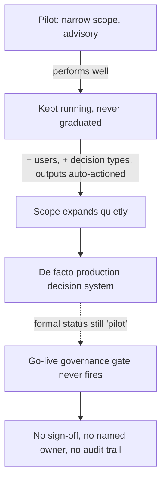

# Silent Pilot-to-Production Promotion

**Also known as:** Permanent Pilot, Pilot-in-Name-Only, The Pilot That Never Ended

**Category:** Governance & Observability  
**Status in practice:** deprecated

## Intent

Anti-pattern: let a well-performing pilot quietly expand in scope until it is a de facto production decision system, while keeping the 'pilot' label so it never trips the go-live governance gate.

## Context

An organisation runs an agent as a limited pilot: a narrow user group, a low-stakes slice of traffic, a short list of decisions it is allowed to touch. The pilot performs well, so no one shuts it down or graduates it. Because it works, more teams ask to be added, more decision types are routed through it, and its outputs start to be acted on without review. The deployment grows continuously, but the paperwork still says 'pilot', and a pilot is exempt from the sign-off, risk assessment, and oversight that a production launch would require.

## Problem

Go-live governance is triggered by a discrete event, the declared transition from trial to production, but a pilot that succeeds is never explicitly graduated, so that event never fires. Scope expands by small increments that each look too minor to warrant re-classification, and the cumulative result is a system making consequential production decisions under a label that exempts it from the very controls its real stakes demand. The gap between the formal status and the operational reality widens silently, and the longer it runs the more disruptive an honest re-classification becomes, so no one initiates it.

## Forces

- A successful pilot creates pull to widen its scope, but every increment is small enough to seem below the threshold that would require re-classification.
- Declaring go-live triggers sign-off, risk assessment, and oversight that add friction, so keeping the 'pilot' label is the lower-effort path even as stakes rise.
- The longer a mislabelled pilot runs, the larger the population that depends on it and the more disruptive an honest re-classification becomes, which discourages anyone from initiating it.

## Therefore

Therefore (as a warning, not a recommendation): the discrete go-live decision is never made, and the 'pilot' label is allowed to lag operational reality so the deployment escapes the governance that its actual scope demands.

## Solution

The anti-pattern is enacted by treating 'pilot' as an open-ended status rather than a time-boxed trial with an exit condition. A pilot that performs well is left running; new user groups and decision types are added one request at a time, each too small to seem to warrant re-classification; outputs that were once advisory begin to be acted on directly; and the formal status is never revisited, so the system grows into a production decision engine while still classified as an experiment exempt from go-live sign-off. The remedy is the inverse: scope every pilot with an explicit expiry and exit criteria, define objective triggers (user count, decision stakes, traffic share, irreversibility of outputs) that force a graduate-or-retire decision, and treat crossing any trigger as a go-live event that must clear production governance before the scope expansion is allowed to stand.

## Structure

```
Time-boxed pilot (narrow scope) --performs well, never graduated--> scope expands one request at a time --> de facto production decision system | formal status still 'pilot' --> go-live governance gate never fires
```

## Diagram



*A successful pilot grows into a production decision system while keeping the 'pilot' label, so the go-live gate never fires.*

## Example scenario

A logistics firm pilots an agent that recommends which late shipments to escalate, on one regional desk, as advisory only. It works, so a second desk asks to join, then a third; soon every desk uses it and the recommendations are auto-actioned overnight without a human glancing at them. Twelve months on it is the firm's de facto escalation engine, but the change board still lists it as a 'pilot', so it never went through the production risk assessment, never got a named oncall, and never had a sign-off. The original Polish source names the dynamic exactly: 'pilotaz dziala dobrze, wiec nikt go nie wylacza, zakres zastosowania rozszerza sie po cichu (...) na poziomie formalnym wciaz mowimy o pilotazu, ale na poziomie faktycznym mamy produkcyjny system decyzyjny.'

## Consequences

**Benefits**

- Short-term: a working pilot keeps delivering value without the friction and delay of a formal production sign-off.

**Liabilities**

- A consequential decision system runs without the risk assessment, sign-off, and oversight that its real scope requires, because the label exempts it.
- Scope creep is invisible to governance: each increment is logged as 'pilot expansion', so no review body ever sees a production launch to scrutinise.
- Accountability is unowned, since a pilot has a trial owner and a feedback loop, not a named production owner answerable for live outcomes.
- Honest re-classification becomes harder over time, because the larger the dependent population the more disruptive admitting production status is, which entrenches the mislabel.
- When an incident occurs, the deployment is found to have been operating outside the controls that production status would have mandated, with no audit trail of a go-live decision.

## Failure modes

- Scope ratchet — each added user group or decision type is approved as a minor pilot tweak, and the cumulative production-scale footprint is never re-assessed.
- Gate evasion — the go-live governance gate is keyed to a declared transition that is deliberately never declared, so the controls never engage.
- Re-classification deadlock — admitting the pilot is really production is so disruptive to the dependent population that no one initiates it, and the mislabel persists indefinitely.
- Oversight vacuum — outputs that began as advisory are acted on directly without anyone re-introducing the review that production stakes would require.

## What this pattern constrains

No useful constraint; the missing constraint is mandatory pilot expiry and graduation gating: a pilot must carry an explicit exit condition and objective re-classification triggers (scope, stakes, traffic, irreversibility) that force a graduate-or-retire go-live decision, and crossing any trigger forbids further scope expansion until production governance is cleared.

## Applicability

**Use when**

- Recognise this anti-pattern when a pilot that performs well has no expiry and no exit criteria, so it simply keeps running.
- Recognise it when scope grows by small increments, more users, more decision types, more direct action on outputs, each approved as a minor pilot tweak with no re-classification.
- Recognise it when the formal status is still 'pilot' while the operational reality is a consequential production decision system that no go-live gate has ever scrutinised.

**Do not use when**

- The pilot is genuinely time-boxed with explicit exit criteria, and crossing a scope or stakes trigger forces a graduate-or-retire go-live decision through production governance.
- The deployment is deliberately and reversibly limited in scope and stakes, so production-grade controls would be disproportionate and the 'pilot' label matches reality.
- A formal go-live has already been declared, with a named production owner, risk assessment, and oversight in place commensurate with the live scope.

## Components

- Pilot deployment — the time-boxed, narrow-scope trial that performs well and is never shut down or graduated
- Scope-expansion path — the stream of small additions (new user groups, new decision types, direct actioning of outputs) each approved as a minor pilot tweak
- Go-live governance gate — the sign-off, risk assessment, and oversight that a declared production launch would trigger, and that the never-declared transition leaves dormant
- Status label — the formal 'pilot' classification that lags operational reality and exempts the deployment from production controls
- Missing production owner — the named, accountable role that production status would require and that a perpetual pilot never appoints

## Tools

- Change-management / approval workflow — the system of record that keeps logging 'pilot expansion' instead of a production launch
- Deployment and traffic-routing infrastructure — admits new user groups and decision types into the running pilot without re-classification
- Decision/recommendation agent — the model whose outputs shift from advisory to directly actioned as scope grows

## Evaluation metrics

- Pilot age vs declared expiry — elapsed time since launch against the pilot's stated exit date; an open-ended or long-overdue pilot signals the anti-pattern
- Scope drift since inception — growth in user count, decision types, and traffic share against the originally approved pilot scope
- Advisory-to-actioned ratio — fraction of agent outputs now acted on directly versus reviewed, indicating production-grade stakes under a pilot label
- Governance-gate coverage — fraction of consequential live deployments that have cleared a declared go-live sign-off; a perpetual pilot scores zero

## Known uses

- **[AI-governance commentary on board decision-making (zig.pl)](https://www.zig.pl/baza-wiedzy/jak-zarzad-powinien-dzis-podejmowac-decyzje-o-ai-zeby-nie-odpowiadac-za-nie-jutro)** _available_ — Polish governance writing warns that a pilot which works is never switched off, its scope expands 'po cichu' (quietly), and at the formal level it is still a 'pilotaz' while at the factual level it is a production decision system, escaping the go-live oversight that label would trigger.
- **[ERP / enterprise rollout commentary (erp-view.pl)](https://www.erp-view.pl/)** _available_ — Polish ERP-rollout writing describes the same dynamic in enterprise deployments, where a proof-of-concept becomes an operational dependency without the formal acceptance step that production status would require.

## Related patterns

- _alternative-to_ **Demo-to-Production Cliff** — Both are go-live failures, but inverted: the cliff ships a demo-validated agent into production with no readiness gate and watches metrics collapse; silent promotion never declares production at all, so the gate is dodged rather than skipped at a known launch.
- _complements_ **Perma-Beta** — Both keep a misleading status label to dodge accountability: perma-beta ships forever in 'beta' to defer quality ownership; this defers the go-live decision by staying forever in 'pilot'. The shared mechanism is a label that lags reality.
- _conflicts-with_ **Compliance-Certified Launch Gate** — The launch gate forbids public serving before a declared, certified go-live and re-certifies on any scope change; silent promotion subverts exactly that gate by never declaring go-live, so the certification it mandates is never triggered.
- _complements_ **Accountability Laundering via Algorithm** — Both let a production-scale decision system escape ownership, and both surface in the same Polish governance source: laundering severs the decision from a named owner; silent promotion severs the deployment from a named production status, so neither trips the controls real stakes demand.

## References

- [Jak zarzad powinien dzis podejmowac decyzje o AI, zeby nie odpowiadac za nie jutro?](https://www.zig.pl/baza-wiedzy/jak-zarzad-powinien-dzis-podejmowac-decyzje-o-ai-zeby-nie-odpowiadac-za-nie-jutro) — 2025
- [EU AI Act — high-risk system obligations (placing on the market and putting into service)](https://en.wikipedia.org/wiki/Artificial_Intelligence_Act) — 2024
- [Scope creep](https://en.wikipedia.org/wiki/Scope_creep) — 2025
