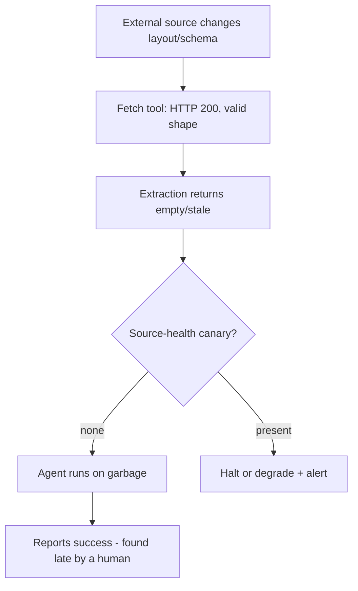

# Silent External-Source Rot

**Also known as:** Silent Source Rot, Valid-But-Empty Upstream, Unwatched Source Decay

**Category:** Anti-Patterns  
**Status in practice:** emerging

## Intent

Anti-pattern: an agent keeps reporting success while a wrapped external source has silently changed structure, so its tool returns valid-but-empty or degraded output that nothing watches.

## Context

An agent depends on an external source it does not control: a scraped web page, a third-party API, or a retrieval corpus refreshed by an upstream feed. A tool node fetches from that source on every run, and the agent treats whatever comes back as the ground truth its task is built on. The source can change its HTML layout, rename API fields, or quietly empty a feed at any time, on a schedule nobody on the agent's side knows.

## Problem

When the source mutates, the fetch still succeeds at the transport layer: the page returns 200, the API returns a well-formed envelope, the corpus still has rows. The extraction underneath, a CSS selector or a field path or a relevance match, now pulls nothing useful, so the tool hands back a structurally-valid but empty or stale payload. The agent has no signal that the content rotted, runs its normal flow on near-empty input, and reports success. Because the failure is silent, it is discovered late, often only when a downstream human notices the output got thin.

## Forces

- External sources change on their own timetable, while the agent's extraction logic is written once against a snapshot and rarely revisited.
- Transport-level health (HTTP status, response shape) is cheap to check and looks green even when the content behind it is empty.
- Validating content quality against expected ranges costs an extra step and an upstream baseline that nobody owns until something breaks.
- A loud failure would stop the run, but a quietly thin result keeps the pipeline green and the cost meter ticking on garbage.

## Therefore

Therefore: do not treat a wrapped external source as stable; watch its content quality, not just its transport status, with a canary that fails the run when the extracted payload falls outside an expected baseline.

## Solution

This entry names the anti-pattern; the corrective is to put a source-health canary between the tool and the agent. After each fetch, assert content-level expectations the source should always meet: a non-empty extraction, a row or token count within a learned range, presence of marker fields, and a freshness timestamp newer than a threshold. When an assertion fails, the run halts or routes to a degraded-mode fallback and raises an alert instead of feeding the empty payload forward as if it were real data. The baseline is recorded once from a known-good run and re-checked on every fetch, so a layout or schema change surfaces on the next run rather than after a human notices thin output ten days later.

## Structure

```
External source --(layout/schema/feed changes)--> Fetch tool (200, valid shape) --> Extraction returns empty/stale --> [no source-health canary] --> Agent runs on garbage --> reports success
```

## Diagram



*Without a content-level canary, a valid-but-empty fetch flows to the agent and the run reports success on garbage.*

## Example scenario

A daily-briefing agent scrapes three competitor sites and emails a summary. One site quietly redesigns its markup. The HTTP fetch keeps returning a full 200 page, but the CSS selector now matches nothing, so the agent writes a half-empty briefing and reports it sent. Nobody catches it for ten days, until the reader mentions the news has felt thin lately.

## Consequences

**Liabilities**

- Decisions and downstream artifacts are built on empty or stale input while every status reads green.
- The defect is found late, usually by a human noticing the output thinned out, not by the system.
- Cost and runtime are spent producing confidently wrong output.
- Trust in the agent erodes once one silent rot is traced, because nothing proves other sources are still intact.

## Failure modes

- Selector rot — the source changes its HTML structure, the fetch still returns 200, and the CSS or XPath selector extracts nothing.
- Field rename — a third-party API renames or nests a field, the envelope still validates, and the path the tool reads is now always null.
- Stale-feed rot — an upstream corpus stops refreshing, so the retrieval returns the same aging rows that look valid but no longer reflect reality.
- Empty-but-200 — the source returns an error page or maintenance stub with a 200 status, which the agent ingests as content.

## What this pattern constrains

The missing constraint is a content-level source-health canary: an extracted payload that falls outside its expected baseline must not flow to the agent as valid input, and a structurally-valid empty or stale fetch cannot be reported as success.

## Applicability

**Use when**

- An agent depends on a scraped page, a third-party API, or a refreshed retrieval corpus it does not control.
- A tool node fetches that source on every run and the agent acts on whatever comes back without a content-quality check.
- Failures would show as thin or empty output rather than as an error, so they stay invisible until a human notices.

**Do not use when**

- The agent reads only its own internal, owned state with no external upstream that can change unannounced.
- A content-level source-health canary already gates the fetch and halts or degrades on a valid-but-empty payload.
- The source publishes a stable, versioned contract with breaking-change notifications the agent's pipeline subscribes to.

## Components

- External source — the page, API, or corpus the agent depends on but does not control
- Fetch tool — the node that retrieves from the source and reports transport-level health only
- Extraction step — the selector, field path, or relevance match that pulls the payload the agent uses
- Source-health canary (missing) — the content-level check that should assert non-empty, in-range, fresh output before it reaches the agent
- Agent — consumes the payload and reports task success without knowing the content rotted

## Tools

- Web scraper or HTTP request node — fetches the external source each run
- Schema and content validator (for example Great Expectations) — asserts non-null, range, and row-count expectations on each fetch
- Data-observability monitor (for example Monte Carlo) — tracks freshness, volume, and schema drift on the source

## Evaluation metrics

- Silent-rot detection lag — runs (or days) between a source change and the system raising an alert, versus a human noticing
- Empty-payload pass-through rate — fraction of valid-but-empty fetches that reached the agent as if real
- Source-health canary coverage — share of external sources guarded by a content-level check
- False-success rate — runs reported successful while the extracted payload was below baseline

## Known uses

- **[Tensoria n8n production agent (REX)](https://tensoria.fr/blog/agents-ia-n8n-retour-experience-production)** _available_ — Field report: a daily-briefing agent's HTTP Request node kept returning content after sources changed their HTML, but the CSS selector pulled nothing relevant; the briefing went out half-empty for ten days before a human flagged it, after which a per-source content check was added.
- **[Great Expectations validation suites](https://docs.greatexpectations.io/docs/)** _available_ — Expectation suites assert content-level conditions (non-null, value ranges, row counts) on each batch, so a source that goes valid-but-empty fails the check instead of flowing downstream.
- **[Monte Carlo data observability](https://www.montecarlodata.com/blog-what-is-data-observability/)** _available_ — Monitors freshness, volume, and schema as first-class signals so silent staleness ('data downtime') is caught upstream rather than after a consumer notices thin output.
- **[Bigeye](https://www.bigeye.com/)** _available_ — Data-observability platform that learns column-level metric baselines and freshness SLAs, alerting when a source goes valid-but-empty or stale rather than letting thin data flow downstream.
- **[Soda (Soda Core + Soda Cloud)](https://www.soda.io/)** _available_ — Pipeline-embedded data-quality checks that assert non-empty, row-count, and freshness expectations on each batch, failing the run when extracted content falls outside its baseline.
- **[Anomalo](https://www.anomalo.com/)** _available_ — Automatically learns expected volume, freshness, and schema for each table and raises an alert when a source silently empties or drifts, catching rot before a human notices.

## Related patterns

- _complements_ **Tool Output Trusted Verbatim** — That anti-pattern is the tool's own return going unvalidated; this one is the wrapped upstream source rotting so even a schema-valid return is empty — the canary here checks content quality, not just shape.
- _complements_ **Phantom Action Completion** — Both end in a falsely-green success report; phantom-action is a side-effect that never happened, source-rot is a read that returned valid-but-empty data.
- _alternative-to_ **Graceful Degradation** — Graceful degradation is the corrective stance: route a failed source-health check to a degraded-mode fallback instead of feeding the empty payload forward.
- _complements_ **CDC-Driven Vector Sync** — CDC sync keeps a corpus fresh from a source-of-truth so the stale-feed flavour of rot does not arise; the canary still guards extraction over whatever corpus the agent reads.

## References

- [Agents IA n8n en production : retour d'experience terrain](https://tensoria.fr/blog/agents-ia-n8n-retour-experience-production) — 2025
- [What is Data Observability? Freshness, Volume, Schema, and Data Downtime](https://www.montecarlodata.com/blog-what-is-data-observability/) — Monte Carlo
- [Great Expectations Documentation](https://docs.greatexpectations.io/docs/)
- [Wrapper Maintenance: A Machine Learning Approach](https://arxiv.org/abs/1106.4872) — Kristina Lerman, Steven N. Minton, Craig A. Knoblock, 2003
- [Solving Freshness in RAG: A Simple Recency Prior and the Limits of Heuristic Trend Detection](https://arxiv.org/abs/2509.19376) — Matthew Grofsky, 2025
- [Data Contracts in Cloud-Native Analytics: Governing Schema and Semantics to Prevent Pipeline Breakage and Accelerate Safe Change](https://ijcesen.com/index.php/ijcesen/article/view/5152) — 2025
