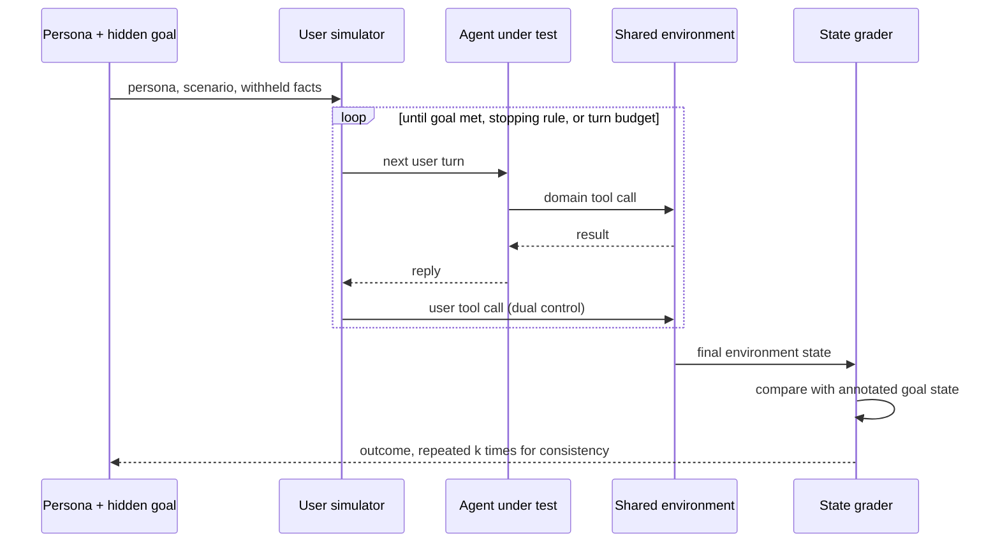

# Simulated-User Rollout Evaluation

**Also known as:** User Simulator Eval, Dual-Control Rollout Evaluation, Synthetic Customer Agent Validation, Tau-Bench-Style Evaluation

**Category:** Governance & Observability  
**Status in practice:** emerging

## Intent

Evaluate a conversational agent by pairing it with a second model that plays the user from a persona and a hidden goal, then score the final environment state rather than the transcript.

## Context

A conversational or tool-using agent is being taken toward deployment in a domain that has its own database, its own tool APIs and its own policy document — retail returns, telecom support, retail banking. Quality in such a domain is a property of whole episodes rather than of single replies: the agent has to ask for the account number it was never given, notice that the stated travel dates contradict the booking on file, and refuse the discount the policy forbids. A team preparing a release needs to measure that property before real customers do, and needs to measure it again on every model, prompt or tool change.

## Problem

A held-out dataset of fixed inputs cannot express a counterpart who withholds a detail until asked, misstates a date, changes their mind halfway through, or has to be talked through an action on their own device. Recruiting people to play that counterpart produces the right signal at the wrong cadence and cost, so it happens once a quarter rather than once a commit. Scoring the transcript instead of the outcome rewards an agent that sounds cooperative while leaving the database wrong, and a single run per task hides the fact that the same task succeeds on one attempt and fails on the next.

## Forces

- Multi-turn quality only appears against a partner who withholds, misstates and changes their mind, and a fixed list of inputs cannot hold that behaviour.
- Human trials give the most trustworthy counterpart but cannot be re-run on every commit, while a model playing the user finishes an episode in minutes for a few cents.
- The model playing the user is itself an instrument with error: on identical retail tasks, measured agent success moves by up to 9 percentage points depending only on which model plays the user.
- Comparing the final database state against an annotated goal state is cheap and objective, but it only covers what the task annotation anticipated; judging the transcript covers the rest and is an opinion.
- One episode per task is affordable and misleading, while repeating each task exposes inconsistency and multiplies the bill.

## Therefore

Therefore: replace the human counterpart with a second model constrained by a persona, a hidden goal and its own tools, run the episode to termination, and score the resulting environment state against an annotated goal state across repeated runs.

## Solution

Give the evaluation two policies instead of one. The agent under test keeps its usual tools and its usual policy document, and is not told that the episode is a test. Opposite it sits a second model instantiated from a persona — who is speaking, how they speak, what they will volunteer unprompted — and a scenario stating what they want and which facts stay back until asked. Where the domain lets the user act as well, such as resetting a router or toggling a setting on their own phone, the simulated user is given its own tool set and its own view of the shared state, so its behaviour is bounded by what the environment permits rather than by prompt wording alone. The two converse until the goal is met, a stopping rule fires, or the turn budget runs out. Grading then compares the final environment state — the database rows, the created ticket, the amended booking — against the goal state annotated with the task, so an episode that reads well but leaves the world wrong scores nothing. Each task is run several times and reported as a consistency figure over the repeats rather than as a single pass. Personas and scenarios are enumerated from named dimensions instead of free-form prompting, and the simulator is periodically checked against real people, because it is an instrument with a bias of its own.

## Structure

```
Persona + scenario + hidden goal --> user simulator (own tools, own view of shared state) <--turns--> agent under test (domain tools + policy doc). Both act on one environment. Termination (goal met | stopping rule | turn budget) --> state grader compares final state with annotated goal state --> repeat k times --> consistency figure.
```

## Diagram



*The persona drives a second model that converses with the agent under test; both act on one environment, and the score comes from its final state compared with the annotated goal, repeated for consistency.*

## Example scenario

A team is about to ship a change to an airline support agent. Instead of replaying fifty saved questions, they start fifty episodes in which a second model plays a passenger who wants to move a flight, does not mention the second bag until asked, and has already spent one of two travel vouchers. Each episode runs to the end, and the score is whether the booking in the test database matches what the passenger actually wanted. Two personas that always passed now fail on the voucher split, which no saved question had covered.

## Consequences

**Benefits**

- Behaviour that only appears under a partner who withholds and changes their mind becomes measurable at commit cadence instead of once a release.
- Grading the final environment state against an annotated goal state gives an objective outcome that a fluent but wrong episode cannot pass.
- Repeating each task exposes run-to-run inconsistency a single pass rate conceals: capable function-calling agents were reported succeeding on under 50% of retail tasks and holding across eight repeats on under 25%.
- Episodes are reproducible and cheap enough to re-run per model change, and the same harness doubles as a training environment for reinforcement learning.
- Giving the simulated user its own tools surfaces a separate skill — guiding a person through an action — that single-control benchmarks never test, and agent scores drop sharply when moved from no-user to dual-control settings.

**Liabilities**

- The simulated user is an unvalidated proxy: measured agent success rates shift by up to 9 percentage points across different models playing the user, on identical tasks.
- Results are miscalibrated in a direction that varies with difficulty, underestimating agent performance on hard tasks and overestimating it on moderately difficult ones.
- The proxy is not equally good for everyone: African American Vernacular English speakers show consistently worse success rates and larger calibration error than Standard American English speakers, and the gap widens with age.
- State-based grading only covers what the annotation anticipated, so tone failures, policy leaks and needless escalations pass unless a separate transcript check is added.
- Simulated users introduce conversational artefacts and surface different failure patterns than people do, so a clean scoreboard can sit alongside unaddressed deployment problems.
- Annotating a goal state for every task is manual work, and a task whose goal state is wrong silently marks correct agents as failures.

## Failure modes

- The persona is written as free-form prose, the simulated user volunteers everything in its opening turn, and the episode collapses into a single-shot question the agent answers trivially.
- The user model and the agent under test are the same checkpoint, so shared blind spots cancel out and the score measures self-agreement rather than capability.
- The simulated user is handed the annotated goal state or the agent's private reasoning, leaks it in conversation, and the task passes for the wrong reason.
- Each task is run once, the reported pass rate looks stable across releases, and the underlying run-to-run inconsistency is never seen.
- A rising simulated score is read as rising deployment readiness even though the simulator was never checked against real people from the populations that will use the system.
- The turn budget is set so low that the agent is cut off mid-recovery, and the harness scores a timeout as a capability failure.

## What this pattern constrains

The agent under test must not be told that its counterpart is simulated, and the simulated user may not receive the annotated goal state or the agent's private reasoning. A rollout cannot be scored from the transcript alone: grading compares the final environment state against the annotated goal state. No single episode may stand as a task's result — each task is repeated and reported as a consistency figure — and a simulated-user number must not be published as a human-user result before the simulator has been checked against real people.

## Applicability

**Use when**

- The agent's job spans several turns and depends on information the counterpart holds back until asked.
- The domain has an inspectable end state — a database row, a ticket, a booking — that can be compared against an annotated goal.
- Quality has to be re-measured on every model, prompt or tool change, at a cadence human testing cannot match.
- The counterpart can also act on the shared state, so guiding a person through a step is part of what needs measuring.
- The same episodes are wanted as a training environment as well as an evaluation.

**Do not use when**

- The task is single-turn and a held-out dataset of fixed inputs already expresses it.
- There is no inspectable end state, so grading would fall back to opinion about the transcript.
- The number is meant to stand as a human-user result and no validation against real people is planned.
- The user population that matters speaks in ways the simulator is known to model poorly, and the score would be read as covering them.
- The episode has irreversible side effects that cannot be run against a disposable copy of the environment.

## Components

- Persona and scenario spec — states who is speaking, what they want, and which facts stay withheld until asked
- User simulator policy — a second model that produces each user turn from the persona and the conversation so far
- User tool set and user state view — bounds the simulated user to actions the shared environment actually permits
- Agent under test — the deployed configuration with its own tools and policy document, not told the counterpart is simulated
- Shared environment — the database, tool APIs and policy document both sides act on, instantiated per episode from a fixture
- Termination controller — ends the episode when the goal is reached, a stopping rule fires, or the turn budget is spent
- Annotated goal state — the end state the task is supposed to produce, written once per task and used as the answer key
- State grader — compares the final environment state against the annotated goal state and records the outcome
- Consistency aggregator — repeats each task and reports agreement across the repeats instead of a single pass
- Simulator calibration set — human-run episodes used to measure what the simulated user over- and under-states

## Tools

- tau-bench and tau2-bench — reference implementations of single-control and dual-control simulated-user domains with state-based grading
- DeepEval ConversationSimulator — persona-and-scenario simulation of full conversations against a chatbot callback
- Promptfoo simulated-user provider — instruction-driven multi-turn rollouts against a configured agent target
- Prime Intellect verifiers — environment library that attaches user simulators so rollouts serve evaluation and training alike
- VISTA — toolkit with metrics for the realism, coverage and effectiveness of simulated episodes

## Evaluation metrics

- Task success on final state — share of episodes whose end environment state matches the annotated goal
- Repeat consistency (pass^k) — share of tasks that succeed on every one of k repeated episodes
- Simulator sensitivity — spread in measured agent success when only the model playing the user is changed
- Calibration gap against human runs — signed difference between simulated-user and human-user success, reported per difficulty band
- Subgroup calibration gap — difference in success and calibration error across the dialects and demographics the deployment will serve
- Persona and scenario coverage — fraction of the intended dimension tuples actually exercised by the generated episodes
- Turn-budget exhaustion rate — share of episodes cut off before termination, which inflates apparent failure

## Known uses

- **[tau-bench and tau2-bench (Sierra Research)](https://github.com/sierra-research/tau2-bench)** _available_ — tau-bench emulates conversations between an LLM-simulated user and a tool-using agent and compares the database state at the end of the conversation with the annotated goal state; tau2-bench adds a dual-control domain where the user simulator has its own tools and is constrained by observable state, and ships an optional user tool set per domain.
- **[DeepEval ConversationSimulator](https://deepeval.com/docs/conversation-simulator)** _available_ — Simulates full conversations between a scripted persona and a chatbot callback, driven by a ConversationalGolden that carries the scenario, the persona and the expected outcome, with a stopping controller and a per-conversation turn cap.
- **[Promptfoo simulated-user provider](https://www.promptfoo.dev/docs/providers/simulated-user/)** _available_ — A provider that runs multi-turn conversations between an instruction-driven simulated user and the agent target, with maxTurns and optional initial messages; the documentation credits tau-bench as its inspiration.
- **[Prime Intellect verifiers](https://github.com/PrimeIntellect-ai/verifiers/releases)** _available_ — Reinforcement-learning environment library that exposes user simulators as part of the environment authoring surface, so the same rollout serves as both evaluation and training signal.
- **[Synthetic customer agents at a UK bank](https://arxiv.org/abs/2607.26060)** _available_ — Synthetic customer agents built as digital twins from real transactional and conversational data were used to validate a customer-facing chatbot at a leading UK bank, combining automated judging, human expert testing and adversarial probing for regulatory sign-off.
- **[VISTA user-simulation toolkit](https://arxiv.org/abs/2606.11079)** _pure-future_ — Research toolkit pairing a hybrid simulator that mixes interface actions and API actions with six metrics for the realism, capability coverage and interaction effectiveness of the simulated episodes; evaluated on shopping and customer-service settings.

## Related patterns

- _complements_ **Eval Harness** — The harness replays a fixed set of inputs against agent versions; here the input is a live second policy that reacts to what the agent says, so the two cover different halves of a release gate.
- _complements_ **LLM-as-Judge** — The judge scores a finished artefact against a rubric; the simulated user participates in and steers the episode, and the primary score comes from environment state rather than model opinion. A judge is still needed for the tone and policy checks state grading misses.
- _complements_ **Agent Evaluator** — A standing tester that submits inputs and grades outputs; this pattern supplies the interlocutor those tests need when the task is conversational rather than single-shot.
- _complements_ **CAMEL Role-Playing** — Same two-model conversational structure aimed at completing a task rather than measuring one: the AI-User there cooperates toward an artefact, while the simulated user here withholds information and its counterpart is the subject of the score.
- _complements_ **Dimensional Synthetic Eval Set** — Supplies the enumeration discipline for the persona and scenario space, so the rollout set does not mode-collapse onto one cooperative caller.
- _complements_ **Checklist Partial-Credit Scoring** — Replaces the rollout's single pass/fail bit with ordered checkpoints, so a partially recovered episode registers instead of scoring the same as an immediate failure.
- _complements_ **Chance-Corrected Judge Validation** — The same validation duty applied to the interlocutor rather than the grader: a simulated-user score should carry a measured agreement figure against human-run episodes before it gates anything.
- _complements_ **Dual Evaluation (Offline + Online)** — Simulated-user rollouts sit on the offline track; the online track is what catches the failure patterns the simulator does not reproduce.
- _uses_ **Agent Persona Profile** — The simulated user is configured from a structured persona object — who is speaking, what they hold back, which tools they may use — rather than from a free-form role sentence.

## References

- [τ-bench: A Benchmark for Tool-Agent-User Interaction in Real-World Domains](https://arxiv.org/abs/2406.12045) — Shunyu Yao, Noah Shinn, Pedram Razavi, Karthik Narasimhan, 2024
- [τ²-Bench: Evaluating Conversational Agents in a Dual-Control Environment](https://arxiv.org/abs/2506.07982) — 2025
- [Lost in Simulation: LLM-Simulated Users are Unreliable Proxies for Human Users in Agentic Evaluations](https://arxiv.org/abs/2601.17087) — 2026
- [VISTA: A Versatile Interactive User Simulation Toolkit for Agent Evaluation](https://arxiv.org/abs/2606.11079) — 2026
- [Large-Scale ChatBot Validation Through Customer Digital Twin Simulations](https://arxiv.org/abs/2607.26060) — 2026
- [sierra-research/tau2-bench](https://github.com/sierra-research/tau2-bench)
- [DeepEval — Conversation Simulator](https://deepeval.com/docs/conversation-simulator)
- [Promptfoo — Simulated User provider](https://www.promptfoo.dev/docs/providers/simulated-user/)
- [Benchmarking AI agents (τ-bench)](https://sierra.ai/blog/benchmarking-ai-agents)
