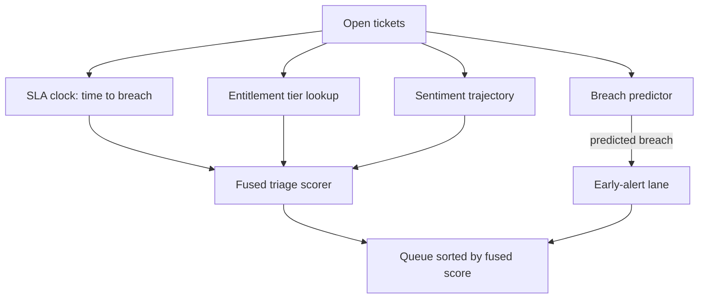

# SLA-Aware Triage Scoring

**Also known as:** SLA-Deadline-Aware Triage Scoring, Deadline-Aware Ticket Prioritisation, Business-Impact Triage Score

**Category:** Routing & Composition  
**Status in practice:** emerging

## Intent

Order the work queue by a single fused score that blends each ticket's time-to-SLA-breach, the requester's entitlement tier, and sentiment trajectory, and surface items predicted to breach before they do.

## Context

A support or operations team runs a shared queue under contractual service-level agreements that promise a response or resolution within a fixed window per account tier. Tickets arrive faster than they can be worked, so the order in which an agent picks the next item decides which commitments hold and which slip. A first-in-first-out queue ignores deadlines and tier; ordering by the requester's stated urgency is gameable, since every requester marks their own ticket urgent.

## Problem

No single field on a ticket captures its true priority. Time-to-breach matters, but a distant deadline on a top-tier account can still outrank a near deadline on a free-tier one, and a customer whose tone is deteriorating may need attention before either. Sorting by any one of these axes alone mis-orders the queue, and the breach risk is only visible once the deadline is already close, which is too late to act. The queue needs one comparable score that fuses the axes and looks ahead to predicted breaches.

## Forces

- A deadline-only sort starves high-value accounts whose breach window is further out; an entitlement-only sort lets cheap, urgent tickets breach unattended.
- Stated urgency is self-reported and gameable, so it cannot be the ordering key, yet the genuine signal it sometimes carries should not be discarded entirely.
- Acting on a breach only once the deadline is near leaves no slack to work the ticket, so the score must predict the breach early enough to matter.
- A fused score is only as trustworthy as its weights; opaque weighting makes the ordering impossible to audit when a commitment slips.

## Therefore

Therefore: compute one fused triage score per ticket from time-to-breach, entitlement tier, and sentiment trajectory, sort the queue by it, and raise a separate alert for any ticket whose predicted completion crosses its SLA deadline.

## Solution

Define a scoring function over each open ticket. Read its SLA clock to compute time remaining to breach, look up the requester's contractual entitlement or account tier, and estimate a sentiment trajectory from the conversation so far. Normalise each axis and combine them with explicit, reviewable weights into one fused triage score; sort the queue by that score so the next item an agent picks is the one with the most at stake. In parallel, run a breach predictor that compares each ticket's expected time-to-completion against its deadline and emits an early alert for those on track to breach, so they can be expedited or escalated before the window closes rather than after. Keep the weights and the per-ticket score contributions visible so a slipped commitment can be traced to the inputs that ranked it.

## Structure

```
Open tickets --(SLA clock, entitlement tier, sentiment)--> Scorer --(fused score)--> Sorted queue; Breach predictor --(predicted breach)--> Early-alert lane
```

## Diagram



*Three axes feed one fused triage score that orders the queue; a parallel predictor routes likely breaches to an early-alert lane.*

## Example scenario

A support queue holds two open tickets. One is a free-tier user whose SLA breaches in twenty minutes; the other is an enterprise account whose SLA breaches in two hours but whose last three messages have turned sharply angry. A pure deadline sort works the free-tier ticket first; the fused score weights the enterprise account's tier and souring sentiment high enough to surface it now, while a breach alert still flags the free-tier ticket so neither is forgotten.

## Consequences

**Benefits**

- One comparable number replaces ad-hoc per-axis sorts, so the next-picked ticket reflects deadline, contract value, and customer state together.
- Early breach alerts convert deadline slips from after-the-fact incidents into items expedited while slack remains.
- Explicit weights make the ordering auditable: a slipped commitment can be traced to the score inputs that ranked it.

**Liabilities**

- Mis-set weights systematically starve one axis — for example a low sentiment weight that lets a deteriorating top-tier account sit behind routine work.
- A wrong breach prediction either floods the alert lane with false positives that get ignored or misses a real breach by under-estimating completion time.
- Sentiment trajectory estimated from text is noisy and can be gamed or misread, skewing the fused score.

## Failure modes

- Weight blindness — the fused score hides which axis dominated, so a recurring mis-order goes undiagnosed.
- Alert fatigue — the breach predictor over-fires, agents learn to ignore the lane, and a real breach slips through unseen.
- Tier capture — high-tier accounts always rank first, so low-tier tickets breach silently and never enter the worked set.

## What this pattern constrains

An agent must not pull the next ticket by arrival order or self-reported urgency alone; the queue ordering is read only from the fused triage score, and breach-predicted tickets cannot be left in the normal lane.

## Applicability

**Use when**

- Work arrives into a shared queue under contractual SLAs with different deadlines per account or entitlement tier.
- Demand exceeds capacity, so the pick order genuinely decides which commitments are met.
- Time-to-breach, account value, and customer sentiment each carry real signal and no single one suffices as the sort key.

**Do not use when**

- The queue is never backlogged, so any reasonable order meets every deadline.
- There are no differentiated SLAs or entitlement tiers, so a simple deadline or arrival sort already suffices.
- The inputs cannot be measured reliably — no SLA clock, no tier data, or no usable sentiment signal — so the fused score would be guesswork.

## Components

- SLA clock — tracks each ticket's elapsed time against its contractual deadline to yield time-to-breach
- Entitlement resolver — looks up the requester's account or contract tier and its weight
- Sentiment estimator — reads the conversation so far to estimate the customer's sentiment trajectory
- Fused scorer — normalises the three axes and combines them with explicit weights into one triage score
- Sorted queue — orders open tickets by the fused score so the next pick has the most at stake
- Breach predictor — compares expected completion time against the deadline and raises early alerts for likely breaches

## Tools

- Ticketing or service-desk system — holds the queue, SLA timers, and per-account tier data
- Sentiment or LLM classifier — scores the conversation's sentiment trajectory from text
- Scoring engine — evaluates the weighted fused score per ticket and re-sorts the queue

## Evaluation metrics

- SLA compliance rate vs a FIFO or deadline-only baseline — whether the fused order keeps more commitments
- Breach lead time — how early the predictor flags a ticket before its deadline, leaving slack to act
- Breach-prediction precision and recall — false-alert rate vs missed-breach rate in the early-alert lane
- Per-tier starvation — fraction of low-tier tickets that breach without ever entering the worked set

## Known uses

- **[IrisAgent](https://irisagent.com/blog/predict-sla-breaches-with-ai-tools/)** _available_ — AI support platform that scores tickets against a combined model of customer urgency, business impact, SLA risk, and sentiment, and predicts SLA breaches so teams act before the deadline.
- **[DevRev](https://devrev.ai/blog/ai-support-ticket-triaging)** _available_ — Support-triage tooling that ranks tickets on SLA proximity and a business-impact score built from ARR, contract stage, feature usage, and historical satisfaction.

## Related patterns

- _alternative-to_ **Complexity-Based Routing** — Both pick a routing key, but complexity-based-routing keys on estimated request difficulty to choose a model tier; here the key is a deadline-x-entitlement-x-sentiment score that orders a human work queue.
- _alternative-to_ **Cost-Aware Action Delegation** — Cost-aware-action-delegation tiers an action by risk to choose an approval policy; this pattern tiers a queued ticket by SLA-impact to choose its position in the work order.
- _complements_ **Mandatory Red-Flag Escalation** — The breach predictor's early alert is a natural trigger source for an unconditional escalation when a high-tier ticket is predicted to breach.
- _complements_ **Conversation Handoff to Human** — A ticket the score flags as predicted-to-breach or sentiment-deteriorating is a prime candidate to hand off to a human agent before the window closes.

## References

- [AI Support Ticket Triaging: The Enterprise Playbook](https://devrev.ai/blog/ai-support-ticket-triaging) — 2025
- [Predict SLA Breaches with AI Tools](https://irisagent.com/blog/predict-sla-breaches-with-ai-tools/) — 2025
- [Prioritizing Tickets with User Sentiment and Business Impact](https://irisagent.com/blog/prioritizing-tickets-with-user-sentiment-and-business-impact/index.html) — 2025
