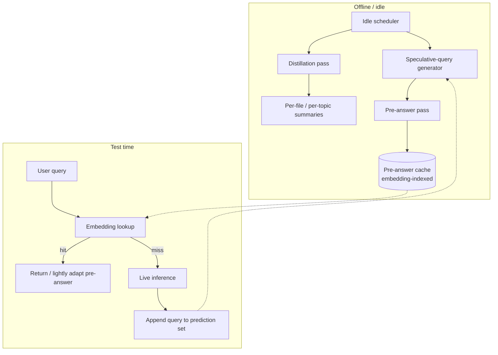

# Sleep-Time Compute

**Also known as:** Offline Pre-Computation, Anticipatory Context Distillation, Background Thinking, Latency-Free Pre-Answering

**Category:** Memory
**Status in practice:** emerging

## Intent

During idle or downtime, run the model offline against the user's standing context to pre-compute dense summaries and likely future answers, so test-time latency and cost drop when the user actually asks.

## Context

A team is running an agent over persistent user context — a codebase, a set of documents, transcripts of prior sessions — that the user queries repeatedly. Many of the queries are predictable variants of previous ones, and the underlying corpus does not change between most of those queries. The provider infrastructure also has idle capacity between user sessions when nobody is actively waiting for an answer.

## Problem

Conventional inference does all the work at test time, when the user is waiting. For every query the system parses the corpus, finds what matters, reasons about it, and produces an answer; the next query repays this work from scratch even if it is asking something very similar. Prompt caching helps only when the prefix matches exactly. The user therefore pays latency on every question even though many questions about a stable corpus could have been pre-processed during idle periods — yielding indices, summaries, or partial answers that would have made the eventual user-visible step nearly instantaneous.

## Forces

- Test-time latency is what the user feels; offline latency is invisible.
- Most queries against a stable corpus are predictable variants — predict and pre-answer once.
- Prefetching wastes compute on queries that never come, so prediction must be cheap and recoverable.
- Prompt caching only helps for matching prefixes; speculative pre-answering generates new content.
- Pre-computed answers stale as the corpus changes — freshness vs cost trade-off.

## Therefore

Therefore: schedule idle-time inference passes that distill standing context into dense summaries and generate speculative answers to predicted future queries, so test-time work shrinks to retrieving or lightly adapting pre-computed material.

## Solution

Run two kinds of offline passes against the user's standing context. (1) Distillation: compress the corpus into structured summaries — per-file, per-module, per-topic — that capture what queries would likely need. (2) Speculative pre-answering: predict likely next queries (from query history, recent context, structural signals) and generate answers ahead of time, stored against query embeddings. At test time, the agent first checks the speculative cache; on a hit it returns or lightly adapts the pre-answer; on a miss it falls back to live inference but adds the new query to the prediction set. Pre-computed material is invalidated when its source documents change. The Letta team and Lin et al. report substantial test-time cost and latency reductions on this pattern.

## Structure

```
Idle scheduler -> Distillation pass (corpus -> summaries) -> Speculative-query generator -> Pre-answer pass (predicted Q -> A pairs, embedding-indexed) | Test-time: query -> embedding lookup -> pre-answer hit (cheap) or fallback to live inference (normal cost) -> append to prediction set.
```

## Diagram



*Offline distillation and speculative pre-answering populate a cache that absorbs most test-time queries.*

## Example scenario

A developer agent has indexed a 200K-file monorepo as the user's standing context. Overnight it runs a distillation pass that summarizes each top-level module and predicts likely next-day queries from the user's commit history and yesterday's questions. When the developer asks the next morning 'what changed in the billing module last week and which tests cover it', the agent retrieves a pre-answer generated at 03:00 that morning and adapts it with one extra inference call instead of re-walking the repo from scratch.

## Consequences

**Benefits**

- Test-time latency drops dramatically on hits.
- Cost shifts from peak (test-time) to trough (idle) capacity.
- Distilled summaries also speed up cold queries by serving as compact retrieval targets.
- Speculative coverage improves over time as the prediction model learns from misses.

**Liabilities**

- Offline compute is real cost — wasted on predictions that never get asked.
- Stale pre-answers can mislead if invalidation lags corpus changes.
- Privacy: pre-answering implies the system holds and reasons over user data during idle.
- Quality regression if the speculative pre-answer is lower-effort than live inference and the agent does not detect it.
- Storage and indexing overhead for the pre-answer cache.

## What this pattern constrains

The agent must not return a stale pre-computed answer when its source documents have changed since pre-computation; freshness checks must gate cache hits. Speculative pre-answers must be marked as such in the trace so downstream evaluation can distinguish them from live inference.

## Applicability

**Use when**

- Agent operates over standing context that changes slowly relative to query volume.
- Provider has idle capacity between sessions and peak-cost test-time inference.
- User queries against the corpus are repetitive or predictable.
- Latency at test time matters more than offline compute cost.

**Do not use when**

- Corpus changes faster than pre-computation can keep up.
- Queries are highly novel and prediction yields no hits.
- Privacy regime forbids holding/processing user data outside live sessions.
- Idle compute is more expensive than the latency it saves.

## Known uses

- **[Letta](https://www.letta.com/blog/sleep-time-compute)** — *Available* — Open-source agent platform with idle-time pre-computation against persistent user memory.
- **[Lin et al. arXiv:2504.13171](https://arxiv.org/abs/2504.13171)** — *Available* — Original sleep-time compute paper; demonstrates trade-off on standing-context benchmarks.

## Related patterns

- *complements* → [episodic-summaries](episodic-summaries.md) — Episodic summaries compact past conversation; sleep-time compute generates new speculative content.
- *complements* → [context-window-packing](context-window-packing.md) — Selection happens at prompt-time; sleep-time compute prepares the material being selected from.
- *alternative-to* → [dream-consolidation-cycle](dream-consolidation-cycle.md) — Both are between-session passes; dream-consolidation targets affective/embodied agents, sleep-time compute targets standing-context cost reduction.
- *alternative-to* → [test-time-compute-scaling](test-time-compute-scaling.md) — Inverts the trade-off: more offline compute so less test-time compute is needed.
- *complements* → [prompt-caching](prompt-caching.md) — Prompt caching hits on matching prefixes; sleep-time compute generates new content that prompt caching cannot.
- *uses* → [cross-session-memory](cross-session-memory.md) — Standing user context is the substrate sleep-time compute operates on.

## References

- (paper) Kevin Lin et al., *Sleep-time Compute: Beyond Inference Scaling at Test-time*, 2025, <https://arxiv.org/abs/2504.13171>
- (blog) Letta, *Sleep-time Compute*, 2025, <https://www.letta.com/blog/sleep-time-compute>

**Tags:** memory, test-time-compute, offline, caching, latency
