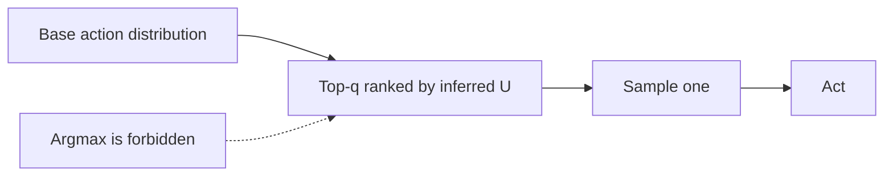

# Soft-Optimization Cap

**Also known as:** Quantilizer, Satisficing Cap, Argmax-Avoidance

**Category:** Safety & Control  
**Status in practice:** experimental

## Intent

Cap how strongly the agent optimises its inferred objective — sample from the top quantile of acceptable actions rather than the argmax, or stop improving once the objective is good enough.

## Context

An agent's planner can produce a range of actions scored by the objective. The naïve choice is argmax — pick the highest-scoring action. Russell-aligned reading: argmax exhausts whatever specification gap exists between the inferred objective and the true preference, and leaves no headroom for human correction.

## Problem

Aggressive optimisation pushes the agent toward action regions where the objective and the true preference diverge most. The 0.001-quantile of action-space (the extreme argmax tail) is the region most likely to contain degenerate maxima the designer never anticipated. Capping how hard the agent optimises trades a little expected score against a large amount of safety from specification gaming.

## Forces

- Argmax over an inferred objective is the most likely place for the objective to be wrong.
- A quantile sampler trades expected score for distance from the failure-prone tail.
- Caps must be high enough to retain capability and low enough to leave headroom.
- Satisficing (stop once good enough) is operationally simpler than quantilizing but coarser.

## Applicability

**Use when**

- The agent's inferred objective is plausibly mis-specified at the tail.
- A reasonable base distribution of human-endorsed actions exists.
- Some loss of expected score is acceptable in exchange for tail safety.

**Do not use when**

- The objective is exactly the principal's preference (rare, but assumed by some narrow applications).
- No reasonable base distribution can be constructed.
- Product requires literal argmax (e.g. competitive game-playing under perfect-information rules).

## Therefore

Therefore: replace argmax with sampling from the top quantile of acceptable actions, or with a satisficing threshold, so the agent leaves headroom for human correction and avoids the degenerate tail.

## Solution

Following Taylor's quantilizers: define a base distribution over actions (the agent's prior over reasonable moves). To pick an action, sample from the top q-quantile of that distribution ranked by the inferred objective. The classic bound: a q-quantilizer's expected cost under any bounded utility is at most 1/q times the cost of the base distribution. In practice for LLM agents: take top-k sampling on the planner, or set a satisficing threshold and accept the first action that clears it. Cap is a tuned parameter, not optimisation.

## Example scenario

A pricing-recommendation agent infers an objective of 'maximise margin'. An argmax recommender would propose extreme prices that the legal team would later reject. A 0.1-quantilizer over the base distribution of pricing decisions executives have historically endorsed samples from the top 10% of acceptable recommendations ranked by margin — competitive but not extreme.

## Diagram

## Consequences

**Benefits**

- Bounded cost under specification gaming with a tunable knob.
- Composes with preference-uncertain and risk-averse patterns.
- Operationally simple: a top-k sampler or a satisficing threshold is implementable.

**Liabilities**

- Caps lose some expected score on aligned objectives.
- The base distribution itself must be reasonable — quantilizing over a bad base does not help.
- Tuning q is a judgment call without a clear principled answer.

## What this pattern constrains

The agent must not pick the argmax of its inferred objective; action selection samples from the top quantile of a reasonable base distribution or accepts the first satisficing action.

## Known uses

- **Quantilizers (Taylor, MIRI 2015)** — *Available* — <https://intelligence.org/2015/11/29/new-paper-quantilizers/>
- **Production LLM agents using temperature > 0 and top-k as crude quantilizers** — *Available*

## Related patterns

- *complements* → [preference-uncertain-agent](preference-uncertain-agent.md)
- *complements* → [risk-averse-reward-proxy](risk-averse-reward-proxy.md)
- *complements* → [corrigible-off-switch-incentive](corrigible-off-switch-incentive.md)
- *alternative-to* → [reward-hacking](reward-hacking.md)
- *complements* → [exploration-exploitation](exploration-exploitation.md)
- *complements* → [cooperative-preference-inference](cooperative-preference-inference.md)

## References

- (paper) *Quantilizers: A Safer Alternative to Maximizers for Limited Optimization*, Jessica Taylor, 2015, <https://intelligence.org/2015/11/29/new-paper-quantilizers/>
- (book) *Human Compatible*, Stuart Russell, 2019, <https://www.penguinrandomhouse.com/books/566677/human-compatible-by-stuart-russell/>

**Tags:** alignment, safety, optimisation
