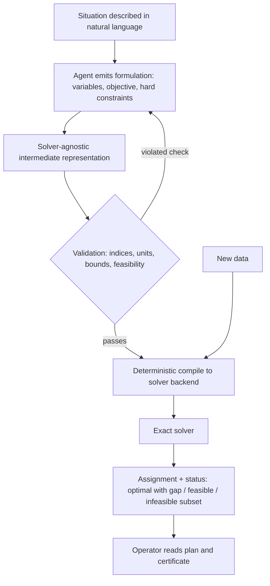

# Solver-Ready Formulation Handoff

**Also known as:** Declarative Model Handoff, LLM-to-Solver Formulation, Formulate-Then-Solve, 制約条件の登録をLLMに任せる

**Category:** Tool Use & Environment  
**Status in practice:** emerging

## Intent

Have the agent emit a declarative optimisation model — decision variables, objective, hard constraints — in a solver-agnostic representation, and let an exact solver produce the decision with its feasibility or optimality certificate.

## Context

Planning problems in logistics, energy dispatch, workforce rostering and production scheduling carry hard constraints — vehicle capacity, generator ramp rates, delivery time windows, conservation of flow — that a schedule either satisfies or does not. An agent handed such a problem in natural language can answer it in two ways: reason its way to a schedule directly, or write the problem down as a formal model and pass that model to an exact solver. Solvers for these problem classes have existed for decades and return provable answers; what has been scarce is the expertise to translate a business situation into the model they consume, which is why many such problems are still solved by hand.

## Problem

A schedule produced by sampling carries no proof. Nothing in it tells an operator whether every ramp-rate limit holds, whether the assignment is the cheapest available, or whether the problem was infeasible from the start, and a hard physical constraint admits no partly-satisfied answer — a plan that breaks one is not a slightly worse plan but an unusable one. The reasoning trace that produced the schedule is also the wrong artefact for review: an auditor has to follow prose rather than read constraints. When the input data changes, a broken-down truck or an updated price, the entire run has to be repeated at model-call cost, and the new answer need not be consistent with the previous one.

## Forces

- Formulating an optimisation problem is the scarce skill, and translating a described situation into variables and constraints is something the model does well, while solving the resulting model exactly is something it does badly.
- Direct optimisation by prompting has headroom on problems no formal model captures; the tool-augmented route gives up that headroom in exchange for auditability, and the survey literature frames this as the central trade-off between the two architectures.
- An exact solver returns a certificate — an optimality gap, or a proof that no feasible assignment exists — that a sampled plan cannot provide, but it answers exactly the model it was given, so a mis-transcribed constraint is answered confidently and wrongly.
- A solver-agnostic representation costs an extra compilation step and the engineering to maintain it, and buys re-solving on changed data with no further model calls.
- Natural-language problem statements are ambiguous and incomplete, so a formulation needs systematic validation and iterative repair before a solver is worth running on it.

## Therefore

Therefore: make the deliverable the formulation rather than the decision — variables, objective and hard constraints in a solver-agnostic representation, validated for feasibility before an exact solver, not the model, produces the answer.

## Solution

Split the work at the point where guarantees begin. The agent reads the situation and pins down the sets, parameters and data sources, then emits a declarative model: decision variables with their domains, an objective, and the hard constraints, each one traceable to a sentence in the source statement. That model is written in a solver-agnostic intermediate representation rather than in one vendor's API, so it compiles deterministically to Gurobi, CPLEX, PuLP, Pyomo or OR-Tools without another model call. Before any solve, a validation step checks index consistency, units, variable bounds and feasibility on known instances; when a check fails, the specific violation is handed back for repair rather than the whole problem being regenerated. The solver then produces the assignment together with its status — optimal within a stated gap, feasible, or infeasible with an inconsistent subset of constraints named. What reaches the operator is the assignment and that status. The agent's remaining job is to explain the solver's output, reading its numbers rather than recomputing them, and when the data changes tomorrow the same representation is recompiled and re-solved with no model in the loop at all.

## Structure

```
Natural-language situation --> formulation module --> solver-agnostic IR {variables, objective, hard constraints} --> validator (index/unit/bound/feasibility) --repair--> IR --> backend compiler --> exact solver --> {assignment, status: optimal+gap | feasible | infeasible+inconsistent subset} --> operator. Data change re-enters at the compiler, not at the model.
```

## Diagram



*The model produces the formulation, never the decision; the solver produces the decision and its certificate, and changed data re-enters at the compiler with no model call.*

## Example scenario

A depot manager types out tomorrow's deliveries: twelve vans, driver shift limits, chilled goods that have to arrive before eleven. The agent does not answer with a route list; it writes the vans, stops and time windows down as a formal model and hands that to a routing solver. The solver returns an assignment and reports it is within two percent of the best possible. When a van breaks down at six the next morning, the same model is re-solved in seconds without asking the model anything.

## Consequences

**Benefits**

- The answer arrives with a solver status — proven optimal within a gap, feasible, or infeasible with the conflicting constraints named — which a sampled plan cannot supply.
- Hard constraints are enforced by construction inside the solve rather than checked afterwards by a reviewer who may miss one.
- Changed data is re-solved deterministically from the existing representation with zero model calls, so two consecutive answers rest on the same model and can be compared.
- The reviewable artefact becomes a list of constraints instead of a reasoning trace, which is what an operator or auditor can actually check.
- Problems previously left to hand-built spreadsheets reach the exact solvers that were always available, because the formulation step no longer requires an operations-research specialist.

**Liabilities**

- The solver answers the model it was given, so a constraint transcribed wrongly produces a confidently optimal plan whose certificate is about the model rather than about reality.
- Only problems that fit the solver's class are served; forcing a genuinely fuzzy or contested objective into a linear one discards the part that mattered, and gives up the headroom the direct-prompting route retains.
- Formulation errors are silent without validation — the power-systems work needed systematic validation and iterative repair to reach feasibility at all — so the validator becomes load-bearing infrastructure.
- Exact solvers can blow up in runtime as instances grow, so a correct model may still fail to return inside the decision window.
- An intermediate representation and its backend compilers are real software to build, test and version, which a single prompt does not need.

## Failure modes

- A hard constraint is quietly moved into the objective as a penalty term, so the solver reports an optimal plan that violates a physical limit.
- Infeasibility comes back as a bare status, the same formulation is retried, and nobody learns which pair of constraints is inconsistent.
- Units or index sets drift between the source statement and the model, so the solver optimises a different problem than the one that was asked.
- Asked to explain the plan, the agent re-derives the numbers in prose instead of reading the solver output, and the explanation contradicts the assignment.
- The formulation is regenerated from scratch on every data change, so successive answers rest on different models and the run-to-run difference cannot be attributed.

## What this pattern constrains

The agent must not emit the decision itself; it emits only the formulation, no plan reaches an operator without the solver status and certificate that produced it, and re-solving on changed data must not call the model again.

## Applicability

**Use when**

- The problem has hard constraints that a plan either satisfies or does not, such as capacity, ramp rates, delivery windows or conservation of flow.
- An operator or auditor has to see why a plan is acceptable, not only what the plan is.
- The same problem is re-solved often on changing data, so re-deciding by prompt each time is expensive and inconsistent between runs.
- A mature exact solver already exists for the problem class, and the missing piece is the translation from the described situation into its model.

**Do not use when**

- The objective is genuinely fuzzy or contested, and forcing it into a formal objective would discard the part that actually matters.
- No tractable formulation exists for the problem class, or instances are large enough that an exact solve does not return inside the decision window.
- A rough, fast answer is sufficient and nobody will audit it afterwards.
- The decision is one-off, so building and maintaining a representation and its compilers costs more than the decision is worth.

## Components

- Problem intake — reads the described situation and pins down the sets, parameters and the data sources behind them
- Formulation module — emits decision variables, objective and hard constraints, each traceable to a sentence in the source statement
- Solver-agnostic intermediate representation — a declarative model that compiles deterministically to several solver backends instead of one vendor API
- Validation and repair loop — checks index consistency, units, bounds and feasibility, and hands back the specific violated check rather than the whole problem
- Backend compiler — translates the representation into the chosen solver's API with no further model calls
- Exact solver — returns the assignment together with its status: optimal within a gap, feasible, or infeasible
- Certificate reporter — surfaces the optimality gap or the inconsistent constraint subset to the operator alongside the plan
- Explanation layer — narrates the solver's output, reading its numbers instead of recomputing them

## Tools

- Gurobi or CPLEX — exact mixed-integer solvers that report an optimality gap and can isolate an inconsistent constraint subsystem
- Google OR-Tools — open-source CP-SAT and routing solvers for scheduling and vehicle-routing formulations
- Pyomo or PuLP — Python modelling layers a solver-agnostic representation compiles into
- MiniZinc — a solver-independent modelling language whose compiled form runs across many backends
- Schema validator — rejects a formulation whose index sets, units or variable bounds do not line up before any solve is attempted

## Evaluation metrics

- Formulation feasibility rate — share of generated models the solver accepts as feasible without repair
- Repair iterations to feasibility — how many validation rounds a formulation needs before it solves
- Optimality gap — how far the returned plan sits from the proven bound
- Constraint fidelity — share of constraints in the source statement present, and correctly typed, in the model
- Model calls per re-solve — should fall to zero once the representation exists and only the data changed
- Solver runtime at operating scale — whether an exact answer arrives inside the decision window

## Known uses

- **[OptiMUS](https://github.com/teshnizi/OptiMUS)** _pure-future_ — Research agent that formulates a described problem as a MILP and calls a solver; motivated by the observation that most such problems are still solved by hand rather than optimally, because formulation expertise is the bottleneck.
- **[ORPilot](https://arxiv.org/abs/2605.02728)** _pure-future_ — Production-oriented optimisation-modelling agent built around a solver-agnostic intermediate representation that recompiles deterministically to Gurobi, CPLEX, PuLP, Pyomo or OR-Tools with zero further model calls.
- **[LLM-assisted power system optimisation framework](https://arxiv.org/abs/2508.08147)** _pure-future_ — Converts natural-language dispatch scenarios into compact solver-ready formulations and enforces feasibility through systematic validation and iterative repair rather than trusting the first formulation.
- **[MiniZinc](https://www.minizinc.org/)** _available_ — A solver-independent modelling language whose compiled form runs on many backends; the kind of representation a formulation handoff targets so the model is not written against one vendor's API.
- **[Google OR-Tools](https://developers.google.com/optimization)** _available_ — Open-source CP-SAT and routing solvers that return a solution together with a status distinguishing proven-optimal, feasible and infeasible.
- **[Gurobi Optimizer](https://www.gurobi.com/documentation/current/refman/index.html)** _available_ — Reports an optimality gap on every solve and can compute an irreducible inconsistent subsystem for an infeasible model, which is the certificate an operator reads when no plan exists.
- **[Ubie engineering practice](https://zenn.dev/ubie_dev/articles/opt_with_llm)** _available_ — Practitioner writeup that splits the work the same way — the model makes constraint entry easy, the mathematical solver does the optimising.

## Related patterns

- _alternative-to_ **Code Execution** — Both take the computation away from the model, but there the artefact is imperative code and the run is the answer; here the artefact is a declarative model that is separately validated, and the solver rather than the execution is the authority.
- _alternative-to_ **Distributed Constraint Optimization** — That solves a constraint problem across many agents holding shared variables because information boundaries forbid centralising it; here one centralised exact solver decides and the agents only write the model.
- _complements_ **Hybrid Symbolic-Neural Routing** — That picks a symbolic or a neural path per query; here both always run, in a fixed producer-and-decider order, with the model structurally barred from the decision.
- _complements_ **MRKL Systems (Modular Neuro-Symbolic)** — That dispatches each request to whichever expert module fits; this is a single fixed handoff whose module is an exact solver and whose output includes a certificate.
- _complements_ **Semantic-Layer Query Guardrail** — The same discipline on the analytics side — the model parameterises a vetted structure and a deterministic compiler produces the executable artefact.
- _uses_ **Structured Output** — The formulation is emitted as a typed artefact that must validate before compilation, not as free prose describing a model.
- _complements_ **Tool-Output Arithmetic Trust** — That anti-pattern is the agent computing over tool data in its head; this pattern moves the whole decision, not just the arithmetic, into a deterministic tool.
- _complements_ **Formal-Proof Compliance Gate** — Both make a machine-checkable artefact the condition of acting; there a proof gates an action, here a solver certificate accompanies the plan.

## References

- [OptiMUS: Scalable Optimization Modeling with (MI)LP Solvers and Large Language Models](https://arxiv.org/abs/2402.10172) — Ali AhmadiTeshnizi, Wenzhi Gao, Madeleine Udell, 2024
- [From Natural Language to Solver-Ready Power System Optimization: An LLM-Assisted, Validation-in-the-Loop Framework](https://arxiv.org/abs/2508.08147) — 2025
- [ORPilot: A Production-Oriented Agentic LLM-for-OR Tool for Optimization Modeling](https://arxiv.org/abs/2605.02728) — 2026
- [Large Language Models as Optimizers: A Survey of Direct vs. Tool-Augmented Approaches and Their Performance Frontiers](https://arxiv.org/abs/2606.15577) — 2026
- [LLMと数理最適化を組み合わせる](https://zenn.dev/ubie_dev/articles/opt_with_llm) — ohtaman, 2024
- [MiniZinc: a solver-independent constraint modelling language](https://www.minizinc.org/)
