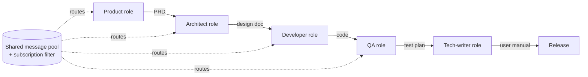

# SOP-Encoded Multi-Agent Workflow

**Also known as:** Standard Operating Procedure Multi-Agent, Assembly-Line Agents, Software-Company Agents

**Category:** Multi-Agent  
**Status in practice:** emerging

## Intent

Encode a human Standard Operating Procedure (roles, ordered phases, standardised hand-off artefacts) into a multi-agent pipeline so that agents communicate through structured documents rather than free-form chat.

## Context

A complex, repeatable task (software development, document production, regulatory submission) already has a well-known human procedure with named roles and defined deliverables between them.

## Problem

Free-form multi-agent chat hallucinates context, drifts off-task, and produces no auditable trail; without a procedure, agents redo each other's work or skip steps.

## Forces

- The model is good at playing a role; it is bad at inventing the workflow that connects roles.
- Free chat between agents is cheap to write but expensive to debug.
- Defined artefacts (PRD, design doc, test plan) compress context across role hand-offs.
- Rigid SOPs lose the model's ability to adapt; the SOP has to leave room for the role to think.


## Applicability

**Use when**

- A complex repeatable task already has a documented human SOP with named roles.
- Hand-off artefacts between phases can be typed (PRD, design doc, code, test plan).
- An auditable trail of artefacts is required.

**Do not use when**

- The task is one-off and writing an SOP is more work than doing it.
- Free-form chat between agents is sufficient and cheaper.
- Phases cannot be cleanly separated and artefact contracts cannot be defined.

## Therefore

Therefore: encode the human SOP as named roles, ordered phases, and typed artefact contracts at every phase boundary, so that agents communicate through documents rather than drifting free-form chat.

## Solution

Encode the SOP as: (a) a fixed set of named roles each with role-specific prompt and tool palette, (b) an ordered sequence of phases, (c) a typed artefact contract for each phase boundary (e.g. PRD → design doc → code → test plan → user manual). Agents communicate via the artefacts; a shared message pool plus a subscription filter routes only relevant context to each role.

## Example scenario

A four-agent product-development chat keeps drifting because agents talk free-form and re-do each other's work. The team rewrites it as an SOP-encoded pipeline: PM writes a typed PRD artefact, Architect transforms PRD into an Architecture artefact, Engineer transforms Architecture into Code, QA transforms Code into Test Report. Each phase boundary is a typed contract, not a chat. Drift stops, the trail is auditable, and review focuses on the artefacts rather than the conversation.

## Structure

```
Role_A -- artefact_1 --> Role_B -- artefact_2 --> Role_C ... ; shared message pool; per-role subscription filter.
```


## Diagram



## Consequences

**Benefits**

- Auditable trail of artefacts at every phase boundary.
- Specialised role prompts beat one mega-prompt on long tasks.
- Standardised artefact schemas catch ambiguity at the hand-off, not at the end.

**Liabilities**

- Designing the artefact contract is the real work; bad contracts propagate to every role.
- Procedure rigidity makes the system brittle when the task does not match the SOP.
- Token cost scales with the number of phases.

## What this pattern constrains

Agents may not communicate outside the artefact contract; a role's output that does not conform to the next role's expected schema is rejected at the phase boundary.

## Known uses

- **[MetaGPT](https://github.com/geekan/MetaGPT)** — *Available*. Five roles (Product Manager, Architect, Project Manager, Engineer, QA) producing standardised artefacts in an assembly-line pipeline.
- **[ChatDev](https://github.com/OpenBMB/ChatDev)** — *Available*. CEO/CTO/Programmer/Reviewer/Tester roles in a phased pipeline with artefact hand-offs.

## Related patterns

- *uses* → [role-assignment](role-assignment.md)
- *complements* → [supervisor](supervisor.md)
- *uses* → [blackboard](blackboard.md) — Shared message pool plus subscription filter is a blackboard variant.
- *complements* → [spec-first-agent](spec-first-agent.md) — The SOP is itself a spec for the multi-agent system.
- *alternative-to* → [hero-agent](hero-agent.md)
- *uses* → [structured-output](structured-output.md)
- *complements* → [chat-chain](chat-chain.md)

## References

- (paper) Hong et al., *MetaGPT: Meta Programming for A Multi-Agent Collaborative Framework*, 2023, <https://arxiv.org/abs/2308.00352>
- (paper) Qian et al., *ChatDev: Communicative Agents for Software Development*, 2023, <https://arxiv.org/abs/2307.07924>

**Tags:** multi-agent, workflow, china-origin, metagpt, chatdev
