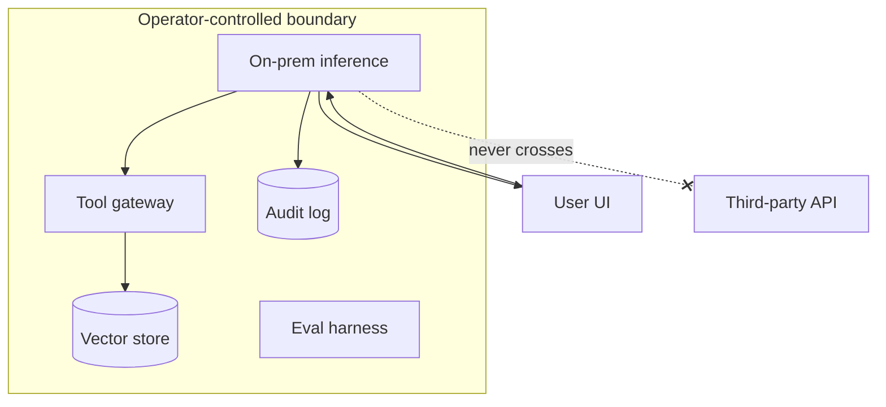

# Sovereign Inference Stack

**Also known as:** On-Premise Agent Stack, Data-Residency Agent Architecture, Sovereign AI

**Category:** Safety & Control  
**Status in practice:** emerging

## Intent

Run the entire agent stack (model weights, inference, tool layer, vector stores, logs) inside a jurisdictional and operational boundary the operator controls, so no request, prompt, or output crosses into a third-party API.

## Context

An operator in public administration, banking, defence, health, or critical infrastructure needs to deploy an agent under a policy or legal regime that forbids sending the prompts, tool inputs, or outputs to a foreign-cloud large-language-model provider. Concrete drivers include the EU AI Act for high-risk systems, the German BSI C5 cloud-security framework, the EU NIS2 directive, and sectoral data-protection rules covering medical or financial data. The operator must be able to demonstrate that no in-scope data crosses the boundary they control.

## Problem

A hosted-API agent sends every prompt, every tool input, and every output to a third party — that is the architecture. Contractual assurances from the provider do not satisfy regulators who require the data to stay inside a specific jurisdiction and under the operator's own keys. At the same time, the frontier hosted models offer the best capability per dollar, and self-hosting demands GPU capital expenditure and machine-learning operations skill the operator may not have. Without a deliberate stack where every load-bearing component sits inside the operator-controlled boundary, the team has to choose between being non-compliant and not shipping at all.

## Forces

- Frontier hosted models offer the best capability per dollar.
- Regulators forbid data egress for protected categories.
- Self-hosting demands GPU capex and MLOps competence the operator may lack.
- Sovereign deployments must still reach acceptable model quality to be useful.


## Applicability

**Use when**

- Regulated workload forbids data egress to a foreign-cloud LLM provider.
- Permissively licensed or sovereign-licensed models meet quality requirements.
- The operator can run inference on-prem or in a controlled jurisdiction.

**Do not use when**

- Data egress to a hosted API is allowed and frontier capability matters more.
- Self-hosted operations cost or complexity exceeds the regulatory benefit.
- Available open-weight models cannot meet quality targets for the workload.

## Therefore

Therefore: place every load-bearing component (weights, inference, tools, memory, logs, eval) inside one operator-controlled jurisdictional boundary and forbid any agent path that crosses it, so that no prompt or output ever reaches a third-party API.

## Solution

Choose models with permissive weights or commercial sovereign licensing. Run inference on-prem or in a jurisdictionally controlled cloud region with the operator holding the keys. Place all auxiliary services (vector store, tool gateway, audit log, evaluation harness) inside the same boundary. Document the boundary as part of the system's compliance posture (model card, data-flow diagram). Treat the boundary as load-bearing: any new tool or model call has to be reviewed for boundary impact before merge.

## Example scenario

A bank wants an internal coding assistant but legal flatly forbids any source-code or prompt leaving the bank's controlled boundary, regardless of vendor contractual language. The team picks a permissively-licensed open-weights model, runs inference in their own datacentre, places the vector store and trace logs inside the same boundary, and holds the keys themselves. No request, prompt, or output ever crosses to a third-party API; the assistant ships under regulator review.

## Structure

```
Boundary { Inference + Tools + Memory + Logs + Eval } -- only public artefacts (UI responses) leave.
```


## Diagram



## Consequences

**Benefits**

- Compliant with data-residency and sectoral regulations.
- Auditable end-to-end; no opaque third-party API.
- Operator retains negotiating power over model upgrades and pricing.

**Liabilities**

- Capex and operational complexity (GPU fleet, ops team).
- Capability gap vs. frontier hosted models is real and ongoing.
- Each new model upgrade is a procurement project, not an API key swap.

## What this pattern constrains

No prompt, tool input, tool output, or memory entry may leave the operator-controlled boundary; agent components that require a third-party hosted call are forbidden by construction.

## Known uses

- **[Aleph Alpha PhariaAI](https://docs.aleph-alpha.com/phariaai-home/latest/index.html)** — *Available*. End-to-end stack (Pharia models, PhariaEngine WebAssembly skill runtime, on-prem deployable) marketed for sovereign / explainable enterprise and government use.
- **Mistral on-prem ("Le Chat Enterprise" / private deployment)** — *Available*. Self-hostable European model option used for similar sovereignty requirements.
- **SAP Joule with private grounding** — *Available*. Tenant-isolated agent stack with customer data residency commitments.

## Related patterns

- *complements* → [session-isolation](session-isolation.md)
- *complements* → [model-card](model-card.md)
- *uses* → [lineage-tracking](lineage-tracking.md)
- *complements* → [secrets-handling](secrets-handling.md)
- *complements* → [constitutional-charter](constitutional-charter.md)
- *complements* → [open-weight-cascade](open-weight-cascade.md)

## References

- (doc) *PhariaAI Documentation*, <https://docs.aleph-alpha.com/phariaai-home/latest/index.html>
- (doc) *Aleph Alpha — Sovereign AI Solutions*, <https://aleph-alpha.com/>

**Tags:** safety, compliance, germany-origin, sovereignty, eu-ai-act
