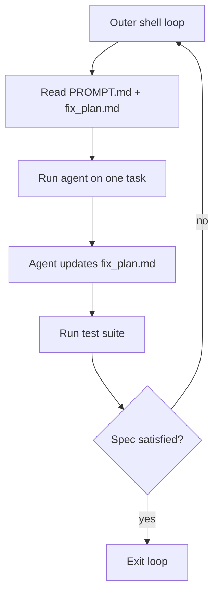

# Spec-Driven Loop

**Also known as:** Naive Iterative Loop, Ralph Wiggum Loop, Ralph Loop

**Category:** Planning & Control Flow  
**Status in practice:** emerging

## Intent

Run the same prompt against a fixed spec in a deterministic outer loop until the spec is satisfied.

## Context

A team works on a task with a clear or steadily-improvable specification — a long bug-fix list, a feature build that decomposes into small chunks, a migration whose end state is well-defined. Each iteration can move the codebase a little closer to the spec without trying to land everything at once. The team has a test suite or a similar gate that can tell whether the spec has been satisfied.

## Problem

Agents that try to plan and implement the whole feature in a single turn are brittle because they have to hold too many decisions in one context and they cannot back out of a bad early commitment. Agents driven from a free-form chat wander, lose their plan, and produce work that is hard to resume after an interruption. Custom orchestration frameworks add their own complexity for what should be a simple loop. The team wants something brutally simple — re-run the agent against the spec until the spec is satisfied — without losing the ability to inspect, pause, and resume.

## Forces

- The spec must be good or the loop polishes the wrong artefact.
- Tests gate progress; without them the loop has no error signal.
- Cost per iteration must be tolerable for hundreds of runs.

## Applicability

**Use when**

- A task has a clear (or improvable) spec and incremental iteration adds value.
- Each iteration's output can be gated by a test or check.
- An outer shell loop can run the same prompt repeatedly without supervision.

**Do not use when**

- The task has no spec and cannot be incrementally improved.
- There is no test gate and the loop cannot tell when to stop.
- Unsupervised loops would consume cost without convergence.

## Therefore

Therefore: drive the agent from a deterministic outer shell loop pinned to one prompt, an agent-updated fix_plan, and a test gate per iteration, so that progress is legible and the loop converges instead of wandering.

## Solution

An outer shell loop (`while :; do cat PROMPT.md | claude-code ; done`) runs the same prompt repeatedly. The prompt encodes one task at a time, references a fix_plan.md that the agent itself updates, and ends with a test invocation that gates the next iteration. Subagents are used for parallel reads; build/test stays serial.

## Example scenario

A team is fixing a long-tail bug list across a large repo. A free-form chat session wanders, plans become stale, and progress is hard to measure. They write a deterministic outer loop (`while :; do cat PROMPT.md | claude-code; done`) where the prompt names one task, references a fix_plan.md the agent itself updates, and exits when the spec is satisfied. Progress becomes legible: tasks tick off, the loop terminates, and resuming after interruption is a no-op.

## Diagram

## Consequences

**Benefits**

- Brutally simple. No orchestration framework required.
- Self-improving in practice: the agent updates the spec as it learns.

**Liabilities**

- Easy to burn tokens on the wrong shape.
- Hard to share state between iterations beyond what the agent writes to disk.

## What this pattern constrains

Each loop iteration is constrained by the spec and the test gate; the agent cannot expand scope without editing the spec first.

## Known uses

- **[Geoffrey Huntley's Ralph](https://ghuntley.com/ralph/)** — *Available*. The canonical write-up.
- **[Sparrot](https://marco-nissen.com/sparrot/)** — *Available* — The frameworks-picker path runs an iterative loop against a framework spec until satisfied; a deterministic outer loop over a fixed prompt-against-spec rather than free-form chat.

## Related patterns

- *uses* → [spec-first-agent](spec-first-agent.md)
- *complements* → [step-budget](step-budget.md)
- *alternative-to* → [scheduled-agent](scheduled-agent.md)

## References

- (blog) Geoffrey Huntley, *Ralph Wiggum as a 'software engineer'*, 2025, <https://ghuntley.com/ralph/>

**Tags:** loop, spec, iterative
