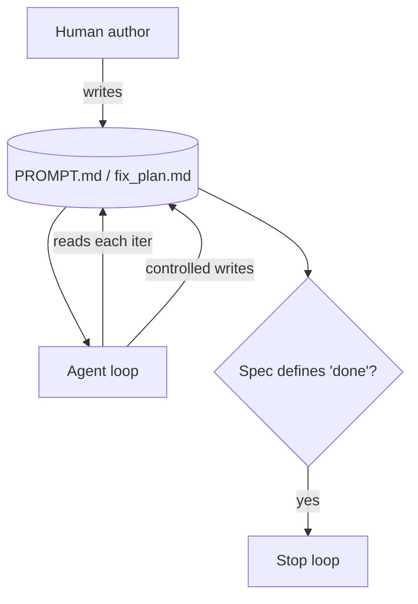

# Spec-First Agent

**Also known as:** Specification-Driven Agent, Plan-as-Document

**Category:** Planning & Control Flow  
**Status in practice:** emerging

## Intent

Drive the agent loop from a human-authored specification document rather than free-form prompts.

## Context

A team runs an agent on a task that is well-defined enough to write down — a recurring report, a bug-fix list, a migration plan, a multi-step automation. The team wants the agent's instructions to live in a file that humans can read, review, and edit alongside the code, rather than in a chat history or someone's head. Reviewers should be able to diff changes to the agent's intent the same way they diff changes to the source code.

## Problem

Free-form prompts drift between sessions: the same engineer types subtly different instructions on different days and the agent's behaviour quietly changes. When the spec lives in one engineer's head, nobody else can review it, audit it, or take over when that engineer is away. Without a written target, there is no single source of truth for what "done" means, so the agent may declare success on partial work or keep going past where the team would have stopped. The team needs a written, version-controlled spec without giving up the agent's ability to update its own plan as it learns.

## Forces

- Spec authoring is up-front work.
- The agent must update the spec when learnings invalidate it; uncontrolled spec mutation is dangerous.
- Spec format must be both human- and agent-readable.

## Applicability

**Use when**

- The task is well-defined enough to write down as a spec.
- The spec needs to be inspectable, audited, or shared across engineers.
- The agent benefits from a stable target rather than free-form prompts.

**Do not use when**

- Requirements change faster than a spec can be maintained.
- The task is exploratory and a spec would prematurely commit to a path.
- Writing the spec costs more than just doing the work.

## Therefore

Therefore: make a human-authored markdown spec the single source of truth for what 'done' means and let the agent read it each iteration and edit it only under controlled conditions, so that intent is auditable and behaviour drift shows up as a reviewable diff.

## Solution

Write the specification as a markdown file (PROMPT.md, fix_plan.md, or similar). The agent reads the spec at each iteration, executes against it, and may update it under controlled conditions. The spec is the single source of truth for what 'done' means.

## Example scenario

A small team has one engineer who knows the agent's behaviour by heart but the spec lives in their head and is unaudited. They write PROMPT.md as the agent's spec, the agent reads it each iteration and may update it under controlled conditions. New engineers read the markdown to understand intent; reviewers diff spec changes; behaviour drift becomes visible because it shows up as a spec edit rather than a silent prompt change.

## Diagram

## Consequences

**Benefits**

- Inspectable target; reviewable diffs over time.
- Pairs naturally with iterative loops (Ralph).

**Liabilities**

- Spec quality bounds agent quality.
- Spec mutation introduces drift if uncontrolled.

## What this pattern constrains

The agent acts only against goals named in the spec; out-of-scope work must be added to the spec first.

## Known uses

- **Ralph Wiggum loop** — *Available*. PROMPT.md + fix_plan.md drive the loop.
- **Spec-driven Claude Code workflows** — *Available*

## Related patterns

- *used-by* → [spec-driven-loop](spec-driven-loop.md)
- *complements* → [agent-skills](agent-skills.md)
- *complements* → [sop-encoded-multi-agent](sop-encoded-multi-agent.md)
- *alternative-to* → [todo-list-driven-agent](todo-list-driven-agent.md)
- *alternative-to* → [automatic-workflow-search](automatic-workflow-search.md)

## References

- (blog) *Geoffrey Huntley, Ralph*, 2025, <https://ghuntley.com/ralph/>

**Tags:** spec, documentation
