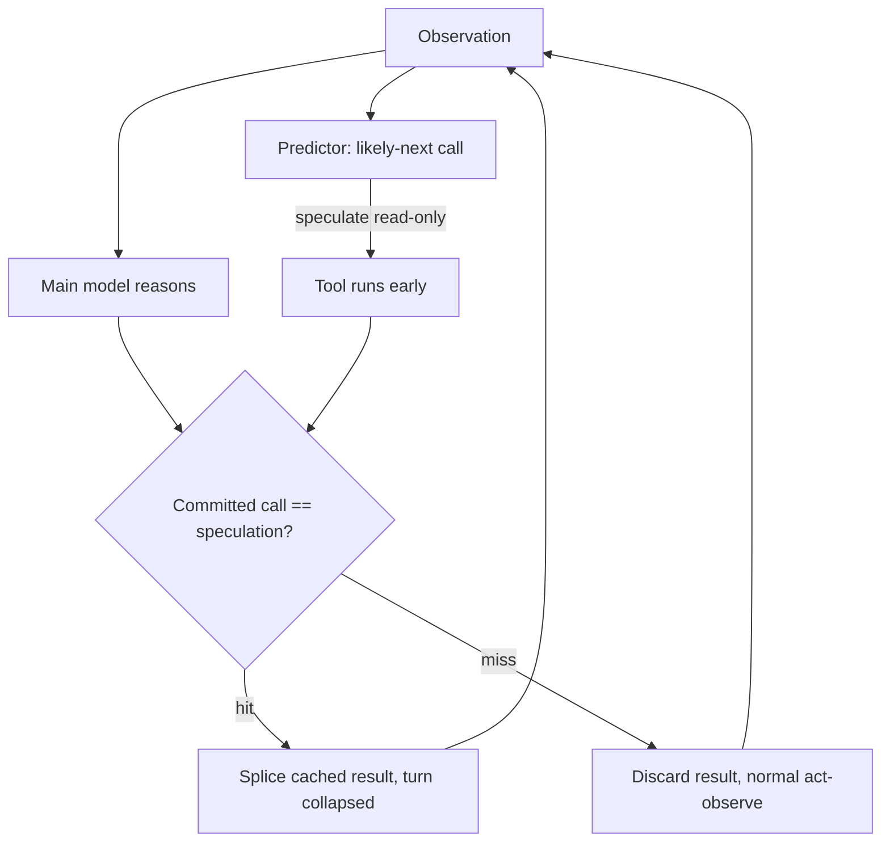

# Speculative Agentic Actions

**Also known as:** Speculative Tool Execution, Action Lookahead, Preemptive Tool Bundling

**Category:** Planning & Control Flow  
**Status in practice:** experimental

## Intent

Predict the tool calls the agent is most likely to issue next and execute them preemptively on the current turn, then keep the results that the confirmed trajectory needs and discard the rest.

## Context

An agent works a long-horizon task as a strict request-act-observe loop: each turn it reads the prior observation, decides on one tool call, waits for the result, and only then plans the next call. On tasks that take dozens of turns this serialisation is the dominant cost. Every turn replays the growing transcript, pays a model round-trip, and waits on a tool whose outcome was often predictable from the previous observation, so the run exhausts its turn or token budget before the goal is reached.

## Problem

Many of the tool calls an agent will make are highly predictable from the current state — after listing a directory it will read the obvious file, after a failing test it will open the named stack-frame, after a search hit it will fetch the top result. Forcing each of these through its own confirm-then-act turn spends a full model round-trip and a transcript replay on a decision the agent had already implicitly made. The agent needs a way to run ahead of itself on the predictable stretches without committing to a wrong branch when the prediction misses.

## Forces

- Each extra turn replays the whole transcript and pays a model round-trip, so collapsing turns directly buys horizon under a fixed token budget — but speculation that misses wastes the very budget it tried to save.
- The next tool call is often near-certain from the current observation, yet the loop treats every call as if it were a fresh, uncertain decision.
- Executing a predicted call early overlaps its latency with the model's reasoning, but a speculative call with side effects cannot simply be thrown away if the prediction is wrong.
- A bolder prediction horizon collapses more turns when right and burns more budget when wrong, so the speculation depth must be tuned to the prediction's confidence.

## Therefore

Therefore: predict the likely-next tool calls from the current state, execute the read-only ones preemptively alongside the model's reasoning, splice in the results that the confirmed trajectory turns out to need, and discard the mispredicted speculation.

## Solution

Add a speculation step to the agent loop. From the current observation a lightweight predictor proposes the tool call (or short chain of calls) the agent is most likely to issue next, and the harness dispatches those calls speculatively while the main model reasons about the same turn. When the model commits to its actual next action, the harness checks it against the speculation: on a hit it splices in the already-computed result and skips the round-trip, collapsing two or more turns into one; on a miss it drops the speculative result and falls back to the normal act-observe step. Speculation is confined to read-only, idempotent, side-effect-free calls so a discarded prediction costs only wasted compute, never corrupted state. The prediction horizon is bounded by confidence, so the loop speculates aggressively where the next step is near-certain and conservatively where it is not.

## Structure

```
Observation --> Predictor (likely-next call) --speculate(read-only)--> Tool ; Main model --commit(actual call)--> Match? --hit--> splice cached result (turn collapsed) / --miss--> discard + normal act-observe
```

## Diagram



*A predictor speculatively runs the likely-next read-only call while the model reasons; a hit collapses the turn, a miss is discarded.*

## Example scenario

A debugging agent is told a test failed. From the failure observation a predictor guesses the agent's next move is to open the file named in the top stack frame, so the harness reads that file speculatively while the model is still reasoning. When the model commits to exactly that read, the already-fetched contents are spliced in and the read-and-wait turn is skipped; when the model instead decides to re-run the test, the speculative read is dropped and the loop proceeds normally.

## Consequences

**Benefits**

- Predictable stretches of a trajectory collapse from one turn per call into a single turn, cutting the round-trips and transcript replays that dominate long-horizon cost.
- Speculative call latency overlaps with the model's reasoning, so a correct prediction is effectively free wall-clock time.
- The agent reaches further under the same turn or token budget, addressing resource exhaustion on long tasks.

**Liabilities**

- A mispredicted speculation spends compute and tool quota on a result that is thrown away, so a poor predictor can make a run slower and costlier than the plain loop.
- Restricting speculation to read-only idempotent calls excludes the state-changing actions that often dominate a task, limiting the turns that can be collapsed.
- The predictor adds a component to build, tune, and keep aligned with the agent's real policy; drift between the two silently lowers the hit rate.

## Failure modes

- Side-effect leakage — a call assumed idempotent is speculated and mutates external state, so a discarded misprediction leaves a partial write behind.
- Over-speculation — the predictor runs a deep chain ahead on a low-confidence branch, burning more budget on discarded work than the loop saved.
- Predictor drift — the speculator's policy diverges from the agent's real policy, the hit rate collapses, and every turn pays speculation overhead with no payoff.

## What this pattern constrains

Only read-only, idempotent, side-effect-free tool calls may be executed speculatively; state-changing actions must not run before the agent commits to them, and a mispredicted speculative result must be discarded rather than fed into the trajectory.

## Applicability

**Use when**

- The next tool call is frequently predictable from the current observation, so a cheap predictor can hit often enough to pay for its misses.
- Per-turn cost (model round-trip plus transcript replay) dominates the run and the task spans many turns.
- The predictable calls are read-only and idempotent, so a discarded misprediction wastes only compute and not external state.

**Do not use when**

- The likely-next action is genuinely uncertain at each step, so speculation misses more often than it hits and adds net cost.
- The dominant tool calls have side effects or are not idempotent, so they cannot be safely run before the agent commits to them.
- Tool calls are cheap and the task is short, so the per-turn cost the pattern targets is not the bottleneck.

## Components

- Agent loop — the request-act-observe controller that decides one committed tool call per turn
- Next-action predictor — proposes the likely-next tool call (or short chain) from the current observation
- Speculation dispatcher — executes predicted read-only calls preemptively while the main model reasons
- Match-and-splice gate — compares the agent's committed call to the speculation, splicing a hit and dropping a miss
- Speculative result buffer — holds in-flight preemptive results until they are spliced or discarded

## Tools

- Tool-calling LLM — reasons and commits the actual next action on each turn
- Read-only / idempotent tool subset — the calls eligible for safe speculative execution
- Async execution runtime — runs speculative calls concurrently with model reasoning so their latency overlaps

## Evaluation metrics

- Speculation hit rate — fraction of preemptive calls the agent actually committed to, the key driver of net benefit
- Turns collapsed per task — how many act-observe round-trips the pattern removes versus the plain loop
- Wasted-work overhead — compute and tool quota spent on discarded mispredictions
- Task success rate and budget headroom — completion under the same turn or token budget versus a no-speculation baseline

## Known uses

- **[Aegis](https://arxiv.org/abs/2508.19504)** _pure-future_ — Taxonomy of agent-environment failures that names Speculative Agentic Actions as an optimisation against resource exhaustion, preemptively bundling related tool calls so the trajectory collapses fewer turns.
- **[Hail Hydra](https://github.com/AR6420/Hail_Hydra)** _available_ — Speculative pre-dispatch: a scout action launches in parallel with task classification to cut latency.

## Related patterns

- _alternative-to_ **Parallel Tool Calls** — Parallel tool calls fan out calls already known to be independent within one turn; speculative actions execute the predicted likely-NEXT call before the agent has confirmed it needs it, and discard it on a miss.
- _complements_ **LLMCompiler** — The compiler overlaps independent steps of a KNOWN plan DAG; speculation overlaps the next step of an UNKNOWN plan by guessing it, so a speculated hit can feed the compiler's next dispatch.
- _complements_ **Sleep-Time Compute** — Both precompute likely-future work, but sleep-time-compute runs offline during idle periods against the standing context, while speculation runs in-loop on the live trajectory and is discarded the moment the prediction misses.
- _complements_ **World Model as Tool** — A world model that rolls out hypothetical futures can supply the likely-next-action prediction that speculation acts on, turning a simulated rollout into a real preemptive call.

## References

- [Aegis: Taxonomy and Optimizations for Overcoming Agent-Environment Failures in LLM Agents](https://arxiv.org/abs/2508.19504) — 2025
- [Speculative Actions: A Lossless Framework for Faster Agentic Systems](https://arxiv.org/abs/2510.04371) — Naimeng Ye, Arnav Ahuja, Georgios Liargkovas, Yunan Lu, Kostis Kaffes, Tianyi Peng, 2025
- [Dynamic Speculative Agent Planning](https://arxiv.org/abs/2509.01920) — Yilin Guan, Qingfeng Lan, Fei Sun, Dujian Ding, Devang Acharya, Chi Wang, William Yang Wang, Wenyue Hua, 2025
- [Speculative Interaction Agents: Building Real-Time Agents with Asynchronous I/O and Speculative Tool Calling](https://arxiv.org/abs/2605.13360) — Coleman Hooper, Minwoo Kang, Suhong Moon, Nicholas Lee, Eric Wen, John Wawrzynek, Michael W. Mahoney, Yakun Sophia Shao, Amir Gholami, Kurt Keutzer, 2026
