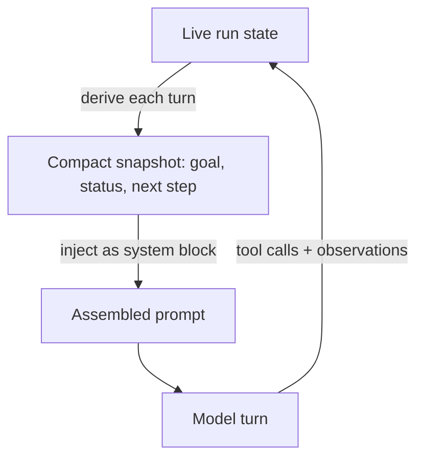

# Standing State Injection

**Also known as:** Current-State Recitation, Per-Turn State Snapshot, Standing Goal Block

**Category:** Planning & Control Flow  
**Status in practice:** emerging

## Intent

Recompute a compact task-state snapshot each turn and inject it as a fresh system block before the model reasons, so a long tool-call loop stays oriented on the goal.

## Context

An agent runs a task that stretches across dozens or hundreds of tool-call turns, such as a multi-step research sweep or a long build-and-fix loop. Every turn the prior reasoning, tool calls, and observations pile up in the running history, and the original goal slides toward the middle of a window that the model attends to less and less. The harness still controls prompt assembly on each turn, so it can place a small block wherever attention is strongest.

## Problem

A goal stated once at the start of a long trajectory drifts as the history grows: the model loses track of what it set out to do, what is already done, and what comes next, and it may ask a question it already answered or declare the task finished early. Relying on the buried opening instruction is brittle, while re-reading the whole history each turn is expensive and still leaves the goal lost in the middle. The agent needs its current state restated where it will actually be read, every turn.

## Forces

- Long histories push the original goal into the low-attention middle of the window, so a one-time goal statement decays even though it is still present.
- Recomputing a snapshot every turn costs tokens and a small derivation step, but a stale or absent state block costs a drifted or abandoned task.
- A snapshot that is too terse omits the next step the model needs, while one that copies the whole plan reintroduces the bloat the loop was meant to avoid.
- Deriving the snapshot from live execution keeps it honest, whereas trusting the model to self-summarise its own state invites quiet drift between the snapshot and reality.

## Therefore

Therefore: on every prompt assembly, derive a short current-state block — goal, status so far, next step — from the live run and inject it as a high-salience system message ahead of the model's reasoning.

## Solution

Before each model turn, the harness builds a compact state snapshot from the live execution: the standing goal, a one-line status of what is done, and the immediate next step or open question. It renders this as a short structured block and injects it as a system message placed near the top of the assembled prompt, where the model attends most. The block is recomputed every turn from the current run rather than copied from the previous turn, so it tracks progress as the agent works. The full history may still be present or offloaded elsewhere, but the standing block guarantees the goal and next step are always restated in a low-cost, high-salience position, independent of any durable plan file.

## Structure

```
Live run state --derive--> Compact snapshot (goal, status, next step) --inject as system block--> Assembled prompt --> Model turn --updates--> Live run state
```

## Diagram



*Each turn the harness re-derives a compact state snapshot from the live run and injects it as a high-salience system block before the model reasons.*

## Example scenario

An agent is asked to triage forty open bug reports and file a summary for each. Twenty turns in, the original instruction sits far up the history and the model starts re-asking which repository to look in. With standing state injection, every turn begins with a small block — goal: triage 40 bugs; done: 23 filed; next: report #24 in the payments repo — so the agent keeps moving through the queue instead of losing the thread.

## Consequences

**Benefits**

- The goal and next step are restated in a high-attention position every turn, cutting goal drift across long trajectories.
- The snapshot is a few dozen tokens regardless of history length, so the orientation cost stays flat as the run grows.
- Because the block is re-derived from the live run, it reflects real progress instead of a stale opening instruction.

**Liabilities**

- A snapshot derived from a wrong reading of run state confidently misdirects the model, which trusts the high-salience block.
- Recomputing and serialising the block each turn adds a small fixed cost to every assembly.
- If the snapshot omits a detail a step needs, the model may act on the terse summary and skip context that was still load-bearing.

## Failure modes

- Stale snapshot — the block is copied from a previous turn instead of re-derived, so it reports a next step the agent already completed.
- Snapshot drift — the derived state subtly disagrees with the real run, and the model follows the block over the evidence in history.
- Over-compression — the snapshot drops the next step or open question, leaving the model oriented on the goal but unsure how to advance.

## What this pattern constrains

The injected state block must be recomputed from the live run on every prompt assembly; the agent cannot reuse a snapshot carried over from a previous turn, and a turn assembled without a current-state block is a harness bug.

## Applicability

**Use when**

- Tasks run long enough that the original goal sinks into the low-attention middle of the context window.
- The harness controls prompt assembly and can derive a current-state snapshot from the live run each turn.
- Goal drift, premature completion, or re-asking answered questions is an observed failure on long trajectories.

**Do not use when**

- Tasks finish in a few turns, so the goal never drifts and the per-turn snapshot cost is pure overhead.
- A durable, agent-edited plan file is already the working memory and re-injecting it serves the same role.
- Reliable run state cannot be derived, so an injected snapshot would more often misdirect than orient the model.

## Components

- State deriver — reads the live run each turn and extracts the standing goal, current status, and next step
- Snapshot renderer — serialises the derived state into a short structured block, kept to a fixed small budget
- Prompt assembler — places the snapshot as a system message in the high-attention slot before the model's reasoning
- Run-state store — the source of truth the deriver reads, updated by each turn's tool calls and observations
- Salience policy — decides where in the assembled prompt the block sits so the model reliably attends to it

## Tools

- Tool-calling LLM — consumes the injected state block and acts on the next step
- Prompt-assembly layer — rebuilds the message list each turn and injects the recomputed block
- Run-state tracker — records progress so the snapshot can be re-derived rather than copied

## Evaluation metrics

- Goal-drift rate — fraction of long runs where the agent abandons or misremembers the original goal, with vs without the block
- Premature-completion rate — how often the agent declares done early, compared to a no-snapshot baseline
- Snapshot token overhead — average tokens the state block adds per turn against the orientation it buys
- Snapshot fidelity — how often the injected state agrees with the true run state on audit

## Known uses

- **[Manus](https://manus.im/blog/Context-Engineering-for-AI-Agents-Lessons-from-Building-Manus)** _available_ — Recites an evolving goal/todo block near the end of context each turn to fight lost-in-the-middle goal drift across long tool-call loops.
- **[Deep Agents context-management (Lance Martin)](https://blog.aihao.tw/2026/02/20/agent-design-patterns/)** _available_ — Structured compaction retains session intent and next-step fields so the agent keeps its direction after the history is reduced.

## Related patterns

- _complements_ **Now-Anchoring** — Both inject a freshly computed block into every prompt assembly; now-anchoring restates the current time, standing-state-injection restates the current task state.
- _alternative-to_ **Todo-List-Driven Autonomous Agent** — The todo-list agent re-injects a durable plan file the agent reads and writes; standing-state-injection re-derives the snapshot per turn with no plan file to maintain.
- _complements_ **Attentive Reasoning Queries** — ARQs re-anchor attention via a fixed query sequence inside the model's reasoning; standing-state-injection re-anchors it via a harness-computed state block placed ahead of reasoning.
- _complements_ **Context Compaction** — Compaction reduces the bloated history; a standing state block guarantees the goal and next step survive the reduction in a fixed high-salience slot.
- _complements_ **Tool-Result Reinforcement** — Both restate goal, status, and next step from the live run; standing-state-injection injects the block as a system message ahead of reasoning, tool-result reinforcement appends it to the tool return the model reads on the action turn.

## References

- [AI Agent 怎麼管理 Context? 從設計模式到 Deep Agents 實作](https://blog.aihao.tw/2026/02/20/agent-design-patterns/) — 2026
- [Context Engineering for AI Agents: Lessons from Building Manus](https://manus.im/blog/Context-Engineering-for-AI-Agents-Lessons-from-Building-Manus) — Yichao 'Peak' Ji, 2025
- [Effective context engineering for AI agents](https://www.anthropic.com/engineering/effective-context-engineering-for-ai-agents) — Anthropic, 2025
- [Lost in the Middle: How Language Models Use Long Contexts](https://arxiv.org/abs/2307.03172) — Nelson F. Liu, Kevin Lin, John Hewitt, Ashwin Paranjape, Michele Bevilacqua, Fabio Petroni, Percy Liang, 2023
- [Evaluating Goal Drift in Language Model Agents](https://arxiv.org/abs/2505.02709) — 2025
