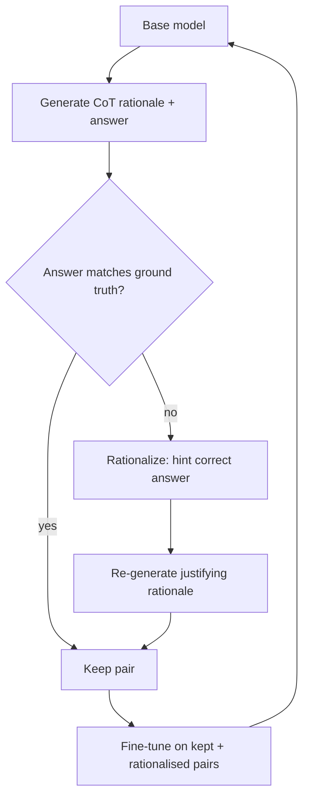

# STaR Bootstrapping

**Also known as:** Self-Taught Reasoner, Rationale Bootstrapping

**Category:** Reasoning  
**Status in practice:** emerging

## Intent

Bootstrap a model's reasoning by training it on its own correct chain-of-thought outputs.

## Context

A team wants to fine-tune a model to become a better reasoner on a class of problems where chain-of-thought prompting visibly helps. They have ground-truth final answers for a training set, and they have compute to generate many model outputs. What they do not have is a dataset of human-written rationales — the step-by-step solutions a person would normally write between problem statement and final answer.

## Problem

Without supervised step-by-step explanations, supervised fine-tuning for reasoning is stuck: the model can be trained to produce final answers, but not to produce the rationales that lead to those answers. At the same time, just prompting the base model with chain-of-thought has plateaued and is as good as plain prompting can make it. The team needs a way to build a training set of rationales without humans writing them, and a training loop that does not require the unstable machinery of full reinforcement learning.

## Forces

- Filter quality determines what 'correct' rationale gets reinforced.
- Wrong rationales that produce right answers can leak in.
- Compute cost of repeated generation + filtering.

## Applicability

**Use when**

- Reasoning task where CoT helps but supervised rationale data is unavailable.
- Ground-truth answers exist so generated rationales can be filtered.
- Fine-tuning the model on rationale + answer pairs is feasible.

**Do not use when**

- No ground-truth answers exist to filter rationales.
- The base model is too weak to produce any correct CoT outputs.
- Quick iteration matters more than the bootstrap-and-train cycle.

## Therefore

Therefore: train the model on its own correct chain-of-thought outputs (rationalising failures with the known correct answer), so that rationales improve without any human-written labels.

## Solution

Prompt the base model with CoT to generate rationale + answer pairs. Keep pairs where the answer matches ground truth. **Rationalization**: when a generated rationale yields the wrong answer, prompt the model with the correct answer as a hint and ask for a rationale that justifies it; add the rationalized example to training. Fine-tune on the kept + rationalized pairs. Repeat: the fine-tuned model generates better rationales next round; iterate.

## Variants

- **Vanilla STaR** — Generate rationale+answer; keep pairs whose answer matches ground truth; fine-tune on those.
- **STaR with rationalisation** — On failure, prompt the model with the correct answer as a hint, accept the resulting rationale, and add it to the training set.
- **Quiet-STaR** — Train the model to generate token-level rationales for every token, not only at problem boundaries (Zelikman et al. 2024).

## Example scenario

A team has a small base model that knows facts but cannot reliably reason. They prompt it with CoT to generate (rationale, answer) pairs across a dataset with ground-truth answers. They keep pairs whose answer is right; for wrong answers they 'rationalize' (give the model the right answer and ask for a rationale). They fine-tune on the kept set, then iterate. After two STaR rounds the model's reasoning capability climbs without any human-written rationales.

## Diagram

## Consequences

**Benefits**

- Self-improvement on reasoning without rationale labels.
- Iterative gains compound.

**Liabilities**

- Spurious-rationale leakage if filtering is too lax.
- Compute-heavy.

## What this pattern constrains

Training data is restricted to filter-passing rationales; ungrounded rationales are not reinforced.

## Known uses

- **STaR paper experiments** — *Available*
- **Influences modern reasoning-distillation pipelines** — *Available*

## Related patterns

- *uses* → [chain-of-thought](chain-of-thought.md)
- *complements* → [self-consistency](self-consistency.md)
- *specialises* → [rest-em](rest-em.md)

## References

- (paper) Zelikman, Wu, Mu, Goodman, *STaR: Bootstrapping Reasoning with Reasoning*, 2022, <https://arxiv.org/abs/2203.14465>

**Tags:** reasoning, training, bootstrapping
