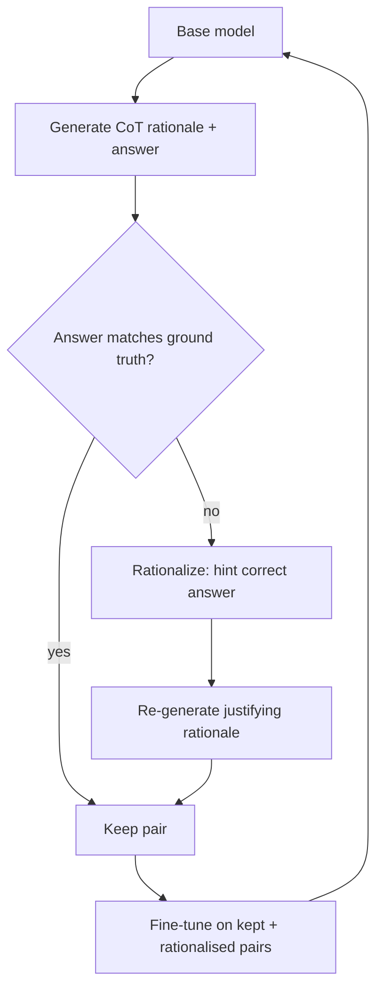

# STaR Bootstrapping

**Also known as:** Self-Taught Reasoner, Rationale Bootstrapping

**Category:** Reasoning  
**Status in practice:** emerging

## Intent

Bootstrap a model's reasoning by training it on its own correct chain-of-thought outputs.

## Context

A team wants to fine-tune a model to become a better reasoner on a class of problems where chain-of-thought prompting visibly helps. They have ground-truth final answers for a training set, and they have compute to generate many model outputs. What they do not have is a dataset of human-written rationales — the step-by-step solutions a person would normally write between problem statement and final answer.

## Problem

Without supervised step-by-step explanations, supervised fine-tuning for reasoning is stuck: the model can be trained to produce final answers, but not to produce the rationales that lead to those answers. At the same time, just prompting the base model with chain-of-thought has plateaued and is as good as plain prompting can make it. The team needs a way to build a training set of rationales without humans writing them, and a training loop that does not require the unstable machinery of full reinforcement learning.

## Forces

- Filter quality determines what 'correct' rationale gets reinforced.
- Wrong rationales that produce right answers can leak in.
- Compute cost of repeated generation + filtering.

## Therefore

Therefore: train the model on its own correct chain-of-thought outputs (rationalising failures with the known correct answer), so that rationales improve without any human-written labels.

## Solution

Prompt the base model with CoT to generate rationale + answer pairs. Keep pairs where the answer matches ground truth. **Rationalization**: when a generated rationale yields the wrong answer, prompt the model with the correct answer as a hint and ask for a rationale that justifies it; add the rationalized example to training. Fine-tune on the kept + rationalized pairs. Repeat: the fine-tuned model generates better rationales next round; iterate.

## Diagram

## Example scenario

A team has a small base model that knows facts but cannot reliably reason. They prompt it with CoT to generate (rationale, answer) pairs across a dataset with ground-truth answers. They keep pairs whose answer is right; for wrong answers they 'rationalize' (give the model the right answer and ask for a rationale). They fine-tune on the kept set, then iterate. After two STaR rounds the model's reasoning capability climbs without any human-written rationales.

## Consequences

**Benefits**

- Self-improvement on reasoning without rationale labels.
- Iterative gains compound.

**Liabilities**

- Spurious-rationale leakage if filtering is too lax.
- Compute-heavy.

## What this pattern constrains

Training data is restricted to filter-passing rationales; ungrounded rationales are not reinforced.

## Applicability

**Use when**

- Reasoning task where CoT helps but supervised rationale data is unavailable.
- Ground-truth answers exist so generated rationales can be filtered.
- Fine-tuning the model on rationale + answer pairs is feasible.

**Do not use when**

- No ground-truth answers exist to filter rationales.
- The base model is too weak to produce any correct CoT outputs.
- Quick iteration matters more than the bootstrap-and-train cycle.

## Components

- Base model — current checkpoint that generates (rationale, answer) pairs
- CoT sampler — prompts the model to produce a rationale alongside the final answer
- Ground-truth filter — keeps pairs whose final answer matches the labelled target
- Rationaliser — re-prompts the model with the correct answer as a hint to obtain a justifying rationale for failed items
- Supervised fine-tuner — trains the next checkpoint on kept and rationalised pairs
- Round controller — drives successive STaR iterations and stops on plateau

## Tools

- LLM training stack — supervised fine-tuning runner with checkpoint rotation
- Answer grader — exact-match or task-specific equivalence checker against ground truth
- Sampling cluster — inference infrastructure for repeated rationale generation

## Evaluation metrics

- Reasoning-task accuracy per round — held-out lift after each STaR iteration
- Rationalised-share of training data — fraction of training pairs that came from the hint-then-rationalise path
- Spurious-rationale audit rate — share of kept pairs where the rationale does not actually justify the answer, manually sampled
- Kept-pair fraction per round — generation efficiency over iterations
- Compute cost per accuracy point — total sampling and training cost per benchmark gain

## Known uses

- **STaR paper experiments** _available_
- **Influences modern reasoning-distillation pipelines** _available_
- **[STaR (ezelikman/STaR)](https://github.com/ezelikman/STaR)** _available_ — Official reference implementation of STaR: Bootstrapping Reasoning With Reasoning (NeurIPS 2022).

## Related patterns

- _uses_ **Chain of Thought**
- _complements_ **Self-Consistency**
- _specialises_ **ReST-EM**

## References

- [STaR: Bootstrapping Reasoning with Reasoning](https://arxiv.org/abs/2203.14465) — Zelikman, Wu, Mu, Goodman, 2022
