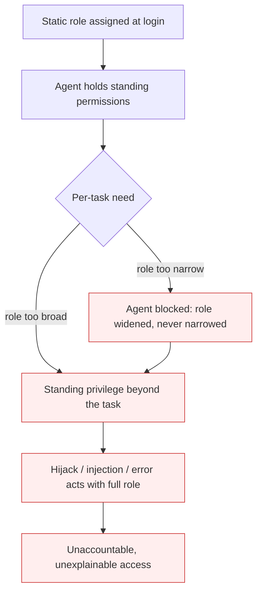

# Static Role for a Dynamic Agent

**Also known as:** Standing Privilege for Agents, RBAC-for-Agents Mismatch

**Category:** Anti-Patterns  
**Status in practice:** deprecated

## Intent

Anti-pattern: authorize a goal-driven agent with static, login-time, role-based privileges, so its standing permissions persist between and beyond tasks, forcing a choice between over-granting broad access and blocking the agent mid-task.

## Context

An organisation already governs its people with role-based access control: users are placed in groups, groups map to roles, roles grant standing permissions, and access is decided once at login. When it deploys an agent it reaches for the same machinery — give the agent a role, put it in the right groups, grant the permissions that role implies. The agent, however, is goal-driven: it chains tools, retries, and discovers paths no one enumerated when the role was defined.

## Problem

Role-based access control decides permissions once, from a static role, for a predictable actor. A goal-driven agent is none of those things. Its action set is dynamic and task-dependent, so the role either grants more standing privilege than any single task needs — broad, long-lived access that persists between and beyond tasks and becomes the blast radius when the agent is hijacked, prompt-injected, or simply wrong — or it grants too little and the agent is blocked mid-task, so someone widens the role to unblock it. Because each new task path wants a different permission combination, roles multiply until effective access can no longer be explained. The model cannot express what actually governs a safe agent action: this principal, this task, this moment, revocable when the task ends. Standing privilege is the default the model pushes toward, and it is exactly the wrong default for an actor that decides its own next step.

## Forces

- RBAC decides access once, at login, from a static role; agents decide their next action continuously, at runtime.
- A goal-driven agent's permission needs are task-dependent and not fully enumerable when the role is defined.
- Granting the role enough privilege to never block the agent means granting standing access far broader than any single task needs.
- Reusing the organisation's existing RBAC machinery is faster than building runtime, task-scoped authorization.

## Applicability

**Use when**

- An agent is assigned a static role with standing permissions decided once, at deployment or login.
- The agent's role is periodically widened to unblock it mid-task, and privilege never narrows again.
- Effective agent access is assembled from proliferating roles or groups and can no longer be explained per action.

**Do not use when**

- Agent actions are authorized at runtime against principal, task, and context, with least-privilege, short-lived grants.
- The agent performs a single fixed, fully enumerable operation that a static scope captures exactly.
- Credentials are task-scoped and revoked when the task ends, so no standing privilege accrues.

## Therefore

Therefore: authorize agents per action at runtime — bind each grant to a principal, a task, and a moment, make it least-privilege and short-lived, and revoke it when the task ends — instead of assigning a static role with standing privilege.

## Solution

Replace standing, role-based grants with runtime, task-scoped authorization. Decide each consequential action against the current principal, task intent, and context rather than against a role assigned once at login; issue least-privilege, short-lived, revocable credentials per task so privilege never outlives the work that needed it; expand access only as the agent demonstrates it needs and can be trusted with more. Mitigation patterns: delegated-agent-authorization for scoped, short-lived, revocable per-action credentials, and progressive-tool-access for minimal access that expands only as competency is shown. Static RBAC is not wrong for human users whose access is decided at login; it is wrong as the authorization model for an actor that chooses its own next step, which is the mismatch this anti-pattern names.

## Diagram

## Example scenario

A team gives its new support agent a role in the existing identity provider: read the ticket store, call the refund API, query the customer database. It works until the agent, following a manipulated ticket, issues refunds it was never meant to — because the refund permission was standing, not task-scoped, and nobody was in the loop at the moment of action. To stop blocking the agent on edge cases, the team had already widened the role twice. They switch to runtime authorization: each consequential action is checked against the current task and principal, refund authority is granted as a short-lived token only for the ticket being handled, and it is revoked when the ticket closes — so privilege no longer outlives the work.

## Consequences

**Liabilities**

- Standing privilege persists between and beyond tasks, so a hijacked, prompt-injected, or simply mistaken agent acts with the full breadth of its role.
- Roles multiply as each new task path demands a different permission combination, until effective access can no longer be explained or audited.
- Teams widen roles to unblock agents mid-task, ratcheting privilege upward and never back down.

## Failure modes

- Blast-radius amplification — a hijacked or mistaken agent acts with the full breadth of its standing role
- Privilege ratchet — roles are widened to unblock agents mid-task and never narrowed afterwards
- Unexplainable access — effective permissions sprawl across roles until no one can say what the agent may do

## What this pattern constrains

No useful constraint; the missing constraint is runtime, task-scoped authorization — every consequential agent action checked against principal, task, and context, granted least-privilege and short-lived, and revoked when the task ends.

## Components

- Static role — a fixed set of standing permissions decided once, at deployment or login
- Login-time decision point — authorization evaluated when the agent starts, not per action
- Standing privilege — access that persists between and beyond the task that needed it
- Role proliferation — new roles minted for each task-specific permission combination

## Tools

- Runtime authorization engine — evaluates each agent action against principal, task intent, and context at the moment of action
- Short-lived credential broker — issues least-privilege, task-scoped, revocable grants instead of standing role permissions
- Standing-privilege auditor — flags agent permissions held continuously but rarely exercised, for narrowing or expiry

## Evaluation metrics

- Standing-privilege ratio — permissions held continuously versus permissions actually exercised per task
- Credential lifetime versus task duration — how long agent grants live relative to the work they serve
- Roles per agent population — proliferation rate of task-specific roles and groups
- Runtime-authorized action share — fraction of consequential actions checked at the moment of action, not at login

## Known uses

- **[Cloud Security Alliance — NIST AI agent standards & agentic identity](https://labs.cloudsecurityalliance.org/research/csa-research-note-nist-ai-agent-standards-20260416-csa-style/)** — *Available* — Reports that emerging agentic-AI controls move away from static role-to-permission mapping toward ephemeral, context-aware identities scoped to an agent's current task, because goal-driven agents chain tools and discover paths static RBAC never anticipated.
- **[Help Net Security — IAM built for humans versus agents](https://www.helpnetsecurity.com/2026/04/27/ai-agents-access-control-model/)** — *Available* — Argues that traditional IAM's static roles and long-lived credentials cannot govern agents whose behaviour is dynamic, contextual, and continuous, and that access must be evaluated at runtime, per action.

## Related patterns

- *alternative-to* → [delegated-agent-authorization](delegated-agent-authorization.md)
- *alternative-to* → [progressive-tool-access](progressive-tool-access.md)
- *complements* → [agent-privilege-escalation](agent-privilege-escalation.md)
- *complements* → [tool-over-broad-scope](tool-over-broad-scope.md)
- *complements* → [agent-identity-sprawl](agent-identity-sprawl.md)

## References

- (paper) arXiv:2510.25819, *Identity Management for Agentic AI*, <https://arxiv.org/abs/2510.25819>
- (blog) SC Media, *A New Identity Class: Why AI Agents Require Runtime Control*, <https://www.scworld.com/resource/a-new-identity-class-why-ai-agents-require-runtime-control>
- (blog) Help Net Security, *Your IAM was built for humans, AI agents don't care*, <https://www.helpnetsecurity.com/2026/04/27/ai-agents-access-control-model/>

**Tags:** anti-pattern, security, authorization, identity, least-privilege
