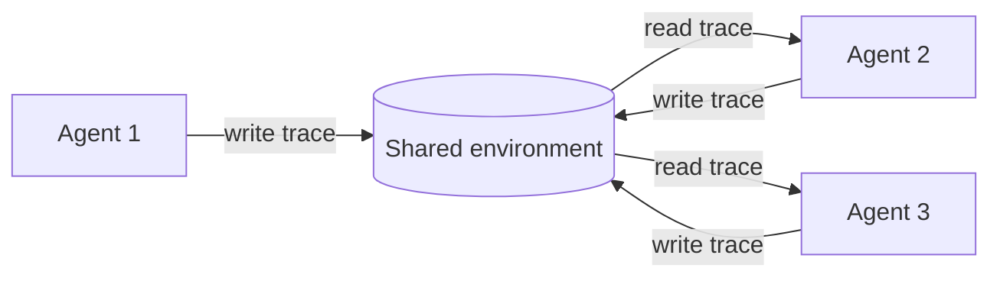

# Stigmergic Coordination

**Also known as:** Trace-Mediated Coordination, Environment-as-Channel, Indirect Coordination

**Category:** Multi-Agent  
**Status in practice:** mature

## Intent

Agents coordinate indirectly by leaving and reading marks in a shared environment (files, queues, scratchpads, world model) so that one agent's trace stimulates another's next action, with no direct messaging.

## Context

Multiple agents share an environment — a workspace directory, a task queue, a shared scratchpad, a vector store. The environment is the only thing they all see; direct point-to-point messaging is either expensive (per-message coordination overhead), unreliable, or simply unavailable across agent boundaries (different processes, different products, different time windows).

## Problem

Forcing every coordination event through direct messaging adds overhead and creates an N×N communication graph. Agents must know each other's identities and protocols. Asynchronous coordination across time windows (one agent finishing a task hours before the next picks it up) needs persistence the messaging layer doesn't have. Without environment-mediated coordination, multi-agent systems either over-couple through direct chatter or fail to coordinate at all when direct channels aren't available.

## Forces

- Direct messaging assumes liveness and identity that may not hold.
- Environment is the natural shared state agents already touch.
- Traces in the environment must be readable by other agents without prior agreement on a protocol.
- Traces decay over time; agents must handle stale marks.

## Applicability

**Use when**

- Agents share an environment they all read and write.
- Coordination crosses time windows or process boundaries direct messaging cannot.
- Trace format can be made readable by future agents without prior protocol agreement.

**Do not use when**

- Real-time tight coordination is needed; polling latency is unacceptable.
- Agents have no shared environment to mediate through.
- Stale traces would mislead more often than fresh traces help.

## Therefore

Therefore: have each agent leave structured traces in the shared environment as the side-effect of its action, and have other agents read the environment as input, so coordination emerges from the environment without direct messaging.

## Solution

Define a structured trace format the environment carries — a TODO file, a queue of jobs, status markers in a scratchpad, named entries in a vector store. Each agent's action writes a trace; each agent's next decision reads traces left by others. Traces include enough context that a fresh agent can act on them. Traces decay or are explicitly cleared. No direct messaging is required. Inspired by stigmergy in social insects (ants follow pheromone trails; termites build mounds via local rules).

## Example scenario

Three coding agents work on the same repository across different sessions. The first writes a TODO file noting which tasks it started and didn't finish. The second reads the TODO, picks up incomplete tasks, and updates it. The third, opening hours later, reads the same TODO and continues. No direct messages pass between them; the TODO file is the coordination channel.

## Diagram

## Consequences

**Benefits**

- Coordination across time, processes, and product boundaries.
- No N×N direct-message graph; the environment is the channel.
- Audit comes for free: the environment is the trace log.

**Liabilities**

- Stale or conflicting traces produce wrong-direction stimulation.
- Traces designed for one agent can mislead another that reads them differently.
- Latency is bounded by how often agents poll the environment.

## What this pattern constrains

Multi-agent coordination must not require point-to-point direct messaging when the environment can carry traces; agents read and write structured traces in the shared environment.

## Known uses

- **Claude Code session files (TODO list, plan files) coordinating sequential agents** — *Available*
- **Multiagent Systems (Weiss) — Coordination via environment** — *Available* — <https://mitpress.mit.edu/9780262731317/multiagent-systems/>
- **Insect-colony coordination (canonical biological reference)** — *Available* — <https://en.wikipedia.org/wiki/Stigmergy>

## Related patterns

- *specialises* → [blackboard](blackboard.md)
- *complements* → [world-model-as-tool](world-model-as-tool.md)
- *alternative-to* → [actor-model-agents](actor-model-agents.md)
- *complements* → [event-driven-agent](event-driven-agent.md)
- *alternative-to* → [performative-message](performative-message.md)
- *alternative-to* → [distributed-constraint-optimization](distributed-constraint-optimization.md)
- *alternative-to* → [joint-commitment-team](joint-commitment-team.md)

## References

- (book) *Multiagent Systems, 2nd ed.*, Gerhard Weiss (ed.), 2013, <https://mitpress.mit.edu/9780262731317/multiagent-systems/>
- (doc) *Stigmergy*, <https://en.wikipedia.org/wiki/Stigmergy>

**Tags:** multi-agent, coordination, environment
