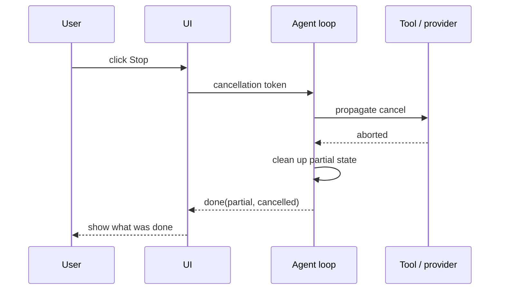

# Stop / Cancel

**Also known as:** User Interrupt, Abort Generation

**Category:** Streaming & UX  
**Status in practice:** mature

## Intent

Let the user interrupt an in-flight agent run cleanly, releasing resources and surfacing partial state.

## Context

A team is running an agent whose individual runs can take tens of seconds to minutes, with multiple tool calls and a streaming response. Halfway through such a run, the user can often see that the agent has misunderstood the request or gone down the wrong path. The team needs a way for the user to stop the run cleanly without closing the tab and without leaving half-written state behind.

## Problem

Without a real cancellation path, the user has only bad options: wait for the run to finish, abandon the page (which leaves orphaned tool calls and partial writes in flight), or kill the process and hope nothing important was mid-write. Meanwhile the agent keeps spending tokens, tool calls, and external API quota on work the user already knows is wrong. Implementing a stop button on the user-interface alone is not enough either — the cancellation has to propagate through the agent loop, through each tool call, and into the streaming connection to the model provider, or the run continues invisibly underneath a stopped-looking interface.

## Forces

- Cancellation must reach upstream tools and providers.
- Partial state may or may not be useful.
- Race conditions between completion and cancellation.

## Applicability

**Use when**

- Long-running agents where the user may notice a wrong direction mid-run.
- A cancellation token can be propagated through agent loop, tools, and provider streams.
- Partial state can be cleaned up and surfaced cleanly.

**Do not use when**

- Runs are short and cancellation provides no real value.
- Cancellation cannot propagate cleanly and would leave inconsistent state.
- The UI has no surface to expose a stop control.

## Therefore

Therefore: propagate a cancellation token from a visible stop control all the way through the loop, tools, and provider streams, so that wrong-direction runs cost seconds, not minutes.

## Solution

Surface a stop control in the UI. On click, propagate a cancellation token through the agent loop, tool calls, and provider streams. Clean up partial state. Show what was done. Optionally save partial output for later resumption.

## Variants

- **Soft cancel** — Stop further model and tool calls but let in-flight calls finish; preserves partial output and logs cleanly.
- **Hard cancel** — Abort in-flight HTTP / tool calls immediately via cancellation tokens; smaller cost cap, more chance of inconsistent state.
- **Cancel-with-resume** — Cancel writes partial state to a checkpoint so the run can be resumed (rather than restarted) on the next user turn.

## Example scenario

A user kicks off an agent run that is going off-track within five seconds; right now there is no UI control to stop it and they wait two minutes for completion while cost burns. The team adds a stop control that propagates a cancellation token through the agent loop, tool calls, and provider streams, cleans up partial state, and surfaces what was done. Wrong-direction runs cost seconds rather than minutes and users feel in control.

## Diagram

## Consequences

**Benefits**

- User control restores when the agent goes wrong.
- Cost is bounded by user attention.

**Liabilities**

- Cancellation plumbing is non-trivial across providers.
- Partial state may be inconsistent.

## What this pattern constrains

Once cancelled, no further model or tool calls may be issued for the cancelled run.

## Known uses

- **ChatGPT Stop button** — *Available*
- **Claude Code's Esc-to-interrupt** — *Available*

## Related patterns

- *complements* → [streaming-typed-events](streaming-typed-events.md)
- *complements* → [step-budget](step-budget.md)

**Tags:** ux, cancel, interrupt
